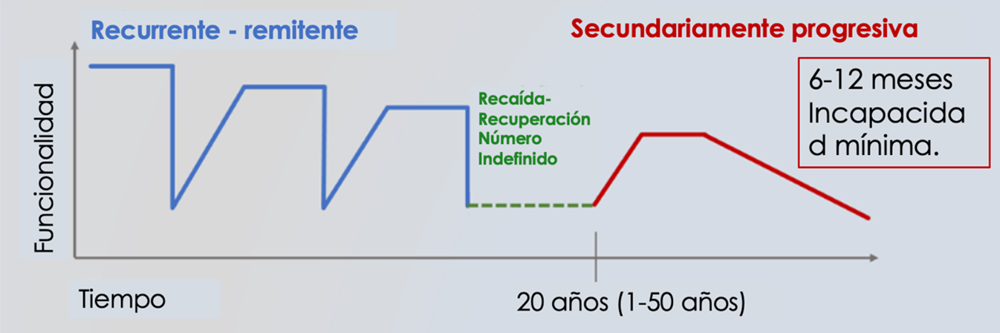
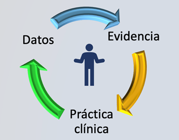
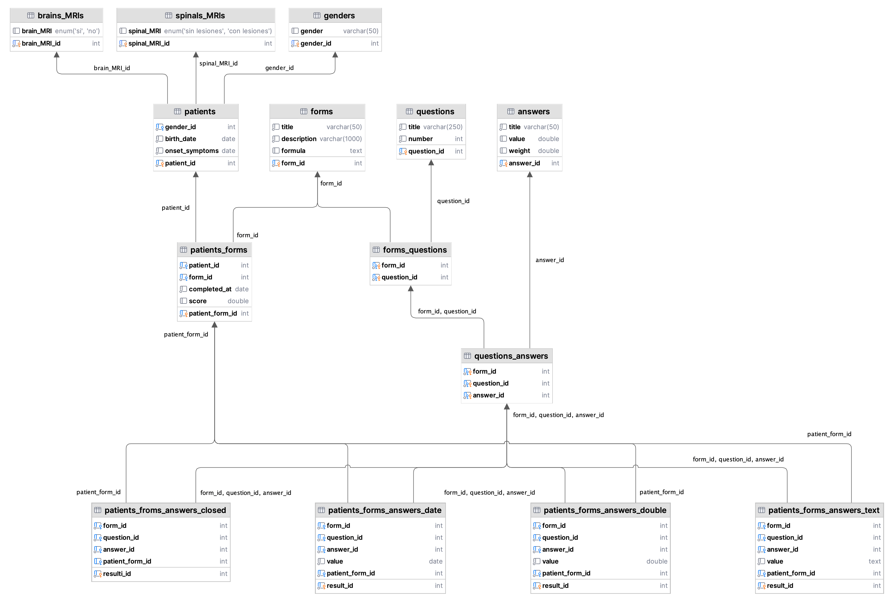

<p align="center"></p>
<p align="center" style="font-family: 'Calibri Light'; font-size:30px">Universidad Internacional de La Rioja</p>
<p align="center" style="font-family: 'Calibri Light'; font-size:26px">Escuela Superior de Ingeniería y Tecnología</center></p>


<p align="center" style="font-family: 'Calibri Light'; font-size:24px">Grado en Ingeniería Informática</p>
<p align="center" style="font-family: 'Calibri'; font-size:30px; color:#0098CD">Desarrollo de una solución en la nube para la gestión de datos de salud que da soporte a la atención médica y la investigación en Esclerosis Múltiple</p>


<div style="display: table; margin: 0 auto;" align="center">
  <table>
    <tr style="background-color:white">
      <td>Trabajo fin de estudio presentado por:</td>
      <td>Jose Manuel Pinillo Rubio</td>
    </tr>
    <tr style="background-color:white">
      <td>Director:</td>
      <td>Jesús Pérez Melero</td>
    </tr>
    <tr style="background-color:white">
      <td>Fecha:</td>
      <td>7 de julio de 2024</td>
    </tr>
    <tr style="background-color:white">
      <td>Repositorio del código fuente:</td>
      <td><a href="https://jmpinillos.github.io/TFE_MS-Insight/" target="_blank">TFE_MS-Insight</a></td>
    </tr>
  </table>
</div>


<p style="font-family: 'Calibri'; font-size:20px; margin: 0 auto;" align="center"><strong>CÓDIGO</strong></p>

<div align="center">
  	<a href="https://github.com/JMPinillos/TFE_MS-Insight/tree/main/Code/MS-Insight_ETL" target="_blank"></a>
  	<a href="https://github.com/JMPinillos/TFE_MS-Insight/tree/main/Code/MS-Insight_Backend" target="_blank"></a>
  	<a href="https://github.com/JMPinillos/TFE_MS-Insight/tree/main/Code/MS-Insight_Frontend" target="_blank"></a>
</div>


## Resumen

La gestión y procesamiento de datos de salud para la implementación de nuevas tecnologías que mejoren la atención sanitaria puede suponer un avance importante en medicina; sin embargo, implica retos y necesidades específicas a nivel de seguridad y de disponibilidad para la investigación biomédica.

Este proyecto se focalizó en el desarrollo de una tecnología que diera soporte a la toma de decisiones médicas y la investigación, mediante la creación de una plataforma en la nube que permitiera el procesamiento eficiente y la visualización accesible de grandes volúmenes de datos. Se buscaba implementar un sistema automatizado para la integración de datos clínicos y percepciones de pacientes, permitiendo la futura implementación de tecnologías emergentes como inteligencia artificial y aprendizaje automático.

La metodología aplicada incluye varias fases, desde la captura y análisis de requisitos hasta la implementación en la nube, pasando por el diseño de la arquitectura y el desarrollo local del sistema. Se adoptó un enfoque sistemático que permite iteraciones y mejoras continuas, asegurando que la solución sea adaptable y escalable.

Los resultados obtenidos demuestran la efectividad de la plataforma en la gestión de datos, proporcionando visualizaciones claras que facilitan la interpretación de información compleja. Este enfoque mejora significativamente la capacidad de los investigadores para analizar tendencias y patrones en la progresión de la enfermedad, resultando crucial para avanzar en el tratamiento de la esclerosis múltiple.

En conclusión, la implementación de esta solución representa un avance significativo en la forma en que se manejan los datos de salud en el contexto de la esclerosis múltiple. Integra de manera eficiente datos de salud y los transforma en información útil para médicos e investigadores, alineándose con las tendencias actuales hacia una atención sanitaria más personalizada, abriendo nuevas posibilidades para mejorar la calidad de vida de los pacientes y optimizar los sistemas de atención médica.

 

**Palabras clave:** Investigación, Esclerosis Múltiple, Gestión de Datos, Visualización, Cloud Computing, AWS.


## Abstract

The management and processing of health data for the implementation of new technologies that improve healthcare can represent a significant advance in medicine; however, it involves specific challenges and needs in terms of security and availability for biomedical research.

This project focused on the development of a technology that supports medical decision-making and research, through the creation of a cloud-based platform that enables efficient processing and accessible visualization of large data volumes. The aim was to implement an automated system for integrating clinical data and patient perceptions, facilitating the future deployment of emerging technologies such as artificial intelligence and machine learning.

The applied methodology includes several phases, from the capture and analysis of requirements to the implementation in the cloud, including the design of the architecture and the local development of the system. A systematic approach was adopted that allows for iterations and continuous improvements, ensuring that the solution is adaptable and scalable.

The results demonstrate the effectiveness of the platform in data management, providing clear visualizations that facilitate the interpretation of complex information. This approach significantly enhances researchers' ability to analyze trends and patterns in disease progression, proving crucial for advancing in the treatment of multiple sclerosis.

In conclusion, the implementation of this solution represents a significant advancement in the way health data are managed in the context of multiple sclerosis. It efficiently integrates health data and transforms them into useful information for medical professionals and researchers, aligning with current trends towards more personalized healthcare, and opening new possibilities for improving patients' quality of life and optimizing healthcare systems.

 

**Keywords**: Research, Multiple Sclerosis, Data Management, Visualization, Cloud Computing, AWS.


## Índice de contenidos

1. [Introducción](#1-introducción)

    1.1. [Motivación](#11-motivación)

    1.2. [Planteamiento del trabajo](#12-planteamiento-del-trabajo)

    1.3. [Estructura del trabajo](#13-estructura-del-trabajo)

2. [Contexto y Estado del Arte](#2-contexto-y-estado-del-arte)

    2.1. [Análisis del contexto](#21-análisis-del-contexto)

    2.2. [Estado del arte](#22-estado-del-arte)

    ​	2.2.1. [Soluciones comercializadas para la extracción de datos de las historias clínicas](#221-soluciones-comercializadas-para-la-extracción-de-datos-de-las-historias-clínicas)

    ​	2.2.2. [Soluciones comercializadas orientadas a la recogida de PROMs](#222-soluciones-comercializadas-orientadas-a-la-recogida-de-proms)

    2.3. [Conclusiones](#23-conclusiones)

3. [Objetivos y metodología de trabajo](#3-objetivos-y-metodología-de-trabajo)

    3.1. [Objetivo general](#31-objetivo-general)

    3.2. [Objetivos específicos](#32-objetivos-específicos)

    3.3. [Metodología de trabajo](#33-metodología-de-trabajo)

    ​	3.3.1. [Fase 1: Captura y análisis de requisitos](#331-fase-1-captura-y-análisis-de-requisitos)

    ​	3.3.2. [Fase 2: Diseño de la arquitectura](#332-fase-2-diseño-de-la-arquitectura)

    ​	3.3.3. [Fase 3: Desarrollo e implementación Local](#333-fase-3-desarrollo-e-implementación-local)

    ​	3.3.4. [Fase 4: Implementación en la Nube](#334-fase-4-implementación-en-la-nube)

    ​	3.3.5. [Fase 5: Refinamiento y mejoras continuas](#335-fase-5-refinamiento-y-mejoras-continuas)

4. [Desarrollo e implementación](#4-desarrollo-e-implementación)

    4.1. [Captura y análisis de requisitos](#41-captura-y-análisis-de-requisitos)

    ​	4.1.1. [Elicitación de requisitos](#411-elicitación-de-requisitos)

    ​	4.1.2. [Análisis de requisitos](#412-análisis-de-requisitos)

    ​	4.1.3. [Desarrollo del prototipo](#413-desarrollo-del-prototipo)

    ​	4.1.4. [Especificación de los requisitos](#414-especificación-de-los-requisitos)

    ​	4.1.5. [Validación de los requisitos](#415-validación-de-los-requisitos)

    4.2. [Diseño de la arquitectura](#42-diseño-de-la-arquitectura)

    ​	4.2.1. [Elección de la plataforma](#421-elección-de-la-plataforma)

    ​	4.2.2. [Estudio y elección de los servicios](#422-estudio-y-elección-de-los-servicios)

    ​	4.2.3. [Diseño de la arquitectura](#423-diseño-de-la-arquitectura)

    4.3. [Desarrollo e implementación local](#43-desarrollo-e-implementación-local)

    ​	4.3.1. [Desarrollo de la base de datos](#431-desarrollo-de-la-base-de-datos)

    ​	4.3.2. [Desarrollo de la aplicación ETL](#432-desarrollo-de-la-aplicación-etl)

    ​		4.3.2.1. [Planificación y diseño Inicial](#4321-planificación-y-diseño-inicial)

    ​		4.3.2.2. [Modelado y estructuración de datos](#4322-modelado-y-estructuración-de-datos)

    ​		4.3.2.3. [Implementación del modelo ETL](#4323-implementación-del-modelo-etl)

    ​		4.3.2.4. [Proceso de Carga de Datos](#4324-proceso-de-carga-de-datos)

    ​		4.3.2.5. [Uso de variables de entorno](#4325-uso-de-variables-de-entorno)

    ​		4.3.2.6. [Optimización y ejecución por lotes](#4326-optimizacion-y-ejecucion-por-lotes)

    ​		4.3.2.7. [Manejo de excepciones y Logs](#4327-manejo-de-excepciones-y-logs)

    ​		4.3.2.8. [Pruebas](#4328-pruebas)

    ​	4.3.3. [Desarrollo de la API (*backend*)](#433-desarrollo-de-la-api-backend)

    ​		4.3.3.1. [Planificación](#4331-planificación)

    ​		4.3.3.2. [Diseño de la API](#4332-diseño-de-la-api)

    ​		4.3.3.3. [Desarrollo de la API](#4333-desarrollo-de-la-api)

    ​		4.3.3.4. [Pruebas](#4334-pruebas)

    ​	4.3.4. [Desarrollo del *frontend*](#434-desarrollo-del-frontend)

    ​		4.3.4.1. [Planificación](#4341-planificación)

    ​		4.3.4.2. [Diseño](#4342-diseño)

    ​		4.3.4.3. [Desarrollo](#4343-desarrollo)

    ​		4.3.4.4. [Pruebas](#4344-pruebas)

    4.4. [Implementación en la nube](#44-implementación-en-la-nube)

    ​	4.4.1. [Creación de usuarios IAM](#441-creación-de-usuarios-iam)

    ​	4.4.2. [Creación y configuración de S3](#442-creación-y-configuración-de-s3)

    ​	4.4.3. [Configuración RDS Aurora MySQL](#443-configuración-rds-aurora-mysql)

    ​	4.4.4. [Configuración de AWS Lambda](#444-configuración-de-aws-lambda)

    ​		4.4.4.1. [Clase LambdaETL](#4441-clase-lambdaetl)

    ​		4.4.4.2. [Descarga de archivos desde S3](#4442-descarga-de-archivos-desde-s3)

    ​		4.4.4.3. [Configuración de Logs con AWS CloudWatch](#4443-configuración-de-logs-con-aws-cloudwatch)

    ​		4.4.4.4. [Configuración adicional en pom.xml](#4444-configuración-adicional-en-pomxml)

    ​		4.4.4.5. [Despliegue de la función lambda](#4445-despliegue-de-la-función-lambda)

    ​		4.4.4.6. [Pruebas de la función Lambda](#4446-pruebas-de-la-función-lambda)

    ​		4.4.4.7. [Monitoreo y mantenimiento](#4447-monitoreo-y-mantenimiento)

    ​	4.4.5. [Configuración de EC2](#445-configuración-de-ec2)

    ​	4.4.6. [Configuración Cognito](#446-configuración-cognito)

    ​	4.4.7. [Configuración Amplify](#447-configuración-amplify)

    ​	4.4.8. [Configuración del API Gateway](#448-configuración-del-api-gateway)

5. [Presupuesto](#5-presupuesto)

6. [Conclusiones y trabajo futuro](#6-conclusiones-y-trabajo-futuro)

    6.1. [Conclusiones del trabajo](#61-conclusiones-del-trabajo)

    6.2. [Líneas de trabajo futuro](#62-líneas-de-trabajo-futuro)

[Referencias bibliográficas](#referencias-bibliográficas)

[Anexo A. Diccionario de datos](#anexo-a-diccionario-de-datos)

[Anexo B. Esquema lógico de la base de datos](#anexo-b-esquema-lógico-de-la-base-de-datos)

[Anexo C. Matriz CRUD de la base de datos](#anexo-c-matriz-crud-de-la-base-de-datos)

<a href="https://github.com/JMPinillos/TFE_MS-Insight/tree/main/Code/MS-Insight_ETL" target="_blank">Anexo D. Código Lambda</a>

<a href="https://github.com/JMPinillos/TFE_MS-Insight/tree/main/Code/MS-Insight_Backend" target="_blank">Anexo E. Código .NET (*Backend*)</a>

<a href="https://github.com/JMPinillos/TFE_MS-Insight/tree/main/Code/MS-Insight_Frontend" target="_blank">Anexo F. Código TypeScript (*Frontend*)</a>

[Índice de acrónimos](#índice-de-acrónimos)


## Índice de figuras

[Figura 1. Representación del curso de la enfermedad. Cedido por M. Viguera Moreno.](#Figura_1)

[Figura 2. Esquema de un sistema de salud que aprende. Cedido por M. Viguera Moreno.](#Figura_2)

[Figura 3. Prototipo del *Dashboard* V3.0. Fuente: Elaboración propia.](#Figura_3)

[Figura 4. Arquitectura *cloud*. Fuente: Elaboración propia.](#Figura_4)

[Figura 5. Diagrama de Gantt. Fuente: Elaboración propia.](#Figura_5)

[Figura 6. Diagrama de casos de uso. Fuente: Elaboración propia.](#Figura_6)

[Figura 7. Diagrama de secuencia, Flujo 1. Fuente: Elaboración propia.](#Figura_7)

[Figura 8. Diagrama de secuencia, Flujo 2. Fuente: Elaboración propia.](#Figura_8)

[Figura 9. Diagrama de secuencia, Flujo 3. Fuente: Elaboración propia.](#Figura_9)

[Figura 10. Clase LambdaETL. Fuente: Elaboración propia.](#Figura_10)

[Figura 11. Clase S3Util. Fuente: Elaboración propia.](#Figura_11)

[Figura 12. Invocación del método S3Util. Fuente: Elaboración propia.](#Figura_12)

[Figura 13. Código manejador de logs. Fuente: Elaboración propia.](#Figura_13)


## Índice de tablas

[Tabla 1. Comparativa de características generales de soluciones.](#Tabla_1)

[Tabla 2. Comparativa de requisitos específicos del proyecto.](#Tabla_2)

[Tabla 3. Comparativa de las tres principales plataformas *cloud*.](#Tabla_3)


## 1. Introducción 

En la última década, los avances tecnológicos han revolucionado nuestro estilo de vida, abriendo un abanico de nuevas posibilidades. La aplicación de estas innovaciones en el sector sanitario ofrece una oportunidad sin precedentes para mejora la calidad de vida de las personas y optimizar la atención médica. Este proyecto se enfoca en el desarrollo de una solución tecnológica avanzada para la gestión de datos de salud, específicamente dirigida a pacientes con esclerosis múltiple (EM), una condición crónica y degenerativa que impacta a millones de personas globalmente. Dada la variabilidad y la impredecibilidad de la EM, es crucial adoptar un enfoque dinámico y personalizado para el tratamiento y seguimiento de los pacientes.

La evolución hacia sistemas de salud que aprenden de cada interacción, conocidos como *Learning Healthcare Systems* (LHS), junto con el uso de tecnologías emergentes como la inteligencia artificial (IA) y el *big data*, abre caminos innovadores para mejorar el diagnóstico, tratamiento y manejo de enfermedades crónicas. Este trabajo explora cómo la implementación de una plataforma en la nube puede revolucionar la recopilación, análisis y visualización de datos de salud en tiempo real, facilitando intervenciones más precisas y personalizadas para pacientes con EM.

La creación de esta solución no solo aborda los desafíos técnicos de la manipulación de grandes volúmenes de datos, sino que también se adentra en las complejidades éticas y prácticas de la gestión de información sensible de salud. A través de la implementación de un sistema de recolección y análisis de datos eficiente, este trabajo puede contribuir a la evolución de los sistemas de salud hacia modelos más adaptativos y centrados en el paciente, enfatizando la importancia de la tecnología como un facilitador crítico en la transformación de la atención médica.

 

### 1.1. Motivación

La elección de este tema surge de un profundo interés personal y profesional en aplicar la ingeniería informática al servicio de la salud humana, especialmente para mejorar la calidad de vida de las personas afectadas por enfermedades degenerativas como la esclerosis múltiple. Personalmente, me motivó la oportunidad de realizar un proyecto que impacte directamente en la salud de los pacientes, utilizando mis habilidades y conocimientos técnicos para contribuir significativamente en un área tan crucial como la medicina.

Profesionalmente, este proyecto ha representado un desafío fascinante y una oportunidad para el aprendizaje transversal, gracias a la colaboración con un equipo multidisciplinar de investigadores y clínicos. Este entorno colaborativo ha sido esencial para desarrollar una solución tecnológica que no solo aborde las necesidades médicas, sino que también integre y haga uso eficiente de las tecnologías emergentes como el aprendizaje automático y la inteligencia artificial, las cuales están revolucionando la medicina y la investigación biomédica.

En un contexto académico y de investigación, la tendencia hacia la digitalización y el uso de tecnologías avanzadas en el tratamiento y análisis de datos de salud ha sido una inspiración considerable. La posibilidad de que estas tecnologías ayuden a mejorar la atención médica y a acelerar la generación de conocimientos sobre enfermedades como la esclerosis múltiple es una oportunidad para transformar la práctica médica.

El impacto esperado de este trabajo es amplio: en la comunidad científica, espero que contribuya a la generación de nuevo conocimiento, proporcionando herramientas y metodologías innovadoras para la investigación de la EM. En la práctica médica, este proyecto tiene el potencial de mejorar la integración de datos clínicos y las percepciones de los pacientes sobre su salud, mejorando así la atención y la comunicación. Para los pacientes, la esperanza es que esta tecnología mejore su calidad de vida, permitiendo un manejo más personalizado y efectivo de su condición. En última instancia, el objetivo es que estos avances faciliten y potencien la colaboración continua entre ingenieros, médicos e investigadores, para seguir mejorando los sistemas de salud y el tratamiento de enfermedades complejas.

 

### 1.2. Planteamiento del trabajo

El trabajo presentado desarrolla una solución tecnológica avanzada para la gestión y análisis de datos de salud en pacientes con esclerosis múltiple, centrada en la creación de una plataforma en la nube que facilita la toma de decisiones médicas y apoya la investigación científica. Este proyecto propone una innovación significativa en cómo los datos clínicos y los *Patient Reported Outcome Measures* (PROMs) son utilizados en la práctica médica y la investigación.

La aportación fundamental de este trabajo es la integración de un proceso de Extracción, Transformación y Carga (ETL) dentro de una infraestructura en la nube, combinado con un *dashboard* interactivo para visualizar la evolución de la enfermedad. Este enfoque permite una gestión de datos más eficiente, reduciendo los tiempos de procesamiento y mejorando la accesibilidad y calidad de la información utilizada por profesionales de la salud.

El objetivo general de este proyecto ha sido el desarrollo de una tecnología destinada a dar soporte a la toma de decisiones médicas y ponerla al servicio de la investigación y de los profesionales que brindan atención a pacientes con esclerosis múltiple a través de la optimización de la gestión y procesamiento de los datos. Para lograr esto, el proyecto ha cumplido varios objetivos específicos, incluyendo el desarrollo de un sistema automatizado que optimiza la manipulación de datos clínicos y la implementación de una herramienta que coloca los informes de pacientes en el centro del sistema de atención médica.

Los resultados alcanzados han demostrado la viabilidad y efectividad de la solución propuesta. La capacidad de procesar datos de manera eficaz y proporcionar visualizaciones claras y accesibles de información compleja ha sido especialmente valorada. Este sistema ofrece a los investigadores una herramienta poderosa para analizar tendencias y patrones en la progresión de la enfermedad.

La implementación de esta plataforma representa un avance notable en el campo de la salud digital, marcando un progreso significativo hacia sistemas de salud más integrados y basados en datos. La novedad de incorporar directamente los resultados informados por pacientes y su integración fluida en un sistema de atención médica basado en la nube es una de las contribuciones más destacadas de este trabajo, alineándose con las tendencias emergentes hacia una atención más personalizada y centrada en el paciente.


### 1.3. Estructura del trabajo

Este trabajo se desarrolla a lo largo de varios capítulos que construyen una base teórica y práctica, culminando en la aplicación y evaluación de una solución tecnológica avanzada para la gestión de datos de pacientes con EM. Comenzando en el Capítulo 2, se establece el contexto y el estado del arte, analizando profundamente la relevancia de la esclerosis múltiple como patología y las tecnologías emergentes utilizadas para su tratamiento y análisis. Este capítulo sitúa el trabajo dentro del marco actual de la gestión de datos de salud y discute las necesidades y desafíos asociados con el desarrollo de soluciones tecnológicas avanzadas.

En el Capítulo 3, se exponen los objetivos y la metodología adoptada para desarrollar la plataforma en la nube, detallando la selección de tecnologías, el diseño de la arquitectura y los procesos utilizados para la integración y visualización de datos. Aquí, se justifican las decisiones técnicas y metodológicas, proporcionando claridad sobre el enfoque sistemático empleado para abordar los objetivos del estudio.

El Capítulo 4, se centra en la implementación práctica de la solución y los resultados obtenidos. Este capítulo aborda la ejecución y la implementación, los desafíos enfrentados y cómo estos fueron superados. También se evalúa la efectividad del sistema a través de casos de uso y análisis de datos, mostrando cómo la plataforma facilita la toma de decisiones médicas y apoya la investigación en esclerosis múltiple.

Finalmente, el Capítulo 5 ofrece una reflexión profunda sobre los hallazgos, discutiendo las implicaciones de la solución desarrollada para pacientes, profesionales médicos y la comunidad científica. Se concluye con una evaluación del impacto del trabajo, discutiendo las limitaciones del estudio y proponiendo futuras direcciones para la investigación y el desarrollo adicional de la tecnología.

 

## 2. Contexto y Estado del Arte

En esta sección se proporciona una visión general del contexto en el que se desarrolla el proyecto y se explora el estado actual del arte en la gestión de datos de salud para pacientes con esclerosis múltiple. Se describe la relevancia de la esclerosis múltiple como patología, su impacto en la población y la necesidad de desarrollar soluciones tecnológicas avanzadas para mejorar el análisis y el pronóstico de la enfermedad. Además, se analiza la utilización de tecnologías emergentes y plataformas en la nube para gestionar y procesar datos clínicos y de pacientes, destacando las herramientas y métodos más adecuados para este propósito.

 

### 2.1. Análisis del contexto

Este trabajo se focalizo en el desarrollo de una solución en la nube para la gestión de datos de salud de personas con esclerosis múltiple para permitir su análisis y aplicación futura en el desarrollo de un sistema basado en IA que permita mejorar la precisión del pronóstico de la patología.

La esclerosis múltiple (EM) representa una patología crónica y degenerativa que compromete al sistema nervioso central (SNC), incidiendo principalmente en el cerebro y la médula espinal. Esta afección se distingue por presentar inflamación, desmielinización —la pérdida del recubrimiento protector de las fibras nerviosas—, y la formación de cicatrices en el tejido nervioso. Estas alteraciones dan lugar a una diversidad de manifestaciones neurológicas (*Esclerosis Múltiple | Web oficial Esclerosis Múltiple España*, n.d.).

En España, se estima que hay alrededor de 55.000 personas afectadas por EM, con una prevalencia de aproximadamente 100-150 casos por cada 100.000 habitantes y 1.900 diagnósticos nuevos cada año. A nivel mundial, la EM es más común en regiones de latitudes altas, como Europa del Norte y América del Norte y Australia, donde se superan los 200 casos por cada 100.000 personas. En los países occidentales, se ha observado un crecimiento continuo en la prevalencia de esta enfermedad durante el período 2013-2020, registrándose un aumento del 34% en Europa (Walton et al., 2020).

La EM incide primordialmente en adultos jóvenes, situando su rango de edad más común entre los 20 y 40 años, aunque su aparición es posible en cualquier etapa de la vida. Es notable que las mujeres presentan casi el doble de riesgo de desarrollar esta enfermedad en comparación con los hombres.

No se conoce una causa específica, aunque se cree que la EM es el resultado de una combinación de factores genéticos (que solo explican parcialmente el incremento del riesgo), junto con otros ambientales y autoinmunes. Hay evidencia sólida de la relación entre la esclerosis múltiple y la infección por virus de Epstein-Barr, el tabaquismo, la exposición solar (la incidencia aumenta al alejarse del ecuador) y la obesidad en las primeras etapas de la vida (Alfredsson et al., 2019)

La EM puede manifestarse de diferentes formas, siendo las más comunes la remitente-recurrente (RR), caracterizada por episodios agudos de síntomas seguidos de periodos de remisión total o parcial, y la secundariamente-progresiva (SP), donde el deterioro es gradual y continuo, sin fases de remisión, llevando a una acumulación progresiva y permanente de discapacidad. Generalmente, la enfermedad comienza con un curso RR, durante el cual el paciente experimenta un número indefinido de brotes y recuperaciones. cuando la enfermedad progresa, se inicia una fase SP. Este intervalo entre la fase RR y la SP puede variar considerablemente, desde 1 hasta 50 años, con una media de 20 años (Fig. 1). El diagnóstico de progresión a la forma secundaria de la enfermedad se realiza una vez transcurridos entre 6 y 12 meses desde el último brote y siempre que el paciente haya sufrido un incremento en su grado de discapacidad (Filippi et al., 2020).




<center><i>Figura 1. Representación del curso de la enfermedad. Cedido por M. Viguera Moreno</i></center>


Esto genera un periodo de incertidumbre en cuanto al diagnóstico y pronóstico de la enfermedad que dificulta la toma de decisiones clínicas (como posibles cambios de tratamiento), sociales (gestión del apoyo requerido por el paciente, certificación de su grado de discapacidad, incapacidad laboral) y psicológicos, impactando profundamente en la calidad de vida y percepción del futuro de las personas que sufren esta enfermedad (Gil-González et al., 2020); (Sand et al., 2014)

En este contexto, se planteó el desarrollo de un Sistema de Salud que Aprende *(Learning Healthcare System - LHS-),* capaz de recoger una gran variedad de datos procedentes de pacientes diagnosticados de esclerosis múltiple, emplearlos como base para la generación de evidencia científica y aplicarlo en la mejora de la precisión diagnóstica y pronóstica de la enfermedad, contribuyendo a minimizar el periodo de incertidumbre descrito anteriormente (Fig. 2). Este sistema debe ser capaz de sustentar un ciclo continuo de recolección de datos, producción de evidencia y su implementación clínica, asegurando una evolución y mejora constantes. Es esencial que este enfoque este centrado en el paciente, orientado a optimizar la atención médica y la calidad de vida de las personas afectadas (Viguera Moreno et al., n.d.).  

 



<center><i>Figura 2. Esquema de un sistema de salud que aprende. Cedido por M. Viguera Moreno</i></center>


A raíz de una exhaustiva revisión bibliográfica en la que se identificaron potenciales factores vinculados con la evolución de la enfermedad, se optó por recopilar datos clínicos reportados por los profesionales (CROs - *Clinical Reported Outcomes*) y percepciones reportadas por los pacientes acerca de su estado de salud  (PROs - *Patient Reported Outcomes*). (Briggs et al., 2019). 

Esta decisión marcó el comienzo de un estudio científico de carácter monocéntrico, cuya meta principal consistió en la recolección y análisis de datos de pacientes. El propósito era emplear técnicas de aprendizaje automático para desarrollar un modelo predictivo capaz de anticipar la trayectoria o progresión de la enfermedad en pacientes individuales. Para ello, se incorporaron al estudio 240 pacientes con diagnóstico de esclerosis múltiple de un hospital de cuarto nivel (*Communication Enfermedades desmielinizantes P4 | Neurology perspectives | Neurology perspectives*, n.d.).

La recopilación de datos clínicos (CROs) se realizó de manera ambispectiva, destacando su reconocido valor científico como indicadores del avance en la progresión de la esclerosis múltiple. Este proceso abarcó tanto la obtención retrospectiva de información a partir de historiales médicos, incluyendo aspectos como el tiempo transcurrido desde el diagnóstico, el patrón de progresión de la enfermedad y la presencia de lesiones, entre otros, como la recogida prospectiva de resultados de pruebas efectuadas semestralmente durante las visitas de seguimiento en la unidad de neurología. (Briggs et al., 2021a). 

La utilización de PROs como indicadores pronósticos no está tan ampliamente respaldada por la evidencia como los CROs, aunque estudios han confirmado la asociación de ciertos aspectos como la depresión, la fatiga y el deterioro funcional físico y cognitivo, con una evolución más adversa de la enfermedad (Briggs et al., 2019, 2021b). Es importante destacar que, durante las consultas, los pacientes a menudo relatan percepciones de cambios sutiles que no quedan registrados mediante las evaluaciones clínicas estándar. Para capturar estos datos, se implementó la recopilación prospectiva de PROs mediante cuestionarios validados que exploran los factores anteriormente citados, realizándose esta recolección cada tres meses (Khurana et al., 2017).

Para la recogida y el manejo de los datos, el equipo investigador decidió usar la plataforma REDCap, específicamente diseñada para dar soporte a la investigación clínica. REDCap se consideró la mejor opción dada su capacidad para centralizar y gestionar datos de manera segura (la anonimización es fundamental cuando se utilizan datos de salud), recopilar datos diversificados, facilitar el seguimiento longitudinal y fomentar la colaboración y la comunicación entre investigadores (Harris et al., 2019).

Con el objetivo de automatizar la recogida de PROs para facilitar que los sujetos del estudio pudieran responder los cuestionarios de forma independiente desde sus dispositivos móviles, se crearon dos proyectos diferenciados en REDCap: uno para la captación de CROs, al que los investigadores clínicos accedían a través de un enlace y otro para los cuestionarios validados al que los pacientes accedían a través a de un código QR. Con el objetivo de asegurar la anonimidad de estos datos, no se recogió ningún dato identificativo y se identificó a los sujetos del estudio, únicamente, a través de un número de paciente asignado que debía ser introducido tanto por los clínicos, como por los propios pacientes (Viguera et al., 2023). 

La recopilación de datos mediante REDCap se estableció como un método efectivo para la obtención de una amplia gama de datos de manera longitudinal y autónoma, beneficiando tanto a investigadores como a pacientes. A pesar de ello, se identificaron ciertas restricciones para el análisis y aprovechamiento de estos datos mediante técnicas de aprendizaje automático (ML).

En este punto de la investigación, el equipo investigador enfrentaba la necesidad de acceder a datos limpios, validados y listos para su análisis en tiempo real, algo que no podía ser satisfecho mediante REDCap. La preparación de estos datos implicaba una serie de procesos automatizables, tales como la evaluación de puntuaciones de cuestionarios y el seguimiento de sus variaciones en distintos momentos temporales. Además, como los datos se han recogido de forma longitudinal durante 18 meses, utilizando repetidamente los mismos formularios y cuestionarios, se generaron múltiples registros para un único individuo en diferentes momentos. Por ello, resultaba vital reorganizar estos datos para que reflejara de manera precisa la información correspondiente a cada paciente identificado por su número único.

Para satisfacer estas demandas y mejorar la gestión y procesamiento de los datos para su análisis, se planteó la creación de una plataforma en la nube utilizando Amazon Web Services (AWS). Esta solución estaría diseñada para facilitar la importación de datos procedentes de REDCap, asegurando su correcta validación, organización y procesamiento. La infraestructura en la nube permitiría un manejo eficiente y escalable de los datos, proporcionando las herramientas necesarias para el tratamiento de grandes volúmenes de información de forma dinámica y adaptativa, esencial para el desarrollo y aplicación de modelos de ML avanzados.

Para este fin, se implementó un proceso ETL. Este proceso es crucial en el ámbito del análisis de datos, pues facilita la recopilación de datos crudos de diversas fuentes para transformarlos en información cohesiva y estructurada, lista para aportar *insights* valiosos y fundamentar la toma de decisiones. Este enfoque permite la normalización de los datos, asegurando su compatibilidad y facilitando su análisis y la aplicación efectiva de modelos predictivos en el contexto de la investigación.

Además, se propuso el desarrollo de una aplicación diseñada para la visualización de los datos esenciales de cada paciente, incluyendo sus resultados en diversos cuestionarios validados y pruebas, así como la trayectoria de estos parámetros a lo largo del estudio. Esta herramienta tiene como objetivo simplificar la evaluación de la progresión del paciente en el contexto de la consulta médica, ofreciendo un apoyo crucial en la toma de decisiones clínicas. La implementación de esta aplicación busca proporcionar una interfaz intuitiva y accesible para los profesionales de la salud, permitiendo un análisis rápido y eficaz de la información relevante para el manejo de la esclerosis múltiple.

 

### 2.2.  Estado del arte

La recolección de datos de pacientes a través de cuestionarios y su unificación con datos de la historia clínica electrónica (EHR, *Electronic Health Record*) es un campo en expansión que busca mejorar la atención al paciente y la eficiencia clínica. Los PROMs son un ejemplo de cómo se pueden integrar estos datos en la práctica clínica (Coyle et al., 2017).

Sin embargo, la integración de datos generados por el paciente (PGHD) en EHRs (*Electronic Health Records*) en entornos de atención ambulatoria enfrenta retos significativos, incluyendo la carga para clínicos y pacientes, problemas de usabilidad e integración de flujos de trabajo, y el potencial de exacerbar las inequidades en salud (Manual-SEFH-cap-4, s. f.).

Los esfuerzos actuales en investigación e implementación de los PROs en la práctica clínica reflejan la creciente importancia de incorporar la voz del paciente en la atención médica y el reconocimiento de que los datos generados por el paciente pueden enriquecer significativamente la comprensión clínica y mejorar la toma de decisiones. La extracción de conocimiento biomédico de los PROs y su retorno a la práctica clínica son fundamentales para materializar los potenciales beneficios para la salud de las personas. 

El desarrollo de una solución en la nube basada en AWS para la gestión de datos clínicos y PROs de pacientes con esclerosis múltiple ha tenido como objetivo servir de soporte para la integración y manejo de este tipo de datos, recogidos durante un proyecto de investigación clínica real. Además, se ha pensado de forma que sea escalable y fomentando la interoperabilidad, permitiendo nuevas investigaciones y la recogida de un mayor número de datos, pudiendo suponer un avance significativo en la investigación de esta enfermedad. 

MS-Insight se centró en importar y organizar datos clínicos y de cuestionarios validados desde REDCap a una base de datos relacional en la nube, cumpliendo con dos requisitos principales: proporcionar un acceso fácil a los datos para los investigadores y crear una interfaz de usuario que permita su visualización a través de un *dashboard*. Esta interfaz de usuario ayuda al personal médico monitorear la evolución de los pacientes, dando soporte a la toma de decisiones clínicas. Este enfoque integrado promete potenciar la precisión del pronóstico de la enfermedad a través de técnicas avanzadas de ML, marcando un hito importante en el tratamiento personalizado y la comprensión de la esclerosis múltiple.

El desarrollo de esta solución en la nube responde a la necesidad de superar las barreras que dificultan tanto la investigación clínica (sobre todo cuando se realiza en el contexto de vida real, es decir, fuera de un ensayo clínico), como la implementación de sistemas orientados a la personalización, humanización e individualización de la atención sanitaria. En el sistema sanitario español estas barreras incluyen: la heterogeneidad en la interoperabilidad entre comunidades autónomas, la diversidad y complejidad en la organización de los sistemas de salud y la escasez de recursos destinado a la investigación clínica. Además, es notable la ausencia de sistemas ágiles que permitan recoger datos, analizarlos de forma automatizada y devolver conocimiento al sistema, mejorando así la atención y, por ende, la salud de las personas (Cernadas Ramos et al., 2022).

Esto afecta a la movilidad y accesibilidad de los datos clínicos a nivel nacional y europeo, complicando la implementación de sistemas de registros electrónicos de salud interoperables y la integración de soluciones digitales avanzadas. Sin embargo, algunas soluciones comercializadas podrían cubrir de forma parcial las necesidades en las que se enfoca este proyecto.

En las siguientes secciones, se analizarán soluciones existentes en el mercado, destacando sus ventajas y las necesidades que aún no satisfacen, enfocándose en cómo MS-Insight pretende llenar estos vacíos.


#### 2.2.1. Soluciones comercializadas para la extracción de datos de las historias clínicas. 

##### PatientIQ

Es una solución desarrollada por una compañía norteamericana que se enfoca en la extracción de información de las historias de los pacientes. Ofrece amplias capacidades de integración con historias clínicas digitales, recolecta automáticamente PROs si se incluyen en el servicio y se da de alta a los pacientes a través de una aplicación. Proporciona análisis en tiempo real incrustados en la historia clínica. Sin embargo, aunque es robusto en la gestión de PROs y su visualización, requiere adaptaciones importantes para integrarse específicamente con REDCap y la importación de datos ya recogidos a través de este medio, requeriría una personalización del servicio(*PatientIQ: Bring patient outcomes data to the forefront of healthcare*, n.d.).

Entre sus ventajas, se cuenta la extracción automatizada de datos de la historia clínica, lo que reduce mucho las horas requeridas para la captación de los datos necesarios para la investigación clínica. Además, la identificación y alta de los pacientes por parte del centro sanitario, elimina las necesidades de anonimización, que se sustituyen por unos altos estándares de seguridad (por otra parte, vitales al tratarse de información privada sobre salud). La recogida de PROs automatizada y su visualización e integración directamente en el sistema de historia clínica de cada hospital, optimiza el ciclo de recogida, análisis y uso clínico de la información, por lo que su utilización redunda en una mejora de la atención sanitaria a las personas. 

*“PatientIQ”* no resultaría, sin embargo, una solución óptima para el problema que abordamos en este proyecto por varias razones, entre las que se cuentan:

- El sistema está desarrollado en Estados Unidos, donde cada hospital, centro sanitario o consorcio toma sus propias decisiones de forma autónoma y pensando en su funcionamiento empresarial y la satisfacción de sus clientes. Esto no puede aplicarse en nuestro país de la misma forma, ya que la instalación dentro del sistema informático de un hospital requiere una serie de procesos públicos y aprobaciones que ralentizan o impiden la implementación de este tipo de soluciones.
- Por otra parte, se trata de un sistema de pago, desarrollado y valorado para su implementación en una entidad sanitaria en su conjunto. En nuestro caso, abordamos las necesidades de una investigación monocéntrica (en un solo hospital) y sobre una sola patología, por lo que el presupuesto que requeriría la implementación de PatientIQ no es asumible en el contexto de la investigación clínica en centros públicos en España.
- Supone también una limitación el hecho de que, en el caso que nos ocupa, los datos se encuentran ya extraídos y recogidos en una plataforma digital (REDCap) por lo que no se requiere su extracción de la historia clínica de nuevo, y adaptar el sistema a la extracción de datos de REDCap supondría sobrecostes y tiempo de personalización. 
- Los desarrolladores no aportan información sobre la extracción de los datos para su utilización en sistemas de IA o ML independientes a la visualización y análisis que se predefina en el sistema, lo que implica una limitación importante en el contexto global de investigación sobre la esclerosis múltiple en el que estamos trabajando. 
- Por último, la solución se ha desarrollado íntegramente en inglés y, en el momento presente no está previsto su adaptación al castellano, por lo que no es viable la recogida de PROs en un idioma diferente al hablado por los pacientes.

 

##### EASIPRO

EASIPRO *(Electronic Health Record Access to Seamless Integration of Patient-Reported Outcomes)* es una herramienta que facilita la integración de medidas de resultados reportados por pacientes (PROs) dentro de los sistemas de registros electrónicos de salud (EHRs) como Epic, Cerner, y OpenEMR.

Desarrollada por Northwestern Univesity, en Illinois, Estados Unidos, se trata de un proyecto ganador de una beca de la institución “*National Institutes of Health National Center for Advancing Translational Sciences (NHI)”*, focalizado en la integración de los PROs en las historias clínicas, lo que implica que su desarrollo responde a las necesidades de los profesionales e instituciones sanitarias a la hora de automatizar el uso de PROs en la práctica clínica: mejora la recopilación, puntuación y visualización de datos PROs directamente en las historias clínicas, promoviendo una atención médica más personalizada y basada en la evidencia. Su implementación busca superar barreras técnicas y metodológicas, potenciando la investigación clínica y la calidad del cuidado al paciente (EASIPRO – Seamless integration of patient-reported outcome measures in electronic health records, n.d.).

Para asegurar su interoperabilidad, utiliza estándares como FHIR *(“Fast Healthcare Interoperability Resources”),* un estándar diseñado para el intercambio electrónico de información de salud que facilita la integración entre sistemas de atención médica, permitiendo una comunicación eficiente y segura de datos clínicos.

Su fortaleza radica en la administración y visualización de PROs dentro de diferentes sistemas de historia clínica existentes, lo que reduce la carga de trabajo tanto para investigadores, como para los pacientes. Además, facilita la estandarización de estas medidas, facilitado la investigación colaborativa entre diferentes centros. La integración de los PROMs en la historia clínica acelera la transferencia de conocimiento entre la investigación y la práctica, optimizando la toma de decisiones clínicas que vayan a favor de mejorar la atención de los pacientes.

Entre sus ventajas, también cuenta con la posibilidad de extraer los datos recogidos en diferentes formatos, empleando protocolos y procedimientos comunes en diferentes sistemas de historia clínica electrónica, lo que permite importarlos en otras plataformas (traslado de pacientes, cambio de comunidad en el caso de España, investigación internacional…). Como el sistema está integrado el sistema informático de los centros, no requiere altas ni accesos a través de plataformas externas, lo que facilita el uso por parte de los profesionales. 

A pesar de ser una solución muy práctica, segura, con altos niveles de interoperabilidad y seguridad, no es posible considerarla como óptima para el problema que abordamos en este trabajo por varias razones:

- El sistema está pensado para trabajar de forma prospectiva, es decir, desde el momento en que se realiza su instalación en el centro sanitario interesado, por lo que no incluye la importación de los datos que los investigadores han recogido durante los últimos dos años y que es la base fundamental del proyecto a medio plazo. 
- Análogamente a lo que ocurría con PatientIQ, se trata de un sistema desarrollado en EE.UU. y, por tanto, se basa en las necesidades y características propias de ese sistema en concreto. Su implementación en Europa y España puede chocar con normativas, sistemas de historia electrónica diferentes y no compatibles u otras particularidades regionales. 
- EASIPRO integra los PROs en las historias clínicas, pero no realiza una integración de los datos recogidos a través de los PROMs con los datos procedentes del análisis retrospectivo de las historias clínicas, por lo que no se asegura, de cara a la investigación, que estos no deban ser extraídos de forma manual, a través de otra plataforma (por ejemplo, REDCap) para poder ser analizados en su conjunto.
- Por último, esta solución también está desarrollada íntegramente en inglés y no hay información sobre su posible adaptación a otros idiomas.

 

##### My Chart

MyChart es una plataforma de salud electrónica que permite a pacientes acceder a su información médica personal y comunicarse con sus proveedores de atención médica de manera segura. Ha sido desarrollada por Epic Systems, el mayor proveedor de historias clínicas electrónicas en los EE. UU. 

MyChart es la aplicación que la compañía ha desarrollado para los pacientes de los centros en los que se implemente su sistema: facilita la gestión de citas, la visualización de resultados de laboratorio, la renovación de recetas, y el acceso a resúmenes de visitas. Además, los usuarios pueden recibir notificaciones de salud importantes, lo que promueve una mayor participación del paciente en su cuidado médico (*MyChart | Powered by Epic*, n.d.).

Una de sus mayores fortalezas es su accesibilidad a través de aplicaciones móviles y sitios web, lo que hace de MyChart una herramienta valiosa para mejorar la comunicación paciente-médico y el manejo de la salud personal, incluyendo la captación de PROMs y PREMs a través de estas plataformas. Adicionalmente, otorga al paciente el control sobre sus datos e información de salud, permitiendo la generación y exportación de informes médicos que pueden ser compartidos con otros profesionales sanitarios. 

Además, Epic implementa estándares de seguridad de alto nivel para proteger la información de salud de los pacientes. Su enfoque en la seguridad de los datos abarca desde el cumplimiento riguroso con regulaciones como HIPAA en EE. UU., hasta el uso de tecnologías avanzadas para la encriptación de datos y la autenticación de usuarios. Epic se esfuerza por asegurar que solo el personal autorizado tenga acceso a información sensible, promoviendo así la confidencialidad y la integridad de los datos de salud.

MyChart no sería, sin embargo, una herramienta útil para el manejo del tipo de información y datos que se han recogido, ni para cubrir las necesidades del proyecto a medio plazo, por diversas razones que se enumeran a continuación:

- Primeramente, el sistema solo es compatible con historias electrónicas gestionadas por Epic, por lo que su implementación dependería del gestor de historias que se utilice en cada centro. Esto, además de hacer inviable su implementación en nuestro proyecto a día de hoy, por incompatibilidad con el sistema actual de gestión del Hospital San Pedro, condicionaría mucho su escalabilidad, ya que limitaría la participación solo a centros con gestión de historias clínicas con Epic, o exigiría un sistema de extracción y transformación adicional para el manejo conjunto de los datos.
- Aunque el manejo por parte del paciente de todos sus datos e información es una ventaja del sistema en líneas generales, en nuestro caso particular, dificultaría la labor investigadora, dependiendo en todo momento del control que el paciente hace sobre determinada información. Además, el sistema no está desarrollado para mejorar la investigación clínica y el retorno del conocimiento generado a la atención sanitaria, sino para mejorar la comunicación entre los pacientes y los profesionales sanitarios, a la par que mejora la experiencia del cliente. Este, que es un objetivo que debe mejorar la atención sanitaria y la salud de los pacientes, no está alineado con el objetivo de investigar sobre el pronóstico de la esclerosis múltiple, por lo que no puede cubrir nuestras necesidades a este respecto. 
- Nuevamente, nos encontramos en la aplicación MyChart con la barrera del idioma y las particularidades regionales, más concretamente el sistema sanitario español y su ya mencionada disgregación, normativas y burocracia asociada a un sistema público de salud.

 

##### Medidata

Medidata es una plataforma que ofrece soluciones de software como servicio (SaaS) diseñadas específicamente para la industria de la investigación clínica. Su objetivo es optimizar la eficiencia de los ensayos clínicos a través de la digitalización y automatización de procesos. Medidata proporciona herramientas para la gestión de datos, análisis, y seguimiento de ensayos, apoyando desde la fase de diseño hasta la recopilación y análisis de datos. Entre sus ventajas principales se encuentran su escalabilidad a nivel global y que cumple con las regulaciones globales en cuanto a investigación clínica. Su plataforma es utilizada por compañías farmacéuticas, organizaciones de investigación clínica y grupos de investigación para mejorar la toma de decisiones y acelerar el desarrollo de terapias innovadoras. (*Medidata | Unified Life Science Platform | Medidata Solutions*, n.d.).

A pesar de ser una solución adecuada desde el punto de vista de manejo de datos y adaptación a la investigación clínica, su fuerte foco en ensayos clínicos limitaría su aplicación en el contexto en el que se ha trabajado por varias razones: 

- Los ensayos clínicos son estudios de investigación que evalúan la eficacia y seguridad de medicamentos, dispositivos, tratamientos, o estrategias preventivas en seres humanos. Implican rigurosos protocolos de investigación y deben seguir estrictas regulaciones éticas y legales para proteger a los participantes y garantizar la fiabilidad de los datos. Además, implican un presupuesto elevado y la implicación de personal especializado en la recogida sistemática y calidad de los datos recogidos. El caso que nos ha ocupado no es un ensayo clínico por lo que el manejo tan riguroso y complejo de los datos y procesos, dificultaría su ejecución. 
- Además, a pesar de que no impide la recogida de datos procedentes de PROMs, estos serían manejados en el contexto del ensayo clínico, no como medidas objetivas de la salud del paciente, sino como medidores de la satisfacción, tolerabilidad, efectos adversos…
- En general, podemos afirmar que esta es una solución técnicamente eficiente pero orientada a otro tipo de investigación, por lo que no podría cubrir las necesidades específicas que nos encontramos.
- Por último, y como en algunas otras de las soluciones evaluadas, topamos con la barrera idiomática y de la integración en sistemas de salud para el aprovechamiento de los datos (en los ensayos clínicos el flujo de información es de salida, pero no retorna a las historias clínicas).

 

##### Datavant

Datavant es una compañía tecnológica enfocada en el intercambio seguro de datos de salud. Su objetivo es conectar fragmentos de datos sanitarios para mejorar los resultados de los estudios, generar conocimiento e impactar positivamente en la salud de los pacientes, mientras protege la privacidad de los datos. Su gran ventaja es que facilita la interconexión entre sistemas dispares, permitiendo a las organizaciones compartir, gestionar y analizar datos de salud de manera segura y eficiente, facilitando así la investigación clínica y el análisis de grandes conjuntos de datos en el sector de la salud (*Datavant | The Leader in Data Logistics for Healthcare*, n.d.).

Las soluciones que ofrecen al mercado utilizan tecnologías avanzadas de encriptación y anonimización para asegurar la privacidad de los datos durante su intercambio. Su plataforma se basa en APIs seguras para facilitar la conexión entre diferentes fuentes de datos, empleando estándares de interoperabilidad para la integración de datos de salud.

Además, integra herramientas para el análisis avanzado de datos, su utilización para el desarrollo de estrategias empresariales e incluso la comercialización con datos y resultados. La propia compañía tiene un enfoque altamente comercial, prestando gran atención al valor que hay tras los datos, la compraventa de datos entre instituciones y la maximización del beneficio del negocio sanitario. 

Su gran limitación a la hora de solventar las necesidades del proyecto que nos ocupa es que no se focaliza en la investigación clínica, por lo que puede que requiera ajustes o preparación exhaustiva de datos de salud que deben cumplir una normativa y requisitos éticos mucho más estrictos que otro tipo de datos. En este sentido, podría tener la ventaja de proveer al equipo investigador con datos de otros hospitales e incluso países, lo que sería positivo para el avance de la investigación. Sin embargo, las preocupaciones a nivel ético relacionadas con la comercialización de datos de salud no permitirían su implementación en el contexto actual 

Una de las soluciones comerciales que ofrecen y que se orienta la integración de datos de historias clínicas es Healthjump, que merece un análisis a parte.

 

##### Healthjump

Se trata de una plataforma que ofrece soluciones de integración de datos de salud, facilitando la interoperabilidad entre diversos sistemas de registros electrónicos de salud (EHRs). Su objetivo es simplificar el acceso, migración y análisis de datos clínicos, mejorando así la calidad de la atención sanitaria y apoyando la investigación. Funciona como un intermediario que conecta distintas fuentes de datos mediante una tecnología que permite la extracción, normalización y entrega de datos en formatos utilizables, respetando la seguridad y privacidad (*EHR Data Extraction and Integration Platform | Healthjump*, n.d.).

A pesar de que cuenta con altos estándares de seguridad y que sus funcionalidades podrían responder a alguno de los requisitos de este proyecto, su implementación se vería limitada por: 

- No permite la importación de datos previamente extraídos o recogidos a través de otros sistemas, ya que se centra en la extracción de datos de la historia clínica y su transformación a formatos comunes que permitan la colaboración interhospitalaria o la venta o intercambio de esta información, lo que no permitiría el aprovechamiento del trabajo realizado hasta este momento. 
- No tiene en cuenta ni integra PROMs, por lo que esos datos deberían cargarse en las historias clínicas a través de otro sistema, para luego ser extraídos. Alternativamente, podría gestionarse el manejo conjunto de PROs y datos clínicos, pero a partir de dos sistemas diferentes (por un lado, Helathjump y, por otro, una solución orientada únicamente a PROs). Esta opción complicaría probablemente el manejo de los datos disponibles y no supone ninguna ventaja a la desarrollada. 
- Requiere la autorización del sistema sanitario u hospital en el que se va a implementar la solución y la integración de las historias clínicas debe ser para todo el centro, no únicamente para una especialidad y patología como es el caso que nos ha ocupado. Esto implicaría la cumplimentación de trámites públicos con el sistema regional y nacional de salud, produciendo una extensión importante de los plazos. 
- Finalmente, encontramos nuevamente el problema del idioma y del coste de esta solución. 

 

##### IQVIA's EMR Data Factory 

IQVIA es una compañía global que provee análisis avanzados, tecnología y servicios clínicos para la industria farmacéutica y de salud. Se especializa en la gestión de grandes volúmenes de datos para mejorar la toma de decisiones en el desarrollo de medicamentos, estudios clínicos y estrategias de mercado. Su enfoque se centra en impulsar la innovación en la atención sanitaria a través de la inteligencia de datos, optimizando así la eficacia y eficiencia en la investigación y el cuidado de los pacientes (*Real World & Health Data Sets - IQVIA*, n.d.).

IQVIA's EMR Data Factory es una solución innovadora que ofrece acceso y análisis de datos extensos provenientes de registros médicos electrónicos (EMR) para impulsar la investigación y la comprensión en el campo de la salud. Este sistema permite la recopilación, normalización y análisis de grandes volúmenes de datos de salud, facilitando a los investigadores y profesionales médicos obtener *insights* valiosos para el desarrollo de tratamientos, políticas de salud y decisiones clínicas basadas en evidencia.

Entre sus ventajas se cuentan su capacidad para gestionar grandes volúmenes de datos, su interoperabilidad y sus altos estándares de seguridad. Permite unificar datos a nivel global siempre que estén integrados en sistemas IQVIA.

Su focalización al análisis complejo y de grandes volúmenes de datos, es una limitación para su implementación en el caso que nos ocupa, en el que el volumen de datos es relativamente pequeño y no requiere análisis sistemáticos complejos ya definidos sino el trabajo meticuloso de investigación. 

El sistema permite la extracción de datos de historias clínicas, aunque no consta si permitiría la integración de los datos ya extraídos durante el trabajo de investigación. IQVIA, por otro lado, trabaja con PROMs de desarrollo propio y licenciados según uso, por lo que aumentaría el coste asociado a la investigación, que, como se ha mencionado, cuenta con recursos muy limitados en nuestro entorno. Por otra parte, tendría la ventaja potencial de tener PROMs integrados en sistema IQVIA, por lo que su manejo conjunto con los datos de la ficha técnica se podría ver simplificado. 

Por último, y análogamente a lo que se ha comentado para otras soluciones, IQVIA se orienta a la generación de conocimiento empresarial y venta de datos y resultados de análisis, por lo que la utilización de los datos procedentes de investigación en análisis de mercado que puedan ser comercializados, puede despertar preocupaciones éticas que descarten esta alternativa como solución potencial para este trabajo.

 

#### 2.2.2. Soluciones comercializadas orientadas a la recogida de PROMs

##### Naveta

Naveta Health es una solución digital desarrollada en España (Hospital General Mateu Orfila de Menorca, con la colaboración de otros hospitales e instituciones de investigación clínica), con el objetivo de integrar los PROMs y PREMs en la práctica clínica, mejorando así la atención sanitaria, poniendo al paciente en el centro del sistema sanitario y promoviendo su participación activa en el circuito de cuidados. Facilita la recopilación de datos reportados por el paciente de manera telemática, permitiendo un seguimiento personalizado y la adaptación de los tratamientos en tiempo real (*navetahealth.com - Damos voz al paciente en el cuidado de la salud.*, n.d.). 

El hecho de que haya sido desarrollada en España evita el problema de la barrera idiomática y podría, eventualmente, facilitar su implementación en otros centros hospitalarios del territorio nacional. Otra de sus ventajas potenciales es que su desarrollo ha sido promovido y liderado por profesionales sanitarios parcialmente dedicados a la investigación, por lo que su adaptación a las necesidades de estos colectivos es muy superior a otras soluciones desarrolladas desde el punto de vista de la comercialización. 

Resulta también muy positivo que los profesionales sanitarios puedan acceder a una interfaz gráfica en la que se refleja la evolución de los pacientes en base a los PROMs, que se complementa con un sistema de alertas que puede ayudar a detectar otros problemas de salud o patologías (como depresión, ansiedad o calidad de vida deficitaria, que muchas veces se relacionan con patologías crónicas). Además, está especialmente adaptada para varias patologías, entre ellas la esclerosis múltiple, que nos ocupa en este caso. 

Otra de sus ventajas es su capacidad para integrarse con amplias bases de datos nacionales de algunas patologías. Estas son plataformas donde se registran datos de salud durante todo el periodo de evolución de un paciente, de todos los pacientes de un hospital (siempre que hayan firmado un consentimiento informado). Sin embargo, los datos en estas bases de datos se presentan de manera agregada, es decir, se combina la información de diversas fuentes o individuos para crear un conjunto de datos más amplio. Esto permite realizar análisis para identificar patrones, tendencias o conclusiones a nivel grupal o poblacional, en vez de enfocarse en datos individuales. Esta agregación ayuda a preservar la privacidad de los individuos y permite análisis estadísticos más robustos y generalizables, pero no permite relacionar los resultados recogidos a través de PROMs con los datos clínicos de un paciente, por lo que el estudio al que se da soporte con la solución aquí desarrollada no podría realizarse de esta forma. 

Además, Naveta tiene otras limitaciones, entre las que los propios desarrolladores destacan la importancia del acceso a la tecnología y la familiarización con el entorno digital, tanto por parte de los pacientes como de los profesionales de la salud. Enfocándonos en el contexto de nuestro proyecto, podemos destacar:

- El proceso no depende del equipo sanitario en ningún momento del proceso de recogida de información, por lo que reside en la voluntad de los pacientes. Como resultado, las tasas de respuesta a los cuestionarios son relativamente bajas, con un promedio del 40%, y no existe un mecanismo de supervisión que asegure la obtención regular de resultados. 
- Los datos del paciente son identificativos, necesita un alta por parte de estos y la instalación en los dispositivos móviles, por lo que la extracción de esos datos para su uso en investigación requerirá un proceso estricto de anonimización y agregación. 
- Los datos recogidos no se cargan en el sistema sanitario, el profesional sanitario tiene acceso a través de su propia aplicación y cuenta, lo que requiere un proceso de identificación tanto del sanitario como del paciente para el acceso a los resultados. 
- La información no se integra en la historia clínica y el aprovechamiento del conocimiento generado depende también de la voluntad de los sanitarios en utilizar una plataforma externa para poder tener en cuenta esta información. 
- No recoge ni integra datos de la historia clínica que, en caso de querer utilizarse de forma conjunta, tendrán que ser extraídos a través de otra plataforma o sistema (como REDCap, Microsoft Excel…) para poder ser utilizados en investigación.


##### MyTherapy for MS

Se trata de una aplicación orientada a facilitar a los pacientes la monitorización de su salud y el correcto seguimiento de sus pautas sanitarias.

Entre sus ventajas se cuenta que ha sido específicamente diseñada para personas con EM: ayuda a gestionar la medicación correcta y da recordatorios para citas médicas, asistiendo en la preparación para consultas y facilitando la discusión médico-paciente. Además, permite a los pacientes documentar su vida cotidiana y facilita el acceso a asesores farmacéuticos especializados a través de una línea directa. Esta aplicación busca simplificar la vida diaria de los pacientes con EM y apoyar la cooperación con sus doctores. Los usuarios pueden registrar síntomas comunes de la EM, como fatiga, espasticidad y problemas de vejiga, y calificar su bienestar general. La información ingresada se almacena y puede ser compartida con los médicos a través de un informe de salud que se envía por correo electrónico en formato PDF (*MyTherapy for Multiple Sclerosis | smartpatient gmbh*, n.d.).

satisfacer la necesidad de captar información subjetiva de los pacientes y facilitar su acceso al equipo sanitario mediante informes exportados. No obstante, presenta limitaciones importantes para su aplicación en este proyecto:

- La captación de percepciones y datos de salud de los pacientes no se realiza mediante cuestionarios científicamente validados, sino a través del registro de determinados síntomas. Esto implica que la información obtenida y posteriormente exportada carece de la validez científica asociada a los cuestionarios validados. La falta de personalización de la aplicación impide que se ajuste a las necesidades específicas de la investigación.
- No incluye la posibilidad de importar datos sobre el estado de salud pasado, que resulta fundamental para poder evaluar la evolución de los pacientes, sobre todo en una enfermedad neurodegenerativa como la esclerosis múltiple.
- El formato en el que se exporta la información recogida a través de la aplicación (PDF) hace pensar que no se van a extraer los datos en un formato que sea directamente manejable para su análisis estadístico, si no en formato texto con las variables registradas integradas en él, por lo que habría que extraerlo a través de otro sistema.
- No se integra con la historia clínica ni con otros sistemas sanitarios, restringiendo el acceso del personal clínico a los datos únicamente mediante informes en PDF. Este punto, esencial para cumplir con las normativas sobre datos de salud, donde el paciente mantiene el control y la posesión de su información, constituye una barrera para la extracción y el manejo conjunto de los datos clínicos, aspecto que es clave para la investigación a la que se da apoyo con MS-Insigth*.*

 

##### CLEO

Cleo es una aplicación desarrollada por la compañía biotecnológica Biogen para personas con esclerosis múltiple en España. Ofrece un canal de comunicación directo con profesionales de la salud, gestión de un diario personal de salud, y contenido útil relacionado con la enfermedad. Su objetivo es abordar la necesidad de información y soporte continuo fuera del entorno clínico, aprovechando el alto uso de internet por parte de los pacientes para buscar información sobre salud (*Cleo: App de ayuda en la Esclerosis Múltiple - Famma*, n.d.).

Facilita la creación de un historial de salud mediante la compilación de datos sobre síntomas experimentados durante el día (como problemas de visión, dolor, entumecimiento, cansancio y cambios en el estado de ánimo), permitiendo compartir esta información de manera clara y detallada con los profesionales de la salud.

Esta aplicación es muy similar a la analizada anteriormente, aunque tiene la ventaja de estar desarrollada íntegramente en castellano, lo que permitiría en ese sentido su utilización como herramienta de captación de PROs. No obstante, comparte varias de las restricciones observadas en la aplicación previamente analizada, que enumero brevemente:

- No recoge PROs a través de PROMs validados, lo que compromete la calidad científica de los datos.

- No permite la exportación en formato válido para su uso en investigación. 

- No se integra en las historias clínicas. 

- No permite la visualización independiente por parte del clínico. 

- No permite la integración de datos ya recogidos.

- No está diseñada para dar soporte a la investigación, por lo que no permite la integración de datos clínicos y PROs y requeriría, por tanto, el desarrollo de una solución externa similar a la que se ha creado para dar respuesta a las necesidades de los investigadores.


### 2.3. Conclusiones

*Tabla 1. Comparativa de características generales de soluciones.*

<div id="Tabla_1">
  <table border="1" cellpadding="5" cellspacing="0" style="border-collapse: collapse;">
    <tr style="background-color: #0098CD; color:white; text-align: center;">
      <th>Solución</th>
      <th>Interoperabilidad</th>
      <th>Escalabilidad</th>
      <th>Seguridad</th>
      <th>Usabilidad</th>
    </tr>
    <tr style="background-color: #E1F7FF">
      <td><strong>PatientIQ</strong></td>
      <td>Alta con EHRs principales.</td>
      <td>Diseñada para grandes volúmenes de datos.</td>
      <td>Cumple con HIPAA.</td>
      <td>Interfaces intuitivas. Estadística integrada.</td>
    </tr>
    <tr>
      <td><strong>EASIPRO</strong></td>
      <td>Específica de ciertos sistemas de historias clínicas. <br> Epic y Cerner.</td>
      <td>Limitada por la integración de EHRs.<br> No aplicable en España.</td>
      <td>Segura, con enfoque en privacidad de datos.</td>
      <td>Requiere adaptación a flujos de trabajo clínicos.</td>
    </tr>
    <tr style="background-color: #E1F7FF">
      <td><strong>MyChart</strong></td>
      <td>Integración con Epic. Exportación de informes.</td>
      <td>Depende de la infraestructura de Epic.</td>
      <td>Altos estándares de seguridad de Epic.</td>
      <td>Fácil acceso para pacientes. Integra todos los datos de salud.</td>
    </tr>
    <tr>
      <td><strong>Naveta</strong></td>
      <td>Plataforma externa.</td>
      <td>Escalable a necesidades de la organización.</td>
      <td>Estándares de seguridad de datos clínicos.</td>
      <td>Plataforma específica de seguimiento.</td>
    </tr>
    <tr style="background-color: #E1F7FF">
      <td><strong>Medidata</strong></td>
      <td>Enfocado en investigación clínica.</td>
      <td>Altamente escalable para ensayos globales.</td>
      <td>Cumple regulaciones globales.</td>
      <td>Orientado a investigadores.</td>
    </tr>
    <tr>
      <td><strong>Datavant</strong></td>
      <td>Fuerte en interoperabilidad de datos de salud.</td>
      <td>Escalable. Colaborativa. Solo USA.</td>
      <td>Prioriza la seguridad y privacidad de los datos.</td>
      <td>Facilita la conexión de sistemas dispares.</td>
    </tr>
    <tr style="background-color: #E1F7FF">
      <td><strong>Healthjump</strong></td>
      <td>Conexión con cualquier EHR/PM</td>
      <td>Escalable a múltiples sistemas y datos.</td>
      <td>Enfocado en la seguridad de datos.</td>
      <td>Simplifica la migración y análisis de datos. Requiere instalación en servidores del Hospitales.</td>
    </tr>
    <tr>
      <td><strong>IQVIA's EMR Data Factory</strong></td>
      <td>Amplia cobertura de datos de EHR</td>
      <td>Adaptada para análisis complejos y grandes datos.</td>
      <td>Altos estándares de seguridad.</td>
      <td>Integración con sistemas IQVIA. Solo extrae datos de EHR.</td>
    </tr>
    <tr style="background-color: #E1F7FF">
      <td><strong>MyTherapy for MS</strong></td>
      <td>Desde dispositivos móviles. Permite generar informes.</td>
      <td>Adaptada para manejo de esclerosis múltiple.</td>
      <td>Protección de datos personales.</td>
      <td>Fácil de usar para seguimiento de pacientes.</td>
    </tr>
    <tr>
      <td><strong>Cleo</strong></td>
      <td>Dispositivos móviles. Permite compartir información.</td>
      <td>Adaptada para manejo de esclerosis múltiple.</td>
      <td>Seguridad de datos del paciente.</td>
      <td>Interfaz amigable para usuarios.</td>
    </tr>
  </table>
</div>


*Tabla 2. Comparativa de requisitos específicos del proyecto.*

<div id="Tabla_2">
  <table border="1" cellpadding="5" cellspacing="0" style="border-collapse: collapse;">
    <tr style="background-color: #0098CD; color:white; text-align: center;">
      <th>Solución</th>
      <th>Dashboard</th>
      <th>PROs</th>
      <th>Alta paciente</th>
      <th>Acceso</th>
    </tr>
    <tr style="background-color: #E1F7FF">
      <td><strong>PatientIQ</strong></td>
      <td>SI</td>
      <td><center>SI</center></td>
      <td><center>SI</center></td>
      <td>Centros sanitarios.<br>Médicos.<br>Empresas de dispositivos médicos.</td>
    </tr>
    <tr>
      <td><strong>EASIPRO</strong></td>
      <td>SI, Solo PROs.<br>No integra CRO.</td>
      <td><center>SI</center></td>
      <td><center>SI</center></td>
      <td>Centros sanitarios.<br>Médicos.<br>Empresas de dispositivos médicos.</td>
    </tr>
    <tr style="background-color: #E1F7FF">
      <td><strong>MyChart</strong></td>
      <td>SI</td>
      <td><center>SI</center></td>
      <td><center>SI</center></td>
      <td>Centros sanitarios.<br>Pacientes.</td>
    </tr>
    <tr>
      <td><strong>Naveta</strong></td>
      <td>SI, para PROs.<br>No integra datos de EHR.</td>
      <td><center>SI</center></td>
      <td><center>SI</center></td>
      <td>Centros sanitarios.</td>
    </tr>
    <tr style="background-color: #E1F7FF">
      <td><strong>Medidata</strong></td>
      <td>NO</td>
      <td><center>NO</center></td>
      <td><center>SI</center></td>
      <td>Centros sanitarios.<br>Centros investigadores.</td>
    </tr>
    <tr>
      <td><strong>Datavant</strong></td>
      <td>NO</td>
      <td><center>NO</center></td>
      <td><center>NO</center></td>
      <td>Centros sanitarios.</td>
    </tr>
    <tr style="background-color: #E1F7FF">
      <td><strong>Healthjump</strong></td>
      <td>NO</td>
      <td><center>NO</center></td>
      <td><center>NO</center></td>
      <td>Centros sanitarios.</td>
    </tr>
    <tr>
      <td><strong>IQVIA's EMR Data Factory</strong></td>
      <td>NO</td>
      <td><center>NO</center></td>
      <td><center>NO</center></td>
      <td>Centros sanitarios.</td>
    </tr>
    <tr style="background-color: #E1F7FF">
      <td><strong>MyTherapy for MS</strong></td>
      <td>SI</td>
      <td><center>SI</center></td>
      <td><center>SI</center></td>
      <td>Industria farmacéutica.</td>
    </tr>
    <tr>
      <td><strong>Cleo</strong></td>
      <td>SI</td>
      <td><center>SI</center></td>
      <td><center>SI</center></td>
      <td>Pacientes.</td>
    </tr>
  </table>
</div>


A la vista del análisis que se ha realizado de estas 10 soluciones comercializadas para la gestión y manejo de datos de salud, podemos concluir que ninguna de ellas se adapta y cubre todas las necesidades que el equipo investigador expresó y que llevaron al desarrollo de MS-Insigth. 

La mayoría de ellas se han desarrollado en Estados Unidos y se implementan en inglés, lo que supone ya un impedimento importante para su utilización en investigación clínica en el contexto sanitario en el que nos encontramos. Además, los costes asociados a servicios sanitarios en Estados Unidos limitan su implementación en nuestro sistema sanitario público. 

En este sentido, la integración en las historias clínicas choca con dos barreras importantes: la legislación regional, nacional y europea, que obligaría a adecuar las soluciones desarrolladas en Estados Unidos para cumplir con los requisitos de esta área geográfica y la interoperabilidad con diferentes sistemas de historias clínicas. Este último punto ya dificulta actualmente la investigación clínica colaborativa entre comunidades autónomas en nuestro país, al ser propias de cada comunidad autónoma. 

Además, salvo aquellas desarrolladas específicamente para su uso por parte de los pacientes, solo Naveta e EASIPRO integran los PROs a través de cuestionarios validados en su proceso de captación de datos y generación de conocimiento que redunde en una mejor atención sanitaria.

Entre estas dos opciones, la primera destaca por su capacidad para implementar PROs en la práctica clínica y facilitar el acceso del personal sanitario a los datos de sus pacientes a través de sus propias cuentas, aunque presenta la limitación de no integrar directamente los datos de cada paciente con su historia clínica, sino más bien con datos agregados de grandes bases de datos.

Por otra parte, EASIPRO ofrece una integración efectiva de los datos obtenidos a través de PROMs validados directamente en las historias clínicas de los pacientes, brindando una interfaz de usuario que facilita la visualización y el análisis de esta información. Esta solución parece ser más adecuada para la necesidad de proporcionar un retorno de conocimiento generado a partir de la información recopilada. Sin embargo, la principal desventaja de EASIPRO radica en su incapacidad para extraer estos datos, junto con los clínicos, de la historia electrónica, lo cual podría requerir un esfuerzo para extraerlos manualmente a través de REDCap o una solución similar, o requerir la implementación de alguno de los sistemas de extracción también discutidos. 

Al respecto de la extracción de este tipo de información por parte de empresas privadas cabe mencionar que suscita profundas preocupaciones éticas, centradas en la privacidad, consentimiento y equidad. Es esencial garantizar que los datos personales se manejen con la máxima seguridad, protegiendo la información contra accesos no autorizados y usos indebidos. Además, debe asegurarse que los pacientes comprendan cómo y por qué se utilizan sus datos, consintiendo de manera informada. La equidad en el acceso a los beneficios derivados del análisis de estos datos también es crucial, evitando la discriminación y promoviendo el bienestar colectivo.

La implementación de los PROMs en la práctica clínica habitual, su integración en las historias clínicas y su utilización como fuente de conocimiento biomédico puede suponer un paso de gigante en la humanización de los sistemas sanitarios y redundar en la calidad de vida de las personas que sufren alguna enfermedad. Para ello, es fundamental el desarrollo de sistemas como MS-Insigth, que permitan la extracción y transformación de estos datos para su utilización en la generación de nueva evidencia científica, asegurando el cumplimiento de normativas, requisitos éticos y seguridad de los datos.


## 3. Objetivos y metodología de trabajo

Este trabajo propone el desarrollo de una solución innovadora adaptada a las necesidades específicas de los profesionales médicos y de investigadores en enfermedades neurodegenerativas. Cada objetivo específico está diseñado para ser alcanzable, medible y comprobable, garantizando su contribución al objetivo principal. La metodología del proyecto se organiza en etapas clave, desde la conceptualización hasta la implementación final, con el propósito de optimizar la gestión de datos clínicos y proporcionar una herramienta eficaz para los profesionales.

 

### 3.1. Objetivo general

El propósito principal de este proyecto es desarrollar una tecnología destinada a dar soporte a la toma de decisiones médicas y ponerla al servicio de la investigación y de los profesionales que brindan atención a pacientes con esclerosis múltiple, impactando de forma positiva tanto en la atención y cuidados como en la calidad de vida de quienes la padecen. 

 

### 3.2. Objetivos específicos

1. Desarrollar un sistema automatizado para la eficiente gestión de datos originados en la investigación clínica.
2. Incorporar resultados directamente informados por pacientes, colocándolos en el núcleo del sistema de atención y de investigación sanitaria.
3. Proveer a los investigadores con una solución en la nube que facilite el acceso a datos ya procesados y mejore la eficiencia en el manejo de información.
4. Crear una plataforma que permita visualizar la información recabada y la progresión de los pacientes, apoyando de esta manera las decisiones clínicas.

 

### 3.3. Metodología de trabajo

Este proyecto se abordó mediante una metodología estructurada en cinco fases esenciales enfocadas en captar las necesidades específicas de los investigadores y en el desarrollo de una solución tecnológica robusta. Cada etapa estuvo marcada por objetivos claros y procesos detallados, desde la captura y análisis de requisitos, el diseño de la arquitectura, hasta la implementación tanto en entornos locales como en la nube, culminando en un proceso de refinamiento continuo. Este enfoque no solo aseguró una alineación estrecha con las expectativas del equipo investigador, sino que también estableció una base sólida para futuras mejoras y expansiones del sistema.

 

#### 3.3.1. Fase 1: Captura y análisis de requisitos

Inicialmente, se llevó a cabo una meticulosa captura de requisitos, centrada en identificar y comprender profundamente las necesidades de los investigadores. Esto implicó definir objetivos claros, especificaciones del sistema, y la interacción entre usuarios y la plataforma. Se diseñó la interfaz de usuario del *dashboard* (ver Fig.3) utilizando prototipos, lo que facilitó la definición de los modelos de datos a partir de los CSV exportados de REDCap, asegurando así que el sistema estuviera alineado con las expectativas de los usuarios.

 


<center><i>Figura 3. Prototipo del Dashboard V3.0. Fuente: Elaboración propia</i></center>


#### 3.3.2. Fase 2: Diseño de la arquitectura

En esta etapa, se tomó una decisión crítica respecto a la selección de la plataforma en la nube (AWS, en este caso), evaluando meticulosamente los servicios que esta ofrece. Se determinaron los servicios a utilizar y se elaboró un esquema detallado de la arquitectura propuesta (ver Fig.4), garantizando una base sólida para el desarrollo futuro.

 


<center><i>Figura 4. Arquitectura cloud. Fuente: Elaboración propia</i></center>


#### 3.3.3. Fase 3: Desarrollo e implementación Local

El desarrollo comenzó en un entorno local, enfocándose primero en la creación de la base de datos y la aplicación JDBC responsable del proceso ETL, que más adelante se adaptaría para su uso en AWS Lambda. Este proceso se caracterizó por una planificación cuidadosa, diseño, desarrollo y pruebas con datos ficticios. Posteriormente, se procedió con el desarrollo del *backend* usando .NET y el *frontend* con React, basándose en el prototipo aprobado y las especificaciones detalladas anteriormente.

 

#### 3.3.4. Fase 4: Implementación en la Nube

Con un sistema funcional en el entorno local, se inició la migración hacia AWS, configurando los servicios necesarios (Cognito, IAM, S3, Lambda, Elastic Beanstalk, y Amplify) y realizando pruebas exhaustivas para asegurar la integración y funcionamiento correcto de cada componente. Esta fase culminó con la implementación de la API y la aplicación *frontend* en la nube, así como la configuración final del gateway.

 

#### 3.3.5. Fase 5: Refinamiento y Mejoras Continuas

La fase final se dedicó a la mejora continua y al refinamiento del sistema, llevando a cabo una serie de acciones clave para potenciar su eficacia y eficiencia. Una de las mejoras significativas fue la optimización del rendimiento de la base de datos y la creación de vistas adicionales para facilitar consultas externas al *dashboard*. Este enfoque no solo mejoró la eficiencia en el manejo de datos, sino que también incrementó la velocidad y precisión de las respuestas del sistema. Además, se procedió con la refactorización del código, con el objetivo de optimizar tanto los procesos ETL como las consultas realizadas por el API, garantizando así un sistema más ágil y robusto. La interfaz de usuario del *frontend* también recibió mejoras significativas, con ajustes en el diseño que aumentaron la usabilidad y dinamismo, mejorando la experiencia general del usuario. Estas acciones no solo contribuyeron a mejorar la experiencia del usuario, sino que también sentaron las bases para futuras expansiones y desarrollos, asegurando su adaptabilidad y escalabilidad a largo plazo. 

 


<center><i>Figura 5. Diagrama de Gantt. Fuente: Elaboración propia</i></center>


## 4. Desarrollo e implementación

En esta sección se detalla el proceso de desarrollo, implementación y despliegue de MS Insight, abarcando desde la captura y análisis de requisitos hasta el diseño arquitectónico, el desarrollo del *frontend* y *backend*, las pruebas realizadas y finalmente, el despliegue de la aplicación en AWS. Se describen las metodologías y herramientas utilizadas para cada etapa, destacando cómo se asegura la seguridad, la eficiencia y la adaptabilidad del sistema. Además, se incluye el proceso de despliegue en AWS, detallando cómo se configuraron y utilizaron los servicios de AWS para alojar y mantener la aplicación.

 

### 4.1. Captura y análisis de requisitos

En esta sección se describe el proceso de identificación, análisis y especificación de los requisitos del sistema MS Insight. Se detallan las metodologías utilizadas para asegurar que los requisitos capturados reflejan con precisión las necesidades de los usuarios finales y las expectativas del proyecto. Además, se explica cómo se validan estos requisitos para garantizar su alineación con los objetivos del proyecto y su viabilidad técnica.

 

#### 4.1.1. Elicitación de requisitos

En la fase inicial del proyecto, se organizaron reuniones de cuatro horas cada una. Estas sesiones contaron siempre con la presencia de un equipo clave, que incluía a una doctora con profunda experiencia clínica, una investigadora con un sólido trasfondo científico, y a mí como responsable del proyecto. Juntos, abordamos el establecimiento del alcance y la definición de los objetivos a medio y largo plazo del sistema. Se facilitó un intercambio de información detallado que permitió comprender los avances actuales y las necesidades emergentes del equipo de investigación.

Durante estas reuniones, se identificaron los desafíos clave que la solución debía abordar, tales como la necesidad de los investigadores de manejar los datos y la capacidad de exportarlos de manera eficaz para futuros tratamientos. También se trató la escalabilidad del sistema y su capacidad para adaptarse a cambios futuros en las necesidades de investigación. Esto permitió identificar claramente las capacidades esenciales que debería incorporar la solución, asegurando que estuviera diseñada para ser flexible y robusta frente a las evoluciones del ámbito científico. Uno de los momentos clave de estas discusiones fue cuando surgió la necesidad de visualizar los datos de manera eficaz, lo que condujo a la propuesta de desarrollar un *dashboard*. Esta herramienta sería fundamental para permitir a los investigadores y al personal médico visualizar y analizar la evolución de los pacientes a lo largo de la enfermedad y adaptar los tratamientos de forma eficaz.

Además, se trató el asunto de los tipos de datos que se iban a manejar, donde se elaboró un diccionario de datos (ver Anexo A) que recogía una colección de información detallada sobre las entidades de datos que utilizaría la aplicación, permitiendo estandarizar la definición de los datos y facilitando una interpretación común durante su análisis.

Esta dinámica de equipo permitió un diálogo continuo y productivo, donde cada miembro aportó su experiencia, ayudando a moldear una solución tecnológica que no solo cumplía con las especificaciones técnicas, sino que también respondía a las necesidades del entorno médico y de investigación.

 

#### 4.1.2. Análisis de requisitos

Una vez completada la etapa de elicitación de requisitos, se inició un exhaustivo análisis para garantizar que todos los aspectos técnicos y funcionales se comprendieran completamente y se documentaran de manera adecuada. En esta fase, se empleó una técnica detallada de revisión de documentos y se analizaron las herramientas existentes que los investigadores habían propuesto, además de muchas otras. Este análisis fue crucial para evaluar si estas plataformas podían integrarse y satisfacer las necesidades del proyecto, o si sería necesario desarrollar una nueva solución desde cero.

Además, se examinaron minuciosamente los tipos de datos relevantes para el proyecto. Esto incluyó un análisis detallado de la estructura, el formato y la frecuencia de actualización de los datos, lo que fue esencial para diseñar un sistema capaz de manejar eficientemente la carga de datos esperada y garantizar la precisión en el procesamiento de estos. La comprensión de estos elementos aseguró que los sistemas técnicos a diseñar fueran capaces de adaptarse a las especificaciones requeridas por los investigadores.

También se recopilaron y documentaron minuciosamente los requisitos técnicos y funcionales, poniendo especial atención en características críticas como el proceso ETL y los plazos necesarios para las diferentes etapas del proyecto. Durante este proceso, se especificaron detalladamente los casos de uso (Fig. 5), describiendo cómo debería interactuar el sistema con los usuarios y cómo debería comportarse en diferentes contextos.

 


<center><i>Figura 6. Diagrama de casos de uso. Fuente: Elaboración propia</i></center>


#### 4.1.3. Desarrollo del prototipo

Con los datos y los requisitos técnicos y funcionales ya documentados, se procedió a la creación de un prototipo del *dashboard*. Este prototipo, diseñado con un enfoque en la usabilidad y la funcionalidad, se desarrolló con la intención de proporcionar una visualización clara y efectiva de los datos clave.

El diseño del prototipo reflejó las necesidades identificadas en las fases anteriores, ofreciendo una interfaz de usuario intuitiva que permitía a los médicos y a los investigadores monitorear la evolución de los pacientes con esclerosis múltiple. Se incorporaron gráficos y métricas clínicas esenciales, como la función física, la depresión, la fatiga, y la calidad de vida física y mental. Cada elemento visual del prototipo fue pensado para asegurar que los usuarios finales pudieran interpretar los datos de manera rápida y tomar decisiones informadas sobre los tratamientos de los pacientes.

El *dashboard* presentaba datos en un formato claro y legible, con la capacidad de filtrar por paciente y ver las tendencias a lo largo del tiempo. Los gráficos de líneas mostraban la trayectoria de diferentes aspectos de la enfermedad y la respuesta a los tratamientos, destacando la importancia de una monitorización constante y detallada para el manejo de la enfermedad.

Este prototipo fue una herramienta vital para recoger retroalimentación adicional de los usuarios finales, lo que permitió realizar ajustes y mejoras iterativas. La validación de este prototipo con el equipo de investigación y los doctores fue esencial para ajustar la solución y garantizar que cumpliera con los requisitos y expectativas. Además, se utilizó para determinar la funcionalidad adicional necesaria y para identificar cualquier posible limitación que necesitara ser abordada en el desarrollo posterior.

La finalización exitosa del prototipo marcó un hito en el proyecto, no solo en términos de diseño, sino también en la confirmación de que la dirección tomada era la correcta.

 

#### 4.1.4. Especificación de los requisitos

Tras evaluar el prototipo e integrar la retroalimentación de los usuarios, se documentaron los requisitos funcionales y técnicos del sistema. Para capturar con precisión las necesidades y expectativas, se adoptó la metodología EARS (*Easy Approach to Requirements Syntax*). Esta metodología facilitó una redacción estructurada y coherente de los requisitos, haciéndolos comprensibles tanto para usuarios técnicos como no técnicos.

Además, esto permitió especificar el comportamiento del sistema en diversas situaciones, asegurando que los requisitos fueran expresados de manera clara y sin ambigüedades. Los requisitos se documentaron abarcando todos los aspectos funcionales y técnicos identificados durante las fases de análisis y elicitación de requisitos. Se formalizaron las necesidades de visualización de datos del *dashboard*, la gestión e importación de estos, y los diversos casos de uso que describen cómo los usuarios interactuarían con el sistema.

Los requisitos se organizaron en categorías, y se presentaron en detalle bajo cada grupo funcional:

##### Autenticación y Seguridad

1. El sistema proporcionará una página de inicio de sesión segura que autenticará a los usuarios utilizando el servicio AWS Cognito, garantizando la verificación de identidades mediante protocolos estándar de seguridad.
2. Si un usuario olvida su contraseña, el sistema ofrecerá una opción de recuperación a través de un enlace seguro enviado por correo electrónico, que permitirá al usuario restablecer su contraseña siguiendo un proceso de verificación en dos pasos.
3. El sistema utilizará tokens de autenticación para mantener activas las sesiones de usuario. Estos tokens expirarán automáticamente tras 30 minutos de inactividad del usuario, tras lo cual será necesario volver a iniciar sesión para mantener la seguridad.
4. El sistema manejará todas las credenciales y datos sensibles utilizando variables de entorno para proteger la información y asegurar su confidencialidad.


##### Interfaz de Usuario y Experiencia

5. El sistema permitirá a los usuarios visualizar en el *dashboard* los resultados de los test médicos de cada paciente, presentando los datos en forma de gráficos y tablas diseñadas para ser intuitivas y fáciles de interpretar.
5. El sistema ofrecerá una interfaz *responsive*, adaptándose a diferentes dispositivos y tamaños de pantalla y proporcionando *feedback* visual claro durante acciones como la carga de archivos y el proceso de autenticación.


##### Gestión de Datos y Procesamiento

7. Cuando el usuario seleccione el número de un paciente desde la interfaz de búsqueda, el sistema deberá mostrar de manera inmediata en la pantalla principal los siguientes detalles: datos personales del paciente, fecha y detalles de las últimas consultas, resultados de los últimos test realizados y gráficos de evolución de los parámetros clínicos medidos.
8. El sistema proporcionará a los usuarios un acceso seguro a una lista completa de pacientes, permitiendo la búsqueda de pacientes específicos por ID a través de un campo de búsqueda dedicado en el *dashboard*.
9. Cuando el usuario ingrese los datos de los test de un paciente, el sistema calculará automáticamente los scores utilizando las fórmulas de cálculo proporcionadas por el investigador y los almacenará en la base de datos.
10. Los usuarios podrán subir archivos CSV conteniendo datos de los test y pacientes. El sistema validará la estructura y el contenido de estos archivos para asegurar su integridad antes de procesarlos y almacenar los datos en la base de datos.

 

##### Arquitectura y Resiliencia del Sistema

11. El sistema utilizará exclusivamente un API Gateway para todas las interacciones entre el *frontend* y el *backend*, incrementando la seguridad y evitando la exposición directa del *backend*.
12. El sistema garantizará que cualquier acceso a la base de datos desde el *backend* se realice únicamente a través de vistas preconfiguradas.
13. Siempre que el sistema esté en operación, mantendrá una réplica sincronizada de la base de datos principal en una ubicación geográficamente separada para garantizar alta disponibilidad.
14. Si el proceso ETL no se completa exitosamente, el sistema automáticamente intentará reiniciar el proceso hasta un máximo de tres veces, con un intervalo de cinco minutos entre cada intento.
15. Si después de tres intentos el proceso ETL sigue sin completarse exitosamente, el sistema notificará al usuario mediante un mensaje de error en la pantalla principal y generará un archivo de registro enviado a AWS CloudWatch.

 

##### Escalabilidad y Mantenimiento

16. El sistema soportará múltiples usuarios simultáneamente, manteniendo tiempos de respuesta rápidos y un rendimiento óptimo en las consultas, utilizando para ello tecnologías como AWS Aurora.
17. El sistema será diseñado siguiendo principios de programación orientada a componentes, asegurando que cada módulo funcione de manera independiente pero interconectada.
18. El sistema será capaz de escalar horizontalmente para gestionar aumentos en el número de usuarios y en el volumen de datos.
19. El proyecto mantendrá una estructura organizada con separación clara entre componentes, servicios, repositorios y capas de presentación, utilizando Git para el manejo efectivo de las versiones.
20. El sistema utilizará herramientas como Swagger para facilitar la documentación completa y las pruebas de la API.

 

##### Compatibilidad y Monitoreo

21. El sistema será compatible con los principales navegadores web y garantizará la compatibilidad con diferentes versiones de las tecnologías .NET y React.
22. Todos los errores se capturarán y registrarán en tiempo real en AWS CloudWatch, y el sistema notificará a los administradores sobre errores críticos que requieran una atención inmediata.
23. El sistema implementará técnicas robustas de manejo de excepciones para asegurar la estabilidad del sistema y mantendrá registros detallados de todas las operaciones y eventos significativos.
24. El sistema garantizará que las actualizaciones de software no interrumpan el servicio y mantendrán la integridad de los datos, asegurando la protección de la información sensible mediante el uso de cifrado tanto en tránsito como en reposo, además de implementar políticas de seguridad estrictas.


Esta documentación fue esencial para asegurar que las especificaciones del sistema estuvieran claramente definidas, permitiendo que la implementación avanzara de manera eficiente y bajo un entendimiento compartido entre desarrolladores, investigadores y personal clínico.

 

#### 4.1.5. Validación de los requisitos

Una vez completada la documentación de los requisitos, se inició el proceso de revisión y aceptación mediante una sesión específica destinada a la presentación y discusión de los mismos. En esta sesión, se examinó cada requisito exhaustivamente para confirmar que los aspectos funcionales y técnicos documentados reflejaran con precisión las necesidades del proyecto y que las soluciones propuestas fueran prácticas y eficientes.

Esta etapa permitió resolver cualquier duda o inquietud, asegurando que los requisitos se alinearan con los recursos disponibles y respetaran las restricciones de tiempo del proyecto. La validación final por parte de todos los *stakeholders* marcó la conclusión de la fase inicial.


### 4.2. Diseño de la arquitectura

Aquí se detalla el proceso de diseño de la arquitectura del sistema MS Insight, abarcando la elección de la plataforma en la nube, el estudio y la selección de los servicios necesarios, y la elaboración de la estructura arquitectónica del sistema. Se describen las decisiones clave que garantizan una operación segura, eficiente y escalable, y se explica cómo se implementaron estos elementos para soportar las necesidades del proyecto.

 

#### 4.2.1. Elección de la plataforma

Para la elección de la plataforma de servicios en la nube, se analizaron las tres principales opciones del mercado, cada una con características distintivas que se detallan a continuación:

1. **Amazon Web Services (AWS)**: Esta plataforma es la más amplia y adoptada globalmente, ofreciendo más de 200 servicios desde centros de datos en todo el mundo. AWS destaca por su fiabilidad, seguridad y versatilidad, siendo pionera en soluciones innovadoras en áreas como máquinas virtuales, almacenamiento en la nube, bases de datos y servicios de aprendizaje automático. Su infraestructura global, la robusta red de entrega de contenido y las capacidades de informática de alto rendimiento la convierten en una opción excelente para proyectos que requieren escalabilidad y personalización avanzadas.
2. **Microsoft Azure**: Azure se caracteriza por su enfoque empresarial y su integración con el software de Microsoft. Ofrece una gama completa de servicios que incluyen soluciones de Infraestructura como Servicio (IaaS), Plataforma como Servicio (PaaS) y Software como Servicio (SaaS), y es compatible con diversos lenguajes de programación, herramientas y *frameworks*, tanto propios de Microsoft como de terceros. Es especialmente reconocida por su capacidad de ofrecer soluciones híbridas que permiten a las empresas extender sus centros de datos a la nube con flexibilidad y coherencia operativa.
3. **Google Cloud Platform (GCP)**: GCP se especializa en servicios de computación en la nube de alto rendimiento, análisis de *big data* y aprendizaje automático, aprovechando el liderazgo de Google en la búsqueda de datos y análisis. Sus servicios de contenedores y gestión de datos en tiempo real son líderes en el sector.


<i>Tabla 3. Comparativa de las tres principales plataformas cloud.</i>

<div id="Tabla_3">
  <table border="1" cellpadding="5" cellspacing="0" style="border-collapse: collapse;">
    <tr style="background-color: #0098CD; color:white; text-align: center;">
      <th>Característica</th>
      <th>AWS</th>
      <th>Azure</th>
      <th>Google Cloud</th>
    </tr>
    <tr style="background-color: #E1F7FF">
      <td><strong>Alcance Global</strong></td>
      <td>La mayor red de centros de datos y servicios disponibles globalmente.</td>
      <td>Presencia global con integración con infraestructura y servicios de Microsoft.</td>
      <td>Red global que aprovecha la infraestructura de Google, con énfasis en sostenibilidad.</td>
    </tr>
    <tr>
      <td><strong>Computación</strong></td>
      <td>EC2 para una configuración detallada de VM.<br>
        	Opciones sin servidor con Lambda.</td>
      <td>Máquinas virtuales de Azure.<br>
        	Funciones de Azure para computación sin servidor.</td>
      <td>Compute Engine para VM.<br>
        	Cloud Functions para enfoques sin servidor.</td>
    </tr>
    <tr style="background-color: #E1F7FF">
      <td><strong>Almacenamiento</strong></td>
      <td>S3 para almacenamiento de objetos.<br>
        	EBS para almacenamiento en bloque.</td>
      <td>Blob Storage para objetos.<br>
        	Azure Files para almacenamiento en bloque.</td>
      <td>Google Cloud Storage para objetos.<br>
        	Persistent Disk para almacenamiento en bloque.</td>
    </tr>
    <tr>
      <td><strong>Bases de Datos</strong></td>
      <td>RDS y Aurora para bases de datos relacionales.<br>
        	DynamoDB para NoSQL.</td>
      <td>Azure SQL Database.<br>
        	Cosmos DB para NoSQL.</td>
      <td>Cloud SQL para bases de datos relacionales.<br>
        	Firestore para NoSQL.</td>
    </tr>
    <tr style="background-color: #E1F7FF">
      <td><strong>Big Data y ML</strong></td>
      <td>Amplia gama de herramientas de análisis.<br>
        	SageMaker para ML.</td>
      <td>Azure Synapse Analytics.<br>
        	Azure Machine Learning.</td>
      <td>BigQuery para almacenamiento y análisis de big data.<br>
        	AI Platform para ML.</td>
    </tr>
    <tr>
      <td><strong>Servicios de IoT</strong></td>
      <td>IoT Core para conectar dispositivos.<br>
        	Servicios analíticos de IoT.</td>
      <td>Azure IoT Hub.<br>
        	Azure Stream Analytics.</td>
      <td>Cloud IoT Core.<br>
        	Herramientas analíticas con AI incorporada.</td>
    </tr>
    <tr style="background-color: #E1F7FF">
      <td><strong>Seguridad</strong></td>
      <td>Amplias certificaciones.<br>
        	IAM y KMS para la gestión de identidad y acceso.</td>
      <td>Integración con herramientas de seguridad de Microsoft.<br>
        	Azure Active Directory.</td>
      <td>Seguridad sólida con la experiencia de Google.<br>
        	Cloud Identity para IAM.</td>
    </tr>
    <tr>
      <td><strong>Precio</strong></td>
      <td>Pago por uso.<br>
        	Descuentos por compromiso.</td>
      <td>Pago por uso.<br>
        	Opciones de precios para empresas.</td>
      <td>Pago por uso con precios competitivos.<br>
        	Descuentos automáticos.</td>
    </tr>
  </table>
</div>


Después de una evaluación meticulosa de las tres principales alternativas de plataformas en la nube, se optó por AWS debido a sus destacadas características que la alinean con las necesidades de una plataforma robusta que ofrece una amplia gama de servicios bien integrados. AWS, reconocida por la mayor red de centros de datos y por proporcionar soluciones para casi cualquier carga de trabajo en la nube, se destacó especialmente por su solidez en servicios de bases de datos como Aurora, computación sin servidor a través de Lambda, y sus capacidades avanzadas de almacenamiento y seguridad.

La elección de AWS se justificó por varias razones competitivas frente a Azure y Google Cloud, empezando por su amplitud y profundidad de servicios. AWS cuenta con una extensa colección de servicios que permiten una personalización y optimización sin precedentes de la infraestructura, tales como Amazon Aurora para bases de datos escalables y de alta disponibilidad, AWS Lambda para la computación sin servidor, y Amazon S3 para el almacenamiento de objetos a gran escala. Además, la madurez y confiabilidad de AWS como la plataforma en la nube más establecida se refleja en la robustez de su infraestructura, particularmente en la capacidad de replicación y alta disponibilidad.

AWS también se destaca por su flexibilidad y capacidad para escalar dinámicamente los recursos según las necesidades, utilizando servicios como Elastic Beanstalk para despliegues rápidos y manejo sencillo de aplicaciones, y Lambda, que escala automáticamente al ejecutar código en respuesta a eventos sin necesidad de gestionar servidores. Además, AWS Cognito ofrece soluciones seguras y escalables para el manejo de identidades y accesos, esencial en aplicaciones que manejan datos sensibles, comunes en la investigación médica.

El soporte y el ecosistema de AWS, junto con un extenso mercado de soluciones y una amplia comunidad de usuarios, proporcionan recursos adicionales que enriquecen el proyecto. La política de precios de AWS, con su modelo de pago por uso y descuentos por compromiso, resultó ser coste-eficiente tras un análisis detallado del uso esperado de recursos y servicios. Además, las certificaciones de seguridad y conformidad de AWS aseguran la protección de datos conforme a las normativas vigentes en la industria médica y de investigación.

 

#### 4.2.2. Estudio y elección de los servicios

La selección de servicios en la nube para la arquitectura del proyecto se abordó con una estrategia centrada en satisfacer las necesidades específicas del proyecto. Los servicios de AWS elegidos para el proyecto se escogieron meticulosamente para garantizar eficiencia operativa, seguridad y escalabilidad, reflejando un entendimiento profundo de las capacidades que AWS ofrece y su alineación estratégica con las necesidades y objetivos específicos del proyecto.

AWS Amplify se eligió para el *frontend* debido a su capacidad de integración y despliegue continuo, facilitando la entrega rápida y efectiva de aplicaciones web. La sinergia con React y la configuración sencilla de características del *backend*, junto con la integración con AWS Cognito para autenticación robusta, convertían a Amplify en la opción preferida para asegurar una experiencia de usuario segura y continua.

Amazon Cognito destacaba en la gestión de usuarios y sesiones para aplicaciones web y móviles, proporcionando control de acceso y gestión de identidades de manera sencilla. Su escalabilidad para atender a millones de usuarios y su capacidad para integrar identidades federadas hacían de Cognito el servicio idóneo para una gestión de identidad segura y extensible.

API Gateway era esencial para manejar eficientemente las numerosas llamadas simultáneas a las APIs, manteniendo la seguridad y el monitoreo de las interacciones con el *backend*, lo que justificaba su elección como la interfaz entre el usuario y la arquitectura de procesamiento.

AWS Elastic Beanstalk para el *backend* con .NET simplificaba el despliegue y la escalabilidad de servicios web y aplicaciones, permitiendo a los desarrolladores centrarse en el desarrollo del producto más que en la administración de la infraestructura.

Amazon Aurora se identificaba como la elección estratégica para las bases de datos debido a su alto rendimiento y superior confiabilidad comparada con otras soluciones de bases de datos comerciales y de código abierto, asegurando la continuidad y la integridad de los datos críticos, esenciales en el campo de la investigación médica.

AWS Lambda jugaba un rol crucial en la arquitectura sin servidor, manejando procesos de *backend* como la transformación y el transporte de datos, donde su flexibilidad y eficiencia de costos eran invaluables para las operaciones de procesamiento de datos que podrían variar en intensidad y tamaño.

Amazon S3 se seleccionaba para el almacenamiento por su durabilidad, disponibilidad y escalabilidad, siendo clave su capacidad de organizar datos en *Buckets* y gestionar versiones para el manejo de grandes conjuntos de datos en la investigación médica.

En conjunto, la integración de estos servicios formaba una arquitectura cohesiva y robusta que soportaba el rendimiento óptimo y la expansión futura del proyecto, asegurando una base segura y confiable para el manejo de datos sensibles y la interacción de usuarios dentro del dominio médico.

 

#### 4.2.3. Diseño de la arquitectura

El diseño arquitectónico del sistema en AWS se estableció con una estructura que asegura una operación segura y confiable, optimizando simultáneamente el flujo de trabajo y la gestión de datos. A continuación, se detallan los elementos de la arquitectura en la nube que sustentan los flujos de ejecución de la aplicación:

 

- **Flujo 1: Carga de datos permanentes por el administrador**

  Comenzando con una autenticación segura mediante Amazon Cognito, se asegura el acceso exclusivo a usuarios autorizados. El administrador, a través del *frontend* proporcionado por AWS Amplify, puede cargar archivos CSV de manera segura. El API Gateway, actuando como intermediario entre el usuario y los recursos de *backend*, recibe estos archivos. A continuación, el *backend*, alojado en AWS Elastic Beanstalk y ejecutándose en .NET, procesa los datos y los almacena en un Bucket S3 de Amazon. Este proceso evidencia un flujo de datos desde la carga hasta el almacenamiento persistente y gestionado.

  

  

  <center><i>Figura 7. Diagrama de secuencia, Flujo 1. Fuente: Elaboración propia</i></center>
  
  

- **Flujo 2: Carga de datos variables por el responsable del equipo de investigación**

  Este flujo es similar al del administrador en cuanto a autenticación y carga de datos. La principal diferencia es que, tras la carga de archivos, se activa una función AWS Lambda. Esta función, tras ser notificada por el API, ejecuta el proceso ETL, demostrando la eficiencia de la arquitectura sin servidor de AWS. Los datos procesados son cargados en la base de datos Amazon Aurora MySQL, preparándolos para futuras consultas y análisis.

  

  

 <center><i>Figura 8. Diagrama de secuencia, Flujo 2. Fuente: Elaboración propia</i></center>


- **Flujo 3: Consulta de datos por investigadores y personal médico**

  Para investigadores y personal médico, el acceso a los datos se facilita a través de un proceso intuitivo. Posteriormente a la autenticación con Amazon Cognito, pueden efectuar consultas desde el *dashboard* en AWS Amplify. Las solicitudes se envían a través del API Gateway al *backend* en .NET, que efectúa consultas a Amazon Aurora MySQL. Los datos recuperados se retransmiten al *frontend*, donde se presentan de forma clara y accesible, permitiendo al personal evaluar la información eficazmente.

  

  

 <center><i>Figura 9. Diagrama de secuencia, Flujo 3. Fuente: Elaboración propia</i></center>


Esta arquitectura asegura la integridad y la seguridad de los datos en varios flujos de trabajo, al mismo tiempo que facilita una experiencia de usuario coherente y fluida, alineada con los principios de disponibilidad, escalabilidad y eficiencia de costos que caracterizan la arquitectura en la nube. El uso de herramientas de monitoreo y alertas como Amazon CloudWatch asegura la continuidad operativa y la capacidad de responder proactivamente a cualquier incidente o ineficiencia, asegurando así un entorno robusto y confiable para la gestión de datos.


### 4.3. Desarrollo e implementación local

En esta sección se detalla el proceso de desarrollo e implementación local de MS Insight, abarcando desde la creación de la base de datos hasta la implementación de la aplicación ETL, el desarrollo de la API (*backend*) y la creación del *frontend* en React.

 

#### 4.3.1. Desarrollo de la base de datos

El desarrollo de la base de datos se realizó cuidadosamente a través de varias etapas esenciales: diseño, creación y refinamiento. Inicialmente, se diseñó una estructura relacional normalizada apta para gestionar cuestionarios con respuestas cerradas. Durante este proceso, emergió la necesidad de incorporar preguntas con respuestas de tipo abierto, lo que representó un desafío significativo en la adaptación del diseño. Esta adaptación requería una metodología eficiente para almacenar datos variados (double, date, text) sin comprometer la integridad y el rendimiento de la base de datos.

Inicialmente se contempló la posibilidad de expandir la tabla existente, `patients_questionnaires_results`, añadiendo columnas adicionales para los nuevos tipos de datos. Sin embargo, esta solución presentaba un problema sustancial de escalabilidad y eficiencia, dado que resultaría en una tabla excesivamente grande con muchas columnas vacías (NULL), deteriorando el rendimiento de las consultas.

Para solventar este problema, se optó por un diseño de base de datos polimórfico, creando tablas separadas para cada tipo de respuesta: `patients_forms_answers_double`, `patients_forms_answers_date` y `patients_forms_answers_text`. Esta decisión permitió mantener un esquema normalizado, eliminar las columnas NULL y preparar la base de datos para una futura ampliación. Cada tabla de respuestas se asoció con las preguntas correspondientes, manteniendo la integridad referencial y facilitando la gestión de los datos.

Durante el refinamiento, se enfrentó la complejidad que introdujo el nuevo diseño polimórfico. Aunque ofrecía una mejor estructura y flexibilidad, también implicaba la necesidad de unir múltiples tablas en consultas. Para mitigar esto, se implementaron vistas de base de datos que consolidaban los datos de diversas tablas en una única estructura cohesiva, simplificando así las operaciones de consulta para desarrolladores y analistas. Estas vistas también jugaron un papel crucial en proporcionar los datos necesarios al *backend*, que solo tendría acceso a estas vistas, aumentando la seguridad de la base de datos, ya que sus credenciales solo permitirían consultar estas vistas.

La decisión de adoptar tablas separadas por tipo de respuesta se validó por su robustez y flexibilidad, permitiendo al sistema escalar y adaptarse a futuras exigencias como la incorporación de nuevos tipos de datos, sin necesidad de una reestructuración significativa. Además, la habilidad para realizar cambios y mejoras en el sistema sin comprometer la disponibilidad o el rendimiento fue una ventaja esencial para un entorno de investigación médica que demanda un acceso constante y fiable a los datos. (ver esquema en Anexo B).

 

#### 4.3.2. Desarrollo de la aplicación ETL

El desarrollo de la aplicación ETL se llevó a cabo a través de un proceso meticulosamente estructurado, implicando etapas críticas que garantizan la calidad y eficiencia en el tratamiento de los datos. A continuación, se detalla este desarrollo, resaltando las decisiones adoptadas y las ventajas que estas proporcionaron:

 

##### 4.3.2.1. Planificación y diseño Inicial

Se comenzó con un estudio exhaustivo de los datos contenidos en los archivos CSV y del diccionario de datos, definido durante la fase de elicitación de requisitos. Esta etapa resultó crucial para comprender la naturaleza de los datos y determinar cómo deberían integrarse en la estructura predefinida de la base de datos. Este paso aseguró que el diseño de la solución se alinearía efectivamente con los datos y las necesidades específicas del proyecto.

 

##### 4.3.2.2. Modelado y Estructuración de Datos

En el modelado y estructuración de los datos para el proceso ETL se abordó la complejidad inherente a los mismos, adoptando una estrategia de clasificación dividida que distinguía claramente entre datos fijos y datos variables. Esta metodología permitió establecer una estructura ordenada y coherente, fundamental para el procesamiento y la inserción eficiente de los datos.

Los datos fijos, como géneros y tipos de resonancias magnéticas cerebrales, se manejaron mediante listas específicas para cada categoría, como `MySqlGenders` para géneros y `MySqlBrainsMRIs` para resonancias. Segmentar los datos de esta manera proporcionó varias ventajas:

- **Flexibilidad**: Cada conjunto de datos podía modificarse de forma independiente, lo cual aumentaba la agilidad para implementar cambios específicos en las tablas, sin necesidad de reestructurar otras áreas del sistema.
- **Reutilización de Código**: La estructuración del código para trabajar con listas específicas facilitó la escritura de funciones genéricas que operaban sobre estas listas, ahorrando tiempo y simplificando la base de código.
- **Mantenibilidad**: Con el aislamiento de entidades en diferentes listas, el mantenimiento del código se simplificó, posibilitando una rápida comprensión y navegación por la lógica de procesamiento de cada tipo de dato. Esto redujo significativamente la probabilidad de errores y facilitó tanto la depuración como la expansión futura del sistema.

 

Por otro lado, los datos variables, por su naturaleza heterogénea y la necesidad de inserción en múltiples listas y tablas, se asignaron también a listas separadas, lo que trajo beneficios notables:

- **Agilidad en la Gestión**: La segmentación de los datos variables en listas independientes permitió una manipulación más rápida y precisa de cada conjunto, facilitando inserciones más fluidas y reduciendo la propensión a errores.
- **Simplicidad en el Tratamiento**: La organización en listas individuales simplificó las operaciones de inserción y actualización, permitiendo enfocarse en un solo tipo de dato a la vez.
- **Tratamiento Especializado**: Algunos datos variables requerían tratamientos especializados, como transformaciones de datos o lógica de negocio adicional antes de su inserción. La estructuración separada proporcionó el contexto necesario para aplicar estas transformaciones de forma ordenada y coherente.

 

##### 4.3.2.3. Implementación del Modelo ETL

La implementación de modelos de objetos se diseñó estratégicamente para asegurar la integridad y el manejo efectivo de los datos durante toda la operación. Cada modelo, como `MySqlPatients`, no solo representaba las tablas de la base de datos, sino que también actuaba como una entidad de software que encapsulaba la estructura y el comportamiento de los datos asociados.

Estos modelos de objetos ofrecieron ventajas significativas durante el desarrollo y operación de la aplicación:

- **Consistencia de Datos**: Al reflejar la estructura de las tablas de la base de datos, los modelos de objetos actuaron como una única fuente de verdad. Esto garantizaba que todos los componentes de la aplicación que interactuaban con los datos lo hicieran de manera uniforme y coherente. Por ejemplo, el modelo `MySqlPatients` aseguraba que cada instancia de un paciente en la aplicación contuviera los atributos necesarios, como `patient_id`, `gender_id y birth_date`, entre otros, en conformidad con la tabla de pacientes en la base de datos.
- **Validación de Datos**: La validación de datos se centralizó en los modelos de objetos, proporcionando un lugar específico y lógico para su ejecución. Las comprobaciones dentro de los modelos, como en `MySqlPatients`, aseguraban que cada dato coincidiera con los valores esperados según su correspondiente entrada en la base de datos. Por ejemplo, se verificaba que el `gender_id` correspondiera a una entrada válida en la tabla de géneros. Esto reducía significativamente la probabilidad de introducir datos erróneos o inconsistentes en la base de datos, actuando como una barrera efectiva contra posibles anomalías que pudieran causar fallos en el sistema o resultados inexactos.
- **Encapsulamiento**: La orientación a objetos facilita el encapsulamiento ofreciendo múltiples beneficios al manejo de la información dentro de la aplicación. Al definir cada campo de datos como privado y proporcionar métodos de acceso controlados a través de getters, se asegura que el acceso a la información se realice de manera controlada y segura, permitiendo que cada instancia maneje sus datos de forma autónoma y coherente. Esta práctica reduce la posibilidad de manipulación directa y errónea de los datos por parte de otros componentes de la aplicación, limitando las interacciones a métodos específicos que preservan la integridad de los datos.
- **Mantenibilidad y escalabilidad**: Los modelos de objetos hicieron que la base de código fuera más mantenible y escalable. Si los requisitos de la base de datos cambiaban, se podían ajustar modelos específicos sin necesidad de modificar múltiples bloques de código en la aplicación. Además, al añadir nuevas funcionalidades o escalar el sistema para manejar más tipos de datos, simplemente se expandiría el conjunto de modelos de objetos, manteniendo la cohesión y la modularidad del código.


##### 4.3.2.4. Proceso de Carga de Datos

El código se desarrolló en Java, utilizando JDBC para conectar con la base de datos MySQL. La estructura del código siguió un flujo lógico que incluyó: 

- **Creación de listas y conexión a la base de datos**: Se preparaban las estructuras de datos y se establecía la conexión con la base de datos.
- **Borrado de datos preexistentes**: Se limpiaban las tablas de la base de datos para asegurar que no hubiera datos duplicados o conflictivos.
- **Lectura y procesamiento de los CSV**: Se leían los datos de los archivos CSV y se procesaban adecuadamente para llenar las listas.
- **Inserción de datos en la base de datos**: Se insertaban los datos en la base de datos desde las listas utilizando técnicas de inserción por lotes para optimizar el rendimiento.
- **Actualización de Scores mediante procedimientos almacenados**: Se invocaban procedimientos almacenados para actualizar los scores de los test, aprovechando la lógica de negocios predefinida en la base de datos.

 

##### 4.3.2.5. Uso de Variables de Entorno

En el centro del enfoque de desarrollo, la gestión segura de la información se estableció como un principio esencial. Se asumió plenamente la relevancia crítica de salvaguardar datos y credenciales de acceso, estableciendo una estrategia de seguridad centrada en el uso meticuloso de variables de entorno. Esta elección, más allá de ser meramente operativa, reflejaba un profundo compromiso con la integridad de la información manejada.

Esta metodología ofrecía considerables ventajas: primeramente, mejoraba notablemente la seguridad al evitar la inserción explícita de datos delicados en el código fuente, reduciendo drásticamente cualquier riesgo de exposición accidental o por acciones malintencionadas. Información crítica como contraseñas y claves se mantenían en resguardo, invisibles para ojos no autorizados y a salvo de intrusiones.

La flexibilidad también era clave; las credenciales podían modificarse directamente en el entorno operativo sin necesidad de rehacer o redistribuir el código. Esta característica era de especial importancia en los entornos de producción, donde los periodos de inactividad debían minimizarse y cualquier cambio en la configuración requería de una implementación rápida y sin contratiempos.

 

##### 4.3.2.6. Optimización y Ejecución por Lotes

En la inserción de datos, se empleó la técnica de ejecución por lotes, que consiste en agrupar múltiples operaciones de inserción en una única transacción. Esta metodología era fundamental para optimizar el rendimiento de la base de datos, ya que reducía la cantidad de comunicaciones necesarias entre la aplicación y el servidor de la base de datos. Al ejecutar inserciones en lotes, se disminuía el *overhead* de los viajes de ida y vuelta requeridos para cada operación individual, resultando en un proceso mucho más rápido y eficiente. Además, para garantizar la seguridad y eficiencia en el manejo de estas inserciones, se utilizaba `PreparedStatement`, una técnica que permite precompilar la consulta SQL y reutilizarla con diferentes parámetros. Esto no solo mejoraba la eficiencia al reducir el tiempo de preparación de las consultas, sino que también fortalecía la seguridad, previniendo ataques de inyección SQL mediante el uso de consultas parametrizadas.

Esta técnica no solo aceleraba la ejecución de las inserciones, sino que también contribuía a la estabilidad de la base de datos durante cargas de trabajo altas, al reducir la probabilidad de bloqueos y la contención de recursos. Al manejar las inserciones en lotes, se podía controlar mejor el flujo de datos, asegurando una distribución más uniforme de las cargas de trabajo y una gestión óptima de las transacciones.


##### 4.3.2.7. Manejo de Excepciones y Logs

Se implementó un manejo avanzado de excepciones junto con un sistema de registro de logs detallado para asegurar la robustez y fiabilidad de la aplicación. Este enfoque no solo facilitaba el diagnóstico rápido y efectivo de problemas, sino que también garantizaba que cada error se registrara de manera adecuada. Al capturar y registrar sistemáticamente las excepciones, se proporcionaba una trazabilidad completa de los incidentes, lo que permitía entender el contexto y la secuencia de eventos que llevaban a un error.

 

##### 4.3.2.8. Pruebas

Se llevaron a cabo pruebas del sistema y pruebas de rendimiento en el desarrollo de la aplicación, que resultaron fundamentales para validar tanto la funcionalidad y eficiencia del sistema como para optimizar los costos operativos asociados con la función lambda. Estas pruebas se realizaron exhaustivamente en un entorno local diseñado para replicar las condiciones de producción lo más fielmente posible, lo que permitió evaluar el comportamiento real de la aplicación bajo diversos escenarios de uso.

En el ámbito local, se enfocaron en verificar la integración y el correcto funcionamiento de todos los componentes de la aplicación. Este proceso incluyó la validación de los flujos de datos desde su origen en archivos CSV, a través de todas las transformaciones lógicas, hasta su carga final en la base de datos. Se aseguraron de que cada paso del proceso ETL se ejecutara sin errores y que los datos resultantes fueran precisos y completamente representados en la base de datos.

Por otro lado, las pruebas de rendimiento se orientaron a garantizar que la aplicación manejara eficientemente el volumen de datos proyectado y a estimar los costos de ejecución de la función lambda. Mediante la simulación de cargas de trabajo incrementales, se identificaron y resolvieron cuellos de botella, optimizando así el código y los recursos del sistema para mejorar el rendimiento general. Estas pruebas resultaron cruciales para predecir el consumo de recursos de la función lambda, permitiendo ajustar su configuración y estimar de manera precisa los costos operativos en la nube.

 

#### 4.3.3. Desarrollo de la API (*backend*)

El desarrollo de la API del *backend* se afrontó siguió una metodología detallada que abarca desde la planificación inicial hasta la implementación final, incluyendo pruebas rigurosas para asegurar su correcto funcionamiento y eficiencia. Esta sección explica cada uno de estos pasos en detalle.

 

##### 4.3.3.1. Planificación

Se partió de la base de datos ya establecida y con el diseño del prototipo de *dashboard* para representar la información de los formularios de pacientes anónimos. Se decidió crear un *backend* específico para este *dashboard*, lo que se denomina *Backend To Frontend*, orientado exclusivamente a satisfacer las necesidades del *frontend*. La planificación comenzó con la identificación de la información necesaria para el *dashboard* y la confirmación de que la base de datos podía proporcionarla. Tras un meticuloso estudio, se identificaron una serie de vistas que contenían la información requerida.

Una vez clarificados los datos necesarios, se analizaron los *endpoints* necesarios para que el *dashboard* pudiera mostrar esta información de manera efectiva.

Para el desarrollo de la API, se optó por utilizar .NET 8 y C# debido a varias ventajas significativas. Primero, .NET, en su versión 8, ofrece un ecosistema maduro y robusto que facilita el desarrollo rápido de aplicaciones web escalables. C#, por su parte, es un lenguaje de programación versátil que permite implementar conceptos complejos de manera eficiente y segura.

La integración con Entity Framework Core fue una de las razones principales para elegir .NET 8. Este ORM potente y flexible simplifica el manejo de las operaciones de base de datos. Además, .NET es reconocido por su seguridad y capacidad de integración con diversas interfaces de programación de aplicaciones y bases de datos, lo cual es crucial para manejar la información sensible del proyecto.

La productividad y la mantenibilidad también fueron consideraciones clave. Su amplia documentación y la comunidad apoyan un desarrollo ágil y efectivo frente a problemas técnicos. Finalmente, al elegir una tecnología actualizada como .NET 8, el proyecto se posiciona para una fácil actualización y mantenimiento futuro, asegurando compatibilidad con las nuevas tecnologías y *frameworks* que podrían integrarse con el tiempo.

 

##### 4.3.3.2. Diseño de la API

El diseño se estructuró en tres capas principales: controladores, servicios y repositorios, para facilitar la organización del código y mejorar la escalabilidad y el mantenimiento del sistema. 

La capa de controladores actúa como la interfaz entre el *frontend* y el *backend*, exponiendo *endpoints* específicos que permiten la interacción con los datos del sistema. Cada *endpoint* maneja las solicitudes entrantes y salientes del *backend*, asegurando que los datos sean entregados y recibidos en el formato adecuado. Un ejemplo claro es el *endpoint* para obtener los scores de los pacientes, que verifica que se reciban todos los parámetros necesarios y que la respuesta sea clara y precisa.

En la capa de servicios reside la lógica de negocio, donde se procesan los datos antes de ser enviados a los controladores o tras recibir datos de los repositorios. Métodos como `GetPatients()` y `GetScoresByPatientId(int patientID)` son cruciales para procesar la información, realizar cálculos necesarios y estructurar los datos de manera que puedan ser utilizados eficazmente por el *frontend*. Esta capa actúa como mediadora entre los repositorios y los controladores, asegurando que la lógica de negocio se mantenga separada de las otras responsabilidades.

Los repositorios, utilizando Entity Framework Core para la interacción con la base de datos, facilita la comunicación directa con la misma. Estos repositorios se centran exclusivamente en la recuperación y manipulación de datos, sin involucrarse en la lógica de negocio directamente.

Los *Data Transfer Objects* (DTOs) juegan un papel crucial en la arquitectura de la API. Estos objetos se utilizan para transferir datos entre la capa de servicios y los controladores, asegurando que solo la información necesaria sea enviada al cliente. Esto no solo mejora la seguridad, al no exponer datos internos del modelo de datos, sino que también optimiza el intercambio de información al reducir el tamaño de las respuestas de la API.

 

##### 4.3.3.3. Desarrollo de la API

El desarrollo de la API se realizó siguiendo los principios de diseño y las buenas prácticas establecidas en las etapas de planificación y diseño. Para implementar cada capa y garantizar la funcionalidad completa del sistema.

Se construyó la capa de repositorio utilizando Entity Framework Core, lo que proporcionó acceso y manipulación eficaz de la base de datos. A través del uso de scaffolding, se generaron automáticamente los modelos y las configuraciones necesarias para el mapeo de la base de datos, simplificando el proceso de integración y reduciendo los errores potenciales que podrían surgir de la definición manual de modelos. Este enfoque permitió un rendimiento óptimo en las operaciones de base de datos, aprovechando las optimizaciones que ofrece EF Core.

En cuanto al diseño y uso de DTOs, estos se diseñaron para encapsular los datos específicos necesarios para las vistas del *dashboard*. Esto incluyó la creación de objetos que contenían información esencial sobre los pacientes y sus evaluaciones, facilitando la transmisión de datos sin exponer detalles innecesarios del modelo interno. La implementación de DTOs mejoró la eficiencia de la transferencia de datos y aseguró que solo la información relevante fuera compartida con el *frontend*.

La capa de servicios se desarrolló para implementar la lógica de negocio necesaria para procesar los datos recibidos de los repositorios y transformarlos en formatos utilizables por los controladores. Este enfoque modular permitió una fácil modificación y expansión de la lógica de negocio, ya que las funciones podían actualizarse o reemplazarse sin afectar otras partes del sistema.

Los controladores se configuraron para manejar las solicitudes HTTP entrantes, interactuando con la capa de servicios para procesar estas solicitudes y enviar las respuestas apropiadas. Cada *endpoint* fue cuidadosamente desarrollado para asegurar que cumplía con los requisitos del *dashboard*, facilitando la recuperación de datos específicos y garantizando una interfaz clara y eficiente para el usuario final.

Por razones de seguridad y para adherirse a las mejores prácticas de desarrollo seguro, todas las credenciales y datos sensibles se manejaron mediante variables de entorno. Este enfoque evitó la necesidad de almacenar información sensible directamente en el código fuente, protegiendo así la integridad y confidencialidad de los datos. Las variables de entorno permitieron un manejo más seguro y flexible de la configuración, facilitando la adaptación a diferentes entornos de despliegue sin necesidad de realizar cambios en el código.

 

##### 4.3.3.4. Pruebas

Para asegurar la calidad y el correcto funcionamiento de nuestra API, se implementaron estrategias de pruebas en un entorno local que emulaba al de producción. Esto permitió identificar y solucionar problemas antes de la implementación final, garantizando una integración y operación fluidas en producción.

Se realizaron pruebas exhaustivas del sistema para verificar la correcta interacción entre todos los componentes de la API. Estas pruebas incluyeron la verificación completa de los flujos de datos, desde su extracción de la base de datos, pasando por su procesamiento, hasta la entrega final a través de los *endpoints*. Se confirmó que todos los componentes trabajaran conjuntamente sin fallos y que los datos manipulados y entregados a través de la API fueran precisos y fidedignos.

Además, se integró Swagger, una herramienta interactiva de documentación de APIs, para facilitar el proceso de prueba. Swagger proporciona una interfaz gráfica que permite ejecutar llamadas a la API directamente desde el navegador, simplificando las pruebas y la validación de cada *endpoint*. Esto permitió interactuar con la API sin la necesidad de herramientas adicionales, facilitando una rápida retroalimentación e iteración durante el desarrollo.

 

#### 4.3.4. Desarrollo del *frontend*

En esta sección se aborda el desarrollo del *frontend* de la aplicación ReactJS, desde la planificación y diseño hasta la implementación y pruebas. Se destacarán los enfoques y las herramientas utilizadas para garantizar una integración efectiva con el backend, una experiencia de usuario optimizada y una estructura mantenible y escalable.

 

##### 4.3.4.1. Planificación

El proceso de planificación de la aplicación ReactJS comenzó con una evaluación meticulosa del prototipo inicial y un análisis en profundidad del *backend* previamente desarrollado. Se estableció como objetivo principal asegurar una integración efectiva entre el *frontend* y el *backend*, manteniendo una comunicación segura y eficiente. Se identificaron tres componentes clave para la interfaz de usuario, cada uno diseñado para cumplir con funciones específicas dentro de la estructura general de la aplicación.

La página de Login se conceptualizó como el portal de acceso inicial para los usuarios, diseñándose un sistema de autenticación seguro utilizando AWS Cognito, que no solo proporcionaba robustez en términos de seguridad, sino también escalabilidad y facilidad de gestión de identidades y accesos. Este sistema asegura que solo los usuarios autorizados accedan a la información almacenada en el *dashboard*.

El *dashboard* permite a los usuarios visualizar los resultados de los test por paciente, con gráficos interactivos y tablas dinámicas para una comprensión rápida y clara de los datos. La planificación del *dashboard* incluyó el desarrollo de una interfaz clara y funcional que facilitara a los usuarios la navegación y el análisis de la información relevante. Se planificó la implementación de gráficos de evolución y tablas de datos, utilizando la librería Recharts para representar visualmente la información de manera intuitiva y atractiva. La presentación y usabilidad se consideraron críticas, con un diseño responsivo que se adaptara a diferentes dispositivos y resoluciones de pantalla.

La página de Subida de CSV se diseñó para facilitar a los usuarios la carga de archivos CSV con los datos de pacientes y los resultados de los test. Se planificó implementar una funcionalidad robusta para manejar la carga y el procesamiento de estos archivos, incluyendo validaciones de formato y seguridad para prevenir la carga de datos incorrectos o malintencionados. Además, el uso de buckets de AWS S3 para almacenar de forma segura los archivos subidos garantizaba que los datos estuvieran protegidos contra accesos no autorizados y pérdidas de información.

Además de estas páginas clave, se planificó una infraestructura de desarrollo local robusta para permitir iteraciones rápidas y pruebas eficientes antes de la implementación en producción. 

La integración de sistemas de control de versiones fue una parte crucial de la planificación, asegurando que todos los aspectos del desarrollo fueran trazables y gestionables. Esta fase estableció una base sólida para el desarrollo exitoso de la aplicación, teniendo en cuenta las necesidades del usuario final y asegurando que todos los requisitos fueran gestionados de manera proactiva desde el inicio del proyecto.

 

##### 4.3.4.2. Diseño

El diseño de la aplicación fue cuidadosamente elaborado para crear una experiencia de usuario coherente y visualmente atractiva, al tiempo que se garantizaba la funcionalidad técnica y la escalabilidad del sistema. El enfoque estaba centrado en la modularidad y la reutilización de componentes, una práctica que facilita el mantenimiento y futuras expansiones de la aplicación.

Para la interfaz de usuario, se optó por un diseño claro y minimalista que priorizaba la usabilidad y la accesibilidad. Se eligió un esquema de colores dual para el modo claro y oscuro, mejorando la adaptabilidad visual para diferentes condiciones de iluminación y ofreciendo a los usuarios la flexibilidad de seleccionar la interfaz que prefirieran, mejorando así su experiencia global. Se utilizó Bootstrap para el desarrollo de los componentes debido a su extensa biblioteca de componentes reactivos y su sistema de grid robusto, permitiendo crear diseños responsivos que se adaptaban eficazmente a diferentes tamaños de pantalla, asegurando que la aplicación fuera accesible tanto en dispositivos móviles como de escritorio.

Para la visualización de datos complejos, se implementaron componentes personalizados utilizando la biblioteca `Recharts`. Esto permitió presentar datos históricos y métricas de rendimiento de forma que los usuarios pudieran interactuar de manera intuitiva con la información, facilitando el análisis y la toma de decisiones basada en los datos visualizados. El flujo de usuario se diseñó para ser intuitivo y eficiente, minimizando el número de interacciones necesarias para realizar tareas comunes. La navegación se simplificó con un menú claramente organizado y rutas intuitivas que guiaban al usuario a través de las funciones de la aplicación sin esfuerzo.

Se implementaron indicadores de carga y mensajes de *feedback* visual para mejorar la interactividad y la respuesta de la aplicación, ayudando a los usuarios a entender el estado del sistema en todo momento, especialmente durante la carga de datos o la ejecución de procesos en el *backend*.

La arquitectura de la aplicación se diseñó utilizando un enfoque basado en servicios y repositorios, permitiendo una separación clara entre la lógica de la interfaz de usuario y la lógica de negocio. Se definió una capa de servicios que abstraía la lógica de interacción con el *backend* y una capa de repositorios que gestionaba las llamadas a la API, centralizando la lógica de acceso a datos y promoviendo un código más limpio y mantenible.

Se utilizó Context API de React para manejar el estado global de la aplicación, facilitando compartir datos entre componentes sin necesidad de *prop drilling*, especialmente útil para el estado de autenticación y la configuración del usuario, como la selección del modo claro u oscuro. Este diseño respondió a las necesidades actuales del proyecto y estableció una base sólida para futuras mejoras y expansiones, asegurando que la aplicación pudiera evolucionar junto con las crecientes demandas y cambios tecnológicos.

 

##### 4.3.4.3. Desarrollo

El proceso de desarrollo se llevó a cabo siguiendo métodos ágiles e iterativas, permitiendo adaptar la aplicación de manera continua a algunas necesidades cambiantes del proyecto y asegurar la integración efectiva de nuevas funcionalidades.

Se inició configurando un entorno de desarrollo robusto que incluía herramientas esenciales como Webpack para la gestión de módulos y Babel para la compatibilidad de JavaScript. Se adoptó TypeScript como lenguaje principal para aprovechar sus ventajas en cuanto a tipado estático, lo que aumentaba la legibilidad del código y reducía la posibilidad de errores en tiempo de ejecución. Todo el desarrollo inicial se realizó localmente, utilizando datos simulados y mock-ups de APIs, permitiendo trabajar de manera eficiente sin depender de los servicios externos durante las primeras fases del desarrollo.

La implementación de funcionalidades incluyó la integración de AWS Cognito para gestionar la autenticación y autorización de los usuarios, facilitando la implementación de políticas de seguridad como la rotación de contraseñas y la autenticación multifactor. Se utilizó extensivamente React Hooks para el manejo de estados y efectos dentro de los componentes, incluyendo `useState` para el estado local, `useEffect` para efectos secundarios y `useContext` para acceder al estado global definido en Context API. React Router se empleó para gestionar la navegación en la aplicación, definir rutas y manejar el acceso a diferentes partes de la aplicación basado en el estado de autenticación del usuario.

Para la interacción con el *backend*, se implementó una capa de servicios que encapsulaba todas las interacciones, proporcionando una interfaz clara y mantenible para realizar peticiones HTTP a través de axios, simplificando el manejo de errores y la transformación de datos entre el *frontend* y el *backend*. Se desarrolló funcionalidad para la carga segura de archivos al servicio S3 de AWS, implementando medidas de seguridad para validar y procesar los archivos de manera eficiente antes de su almacenamiento.

El desarrollo de esta aplicación no solo cumplió con los requisitos funcionales del proyecto, sino que también estableció prácticas y patrones de desarrollo reutilizables en futuras expansiones o proyectos similares, asegurando así un legado de código limpio, eficiente y fácil de mantener.

 

##### 4.3.4.4. Pruebas

El proceso de pruebas se diseñó para asegurar un funcionamiento óptimo antes de su despliegue final en el entorno de producción. Dada la importancia de garantizar una experiencia de usuario fluida y segura, se estableció un plan de pruebas exhaustivo. Aunque se reconoció la importancia de las pruebas unitarias y de integración, se optó principalmente por pruebas manuales. Esto permitió interactuar directamente con la aplicación, evaluando de manera exhaustiva la interfaz de usuario, la funcionalidad de negocio y la integración con servicios externos como AWS Cognito y S3. Las pruebas manuales fueron esenciales para identificar problemas de usabilidad y errores funcionales que no siempre eran capturados por las pruebas automáticas.

Se realizaron pruebas de seguridad específicas para validar la implementación de AWS Cognito, asegurando que la autenticación, autorización y manejo de sesiones se realizaran de manera segura. Además, se verificó la seguridad en la carga de archivos a S3, implementando pruebas para validar que solo los archivos correctos y seguros fueran aceptados y almacenados. Los componentes visuales de la aplicación se probaron para asegurar que se renderizaran correctamente bajo diferentes condiciones y tamaños de pantalla, incluyendo la navegación entre páginas y la representación gráfica de datos en el *dashboard*.

Todas las pruebas se realizaron inicialmente en un entorno de desarrollo local, configurado para emular lo más cercanamente posible el entorno de producción. Esto incluyó la configuración de servicios mock y simulación de interfaces del *backend* para permitir pruebas continuas sin dependencia de la disponibilidad de servicios externos. El *feedback* obtenido de las pruebas manuales fue crucial para iterar sobre el desarrollo. Se estableció un ciclo de *feedback* rápido donde se podían realizar ajustes y mejoras continuas basadas en los resultados de las pruebas y los comentarios de los usuarios de prueba.

 

### 4.4. Implementación en la nube

La implementación en los servicios de AWS se realizó en varias etapas clave, comenzando con la configuración de usuarios y permisos mediante AWS Identity and Access Management (IAM). Posteriormente, se establecieron los sistemas de almacenamiento configurando buckets en Amazon S3, seguido por la configuración de una base de datos con Amazon RDS Aurora MySQL, donde se implementaron medidas de seguridad robustas como cifrado y *backups* automáticos. Luego, se implementó una función Lambda para el proceso ETL y se creó una instancia EC2 que funcionó como el *backend*. Para la interfaz de usuario, se desarrolló una aplicación en AWS Amplify que se conectaba al *backend* de EC2 a través de API Gateway. Finalmente, se estableció un sistema de monitoreo utilizando AWS CloudWatch para asegurar un seguimiento efectivo de la operación y rendimiento del sistema.

 

#### 4.4.1. Creación de usuarios IAM

En el proceso de implementación en la nube, lo primero que se realizó fue la creación de permisos de usuarios en AWS Identity and Access Management (IAM). Para mejorar la seguridad y gestionar los accesos de manera eficiente, se creó un usuario con credenciales de administrador, actuando como sustituto del usuario raíz que AWS crea por defecto durante el registro, el cual no es recomendable utilizar para tareas cotidianas o administrativas, excepto para aquellas específicas que requieren privilegios del usuario raíz.

La creación del usuario administrador se llevó a cabo siguiendo las mejores prácticas de seguridad recomendadas por AWS, incluyendo la activación de la autenticación multifactor (MFA) para añadir una capa extra de protección. Una vez creado el usuario administrador, se procedió a establecer los grupos de usuarios. En este caso específico, se creó un único grupo llamado “*Developers*”, destinado a los desarrolladores, aunque en este caso era el único miembro. Este grupo recibió permisos completos para crear y administrar cualquier servicio de AWS, garantizando así la flexibilidad y el control necesarios para el desarrollo y la gestión de recursos en la nube.

Para la asignación de estos permisos, se utilizaron políticas gestionadas por AWS, así como políticas personalizadas cuando fue necesario. Esta medida aseguró que los permisos concedidos fueran específicos y controlados, reduciendo el riesgo de accesos no autorizados. 

El uso de prácticas de seguridad avanzadas como la autenticación multifactor y la asignación de permisos mínimos necesarios garantizó una gestión más segura y eficiente de los recursos en AWS.

 

#### 4.4.2. Creación y configuración de S3

El siguiente paso en la implementación fue la creación y configuración de los buckets en Amazon S3. Por motivos de seguridad y organización, se decidió crear dos buckets diferentes: `ms-insight-fixed-data` para los datos fijos y `ms-insight-medical-data` para los datos variables.

Esta diferenciación entre buckets permitió que, al realizar la carga de archivos, cada usuario tuviera acceso únicamente a su bucket y a sus archivos correspondientes, lo que agregó un nivel adicional de seguridad y redujo el riesgo de posibles eliminaciones o reemplazos de archivos de manera errónea o intencionada.

El bucket `ms-insight-fixed-data` se destinó a almacenar datos fijos, que no cambiaban frecuentemente. Su configuración incluyó políticas de acceso restringido y controlado, asegurando que solo usuarios autorizados pudieran leer o escribir en él.

 Por otro lado, el bucket `ms-insight-medical-data` almacena datos variables, que podían cambiar o actualizarse regularmente. Al igual que el anterior, incluyó políticas de acceso específicas para garantizar que solo los usuarios adecuados pudieran interactuar con estos datos.

Esta estructura de buckets asegura que los datos sensibles estuvieran protegidos de manera efectiva contra errores operativos.

 

#### 4.4.3. Configuración RDS Aurora MySQL

El siguiente paso en la implementación fue la creación y configuración de una instancia de base de datos utilizando Amazon RDS Aurora MySQL. AWS ofreció la opción de crear tanto la instancia como la base de datos simultáneamente durante el proceso de configuración, lo cual facilitó la inicialización del entorno de base de datos.

Durante la configuración inicial, se decidió dejar el acceso público abierto temporalmente para permitir la gestión y configuración de la base de datos desde nuestro entorno local. Esto facilitó las siguientes tareas:

1. **Creación y configuración inicial**: Una vez creada la instancia y la base de datos, se procedió a realizar la conexión desde nuestro entorno de desarrollo integrado (IDE) para verificar la conexión y establecer la estructura de la base de datos.
2. **Establecimiento de permisos**: Se configuraron los permisos de acceso y las estructuras necesarias en la base de datos para garantizar que las operaciones de creación, lectura, actualización y eliminación (CRUD) se realizaran de manera controlada y segura según lo definido en la matriz CRUD adjunta en el Anexo C.

 

Tras completar la configuración inicial y las pruebas de conexión, se modificó la configuración de la base de datos para deshabilitar el acceso público. Esta medida se tomó para mejorar la seguridad, asegurando que la base de datos fuera accesible únicamente desde otros servicios privados de AWS gestionados personalmente. Esta configuración incluyó:

- **Configuración de acceso privado**: La instancia de RDS se configuró para ser accesible solo desde dentro de la red privada de AWS, utilizando grupos de seguridad que limitaban el acceso a direcciones IP específicas y servicios autorizados.
- **Cifrado y *backups***: Se habilitó el cifrado de datos en reposo y en tránsito para proteger la información sensible. Además, se configuraron copias de seguridad automáticas para asegurar la integridad y disponibilidad de los datos. También se estableció una base de datos de *backup* en otra zona de disponibilidad para garantizar la redundancia y la recuperación ante posibles fallos.
- **Monitoreo y alertas**: Se implementaron servicios de monitoreo y alertas utilizando Amazon CloudWatch para supervisar el rendimiento y la seguridad de la base de datos, permitiendo una respuesta rápida ante cualquier incidencia o actividad sospechosa.

 

Esta configuración aseguró que la base de datos estuviera protegida contra accesos no autorizados y ataques potenciales, mientras permitía una gestión eficiente y segura de los datos a través de otros servicios de AWS.

 

#### 4.4.4. Configuración de AWS Lambda

Para ejecutar la función Lambda en AWS, primero fue necesario adaptar el código que ya se encontraba creado en un entorno local. Se creó la clase `LambdaETL`, implementando la interfaz `RequestHandler`, la cual define un método `handleRequest`. Este método permite que la función reciba eventos de entrada y devuelva una respuesta, facilitando la interacción dinámica dentro del entorno de AWS Lambda. 

 

##### 4.4.4.1. Clase LambdaETL

La clase `LambdaETL` implementa `RequestHandler` de la siguiente manera:


 <p id="Figura_10"></p> 

```java
public class LambdaETL implements RequestHandler<MySqlApplicationIntake, String> {

    @Override
    public String handleRequest(MySqlApplicationIntake event, Context context) {
        try {
            MySqlApplicationIntake.main(null);
            context.getLogger().log("LambdaETL executed successfully");
            return "LambdaETL executed successfully";
        } catch (Exception e) {
            context.getLogger().log("Error executing LambdaETL with event data " + "Error: " + e.getMessage());
            throw new RuntimeException("Error executing LambdaETL with event data");
        }
    }
}
```

<center><i>Figura 10. Clase LambdaETL. Fuente: Elaboración propia</i></center>


La interfaz `RequestHandler` establece el contrato que debe cumplir la función Lambda, recibiendo dos parámetros: el evento de entrada (`MySqlApplicationIntake`) y el contexto (`Context`), y devolviendo un resultado, en este caso, una cadena. El método `handleRequest` se activa cada vez que se invoca la función Lambda. El parámetro `event` corresponde al evento que desencadena la función, y el `context` ofrece información sobre el entorno de ejecución, incluyendo el identificador de solicitud de AWS Lambda y los registros de CloudWatch.

Dentro del método `handleRequest`, se emplea un bloque try-catch para administrar la ejecución del método `main` de `MySqlApplicationIntake`. Si la ejecución resulta exitosa, se registra un mensaje en CloudWatch indicando el éxito y se retorna una cadena que confirma la correcta ejecución. En caso de error, se registra un mensaje de error en CloudWatch y se lanza una excepción con detalles de este. Este enfoque permite una gestión efectiva de los flujos exitosos y los errores, garantizando la captura de toda la información necesaria para el diagnóstico y resolución de problemas.

 

##### 4.4.4.2. Descarga de archivos desde S3

Para facilitar la descarga de archivos desde Amazon S3, se desarrolló la clase `S3Util`. Esta clase está diseñada para extraer archivos de S3 y depositarlos en una ubicación específica dentro del entorno de AWS Lambda. El código de la clase `S3Util` es el siguiente:

 

 <p id="Figura_11"></p>

```java
public class S3Util {
    private static final Logger logger = Logger.getLogger(S3Util.class.getName());

    public static void downloadFilesS3(String publicKey, String secretKey, String bucketName, String keyName, String fileName) {

        AwsBasicCredentials awsCreds = AwsBasicCredentials.create(publicKey, secretKey);

        S3Client s3 = S3Client.builder()
                .region(Region.EU_SOUTH_2)
                .credentialsProvider(StaticCredentialsProvider.create(awsCreds))
                .build();

        GetObjectRequest request = GetObjectRequest.builder()
                .bucket(bucketName)
                .key(keyName)
                .build();

        String filePath = "/tmp/" + fileName;

        s3.getObject(request, ResponseTransformer.toFile(Paths.get(filePath)));
        logger.info("ARCHIVO " + fileName + " DESCARGADO CORRECTAMENTE");
    }
}
```

<center><i>Figura 11. Clase S3Util. Fuente: Elaboración propia</i></center>


El atributo `PATH` se configura para definir la ruta en el entorno de AWS Lambda (/tmp/) donde se almacenarán los archivos CSV descargados. El método `downloadFilesS3` realiza la descarga de los archivos. Se inicia creando un objeto `AwsBasicCredentials` con las credenciales de acceso proporcionadas. Posteriormente, se configura un cliente S3Client especificando la región y las credenciales. Se construye un `GetObjectRequest` para identificar el objeto específico en el bucket de S3 que se desea descargar. La ruta completa del archivo se define en `filePath`, y el método `s3.getObject` realiza la descarga del archivo desde S3 a la ruta especificada, registrando un mensaje de éxito en los registros.

Este método se invoca desde la aplicación principal para descargar diversos archivos CSV desde los buckets de S3, y los almacena en la ruta designada dentro del entorno de AWS Lambda. Esto garantiza que los datos necesarios estén disponibles para su procesamiento, con llamadas específicas para cada tipo de archivo requerido, como se muestra en las invocaciones del método para diferentes conjuntos de datos:

 

 <p id="Figura_12"></p>

```java
S3Util.downloadFilesS3(PUBLIC_KEY, SECRET_KEY, S3_FIXED_DATA, PATIENTS_CSV, PATIENTS_CSV);
S3Util.downloadFilesS3(PUBLIC_KEY, SECRET_KEY, S3_FIXED_DATA, FORMS_CSV, FORMS_CSV);
S3Util.downloadFilesS3(PUBLIC_KEY, SECRET_KEY, S3_VARIABLE_DATA, RESULTS_CSV, RESULTS_CSV);
S3Util.downloadFilesS3(PUBLIC_KEY, SECRET_KEY, S3_VARIABLE_DATA, MEDICAL_CONSULTATIONS_CSV, MEDICAL_CONSULTATIONS_CSV);
```

<center><i>Figura 12. Invocación del método S3Util. Fuente: Elaboración propia</i></center>

 

##### 4.4.4.3. Configuración de Logs con AWS CloudWatch

Para gestionar los registros de la aplicación mediante AWS CloudWatch, se implementó un manejador de logs personalizado.


 <p id="Figura_13"></p>

```java
private static final Logger logger = Logger.getLogger(MySqlApplicationIntake.class.getName());

private static final CustomLogHandlerUtil customLogHandler = new CustomLogHandlerUtil();

static {
    logger.addHandler(customLogHandler);
    logger.setLevel(Level.INFO);
}
```

<center><i>Figura 13. Código manejador de logs. Fuente: Elaboración propia</i></center>


En la configuración del código, se estableció un `logger` de tipo `Logger`, declarado como estático y final, para capturar y registrar los eventos de la aplicación. A este `logger` se le añadió un manejador personalizado, `CustomLogHandlerUtil`, también declarado como estático y final, lo que facilitó la gestión centralizada de los registros.

Dentro de un bloque estático, se añadió el `customLogHandler` al `logger` utilizando el método `addHandler`. Esto permitió una personalización efectiva de la gestión de los logs. Además, se estableció el nivel del `logger` en INFO mediante el método `setLevel`, configurando el sistema para que procesara solo los mensajes de nivel INFO o superior. Esta disposición aseguró que todos los registros fueran manejados de manera eficiente y centralizada, utilizando AWS CloudWatch para facilitar la monitorización y el análisis detallado de la actividad de la función Lambda.

 

##### 4.4.4.4. Configuración adicional en pom.xml

Para garantizar que la función Lambda tuviera acceso a todas las bibliotecas requeridas para su interacción con AWS y la gestión de eventos, se efectuó una configuración adicional en el archivo pom.xml, añadiendo varias dependencias esenciales para el funcionamiento apropiado de la Lambda y su integración con otros servicios de AWS. Las dependencias incorporadas fueron:

- **aws-lambda-java-events**: Esta biblioteca incluye clases que manejan los eventos que activan la función Lambda, como los eventos de S3, SNS, DynamoDB, entre otros. Esta característica es vital para que la función Lambda procese variados tipos de eventos que la puedan desencadenar.
- **aws-sdk-java**: El SDK de AWS para Java proporciona las bibliotecas necesarias para la interacción con los servicios de AWS. Se incluyó con el alcance `provided`, dado que AWS Lambda ya incorpora esta dependencia en su entorno de ejecución, lo cual evita redundancias y reduce el tamaño del paquete final.
- **s3**: Esta dependencia ofrece las clases y métodos requeridos para interactuar con Amazon S3, facilitando que la función Lambda ejecute operaciones como la subida, descarga y gestión de archivos en los buckets de S3.
- **aws-lambda-java-core**: Contiene las clases esenciales para desarrollar funciones AWS Lambda en Java, asegurando que la función operase adecuadamente dentro del entorno de AWS.
- **aws-lambda-java-log4j2**: Proporciona soporte para el manejo de registros mediante Log4j2 en funciones Lambda, lo cual es crucial para la administración efectiva de los logs y el seguimiento de la ejecución de la función.

 

Estas adiciones al archivo pom.xml aseguraron que la función Lambda estuviera completamente equipada con todas las herramientas necesarias para interactuar eficazmente con los servicios de AWS y manejar eventos de manera eficiente.

 

##### 4.4.4.5. Despliegue de la función lambda

Para desplegar la función Lambda en AWS, inicialmente se preparó el código para su despliegue. El primer paso consistió en empaquetar el código existente en un archivo JAR (Java Archive), que contenía todas las clases y dependencias necesarias para la ejecución de la función Lambda. Se creó una nueva función denominada **Lambda_ETL_MS-Insight**, seleccionando Java 17 como entorno de ejecución.

Utilizando una arquitectura arm64, se procedió a cargar el archivo JAR empaquetado y se especificó el nombre de la clase que contenía el controlador de la función, en este caso, `com.msinsight.LambdaETL::handleRequest`.

En la configuración general de la función, se ajustó la CPU asignada a 512 unidades y se limitó la memoria a 512 MB, el mínimo requerido, considerando que la cantidad de datos a procesar era elevada, lo que podría resultar en un procesamiento costoso en términos de tiempo, estableciendo un tiempo máximo de ejecución de 10 minutos. Además, se definieron las variables de entorno necesarias para la operación de la función.

Posteriormente, se editó el rol de ejecución creado para incorporar permisos adicionales que fueron necesarios para el adecuado funcionamiento de la función. Esto incluyó permisos para acceder a los buckets de S3 y para registrar actividades en CloudWatch. Para ello, se accedió a IAM desde la consola de AWS, se seleccionó el rol creado para la función Lambda y se adjuntaron políticas específicas, como `AmazonS3ReadOnlyAccess` y `CloudWatchLogsFullAccess`.

Se decidió no configurar disparadores automáticos para la función Lambda, ya que esta se activaría mediante una petición específica desde el *backend* alojado en un servicio EC2. Este *backend* se encargaría de verificar que todos los archivos necesarios estuvieran presentes en los buckets correspondientes antes de invocar la función. Esta configuración se eligió para evitar activaciones innecesarias de la función, dado que necesitaba de cuatro archivos específicos, dos de los cuales se actualizan con frecuencia. Por tanto, la función solo debía ser activada una vez que todos los archivos estuvieran correctamente subidos y listos para ser procesados.

 

##### 4.4.4.6. Pruebas de la Función Lambda

Para probar la función Lambda en AWS, se configuró un evento de prueba en la consola de AWS Lambda sin requerimientos de entrada específicos, dado que la función no esperaba ningún valor particular. Se ejecutó la función y se revisaron los registros generados en CloudWatch para confirmar que la función operaba de manera adecuada y ejecutaba las tareas previstas. Inicialmente, la duración de la ejecución de la función Lambda era de 7 minutos y 30 segundos. Con el objetivo de optimizar este tiempo, se incrementó la memoria asignada al máximo permitido según los parámetros establecidos, alcanzando 3008 MB. Este cambio resultó en una reducción significativa del tiempo de ejecución a 3 minutos y 12 segundos.

Posteriormente, se ajustó el tiempo de espera de la función a 5 minutos para garantizar que pudiera completar todas las operaciones necesarias dentro de este período. Es relevante destacar que el aumento de memoria implicaba un costo adicional; no obstante, la reducción en el tiempo de ejecución también disminuía los costos operativos, considerando que el servicio Lambda se factura por tiempo de ejecución. Dado que la función necesitaba activarse solo cada tres meses, el impacto de los costos adicionales se minimizaba considerablemente.

A pesar del deseo de mejorar aún más el rendimiento, se evaluó la posibilidad de incrementar la memoria efímera para proporcionar mayor capacidad de procesamiento. Sin embargo, se decidió no proceder con esta modificación en esa etapa, ya que los tiempos de ejecución ajustados ya cumplían con las necesidades del proyecto.

 

##### 4.4.4.7. Monitoreo y mantenimiento

Se utilizó Amazon CloudWatch para monitorear los registros y el rendimiento de la función Lambda. Adicionalmente, se configuraron alarmas en CloudWatch que permitían recibir notificaciones ante la presencia de errores, tiempos de ejecución prolongados o ejecuciones sucesivas en cortos períodos de tiempo. Esta configuración garantizaba una supervisión continua y efectiva del funcionamiento de la función Lambda, asegurando así una respuesta rápida ante cualquier incidencia o anomalía.

 

#### 4.4.5. Configuración de EC2.

Para la configuración de la instancia EC2, se utilizó una instancia `t3.micro` dentro de la capa gratuita de AWS. Se inició creando un grupo de seguridad en la VPC, configurado específicamente para permitir el acceso SSH solo desde una IP determinada mediante autenticación de par de claves, garantizando un acceso exclusivo para configuraciones desde la consola de administración. Inicialmente, se permitió acceso HTTPS a todo el tráfico para facilitar las pruebas con Postman.

Posteriormente, se creó la instancia EC2, seleccionando una Amazon Machine Image (AMI) adecuada y asociándola con el grupo de seguridad previamente configurado. Tras lanzar la instancia, se estableció conexión a través de SSH usando el par de claves.

Dentro de la configuración de la instancia, se realizaron varios pasos críticos. Se comenzó actualizando todos los paquetes existentes para asegurar que el sistema estuviera actualizado con las últimas mejoras de seguridad y rendimiento. Luego, se instaló el paquete de .NET 8 y se añadió su ruta al PATH del sistema para facilitar su ejecución desde cualquier ubicación.

Se exportó la aplicación desde el entorno de desarrollo local y se subió a la instancia EC2. Para una gestión eficiente y asegurar su disponibilidad, se configuró un servicio `systemd`, que permite el inicio automático de la aplicación al arrancar el sistema y proporciona una gestión simplificada del proceso en ejecución.

Con la aplicación en funcionamiento, se realizaron pruebas mediante Postman para asegurarse de que respondía correctamente a las solicitudes. Una vez verificado el funcionamiento adecuado, se ajustaron las configuraciones de seguridad para limitar el acceso a la instancia EC2 exclusivamente a través del API Gateway de AWS, un paso crucial para mantener la seguridad de la instancia al permitir solo acceso gestionado y autorizado desde otros servicios de AWS y protegerla contra accesos no autorizados o malintencionados.

 

#### 4.4.6. Configuración Cognito

Para gestionar la autenticación y autorización de los usuarios en la aplicación, se implementó Amazon Cognito, un servicio que permite crear y gestionar identidades de usuario de manera segura y escalable. En esta implementación, se establecieron tres tipos de acceso distintos mediante grupos de usuarios: administradores (*admins*), doctores (*doctors*) e investigadores (*researchers*). No se configuraron opciones de registro automático ni proveedores de identidades federadas, ya que los usuarios solo serían creados y gestionados por el administrador a través de la consola de AWS.

Se aplicaron políticas de seguridad estrictas para proteger las cuentas de usuario. La política de contraseñas establecida requería una longitud mínima de 8 caracteres e incluía requisitos adicionales como al menos un número, un carácter especial, una letra mayúscula y una letra minúscula. Además, se implementó la autenticación multifactor (MFA) para los administradores y los investigadores, quienes tienen acceso a datos sensibles, para añadir una capa adicional de seguridad.

En cuanto a la recuperación de contraseñas, se habilitó exclusivamente la opción de recuperación por correo electrónico, garantizando que los usuarios pudieran recuperar su acceso de manera segura y controlada. También se ajustó la duración de vencimiento de los tokens para gestionar adecuadamente las sesiones y accesos temporales.

Finalmente, se procedió a la creación de los usuarios y se les asoció a cada uno de los grupos respectivos, seleccionando el correo electrónico como método de inicio de sesión. Esto permitió una gestión centralizada y segura de las identidades de los usuarios, facilitando su administración y reforzando la seguridad general de la aplicación.


#### 4.4.7. Configuración Amplify.

Con la aplicación ya desarrollada localmente, el paso siguiente fue subirla a AWS Amplify para su despliegue y hospedaje. Inicialmente, se accedió a la consola de AWS Amplify donde se creó un nuevo proyecto. En la configuración inicial, se seleccionó React como el framework de desarrollo y se optó por GitHub como método de implementación, permitiendo que las actualizaciones en el repositorio se reflejaran automáticamente en el entorno de producción.

Para establecer el nuevo proyecto en AWS Amplify, se procedió a la creación de una nueva aplicación desde la consola. Posteriormente, se conectó el repositorio de GitHub, seleccionándolo como el proveedor de repositorio y autorizando a AWS Amplify para acceder al repositorio de GitHub. Seleccionado el repositorio y la rama adecuada, se configuró el *framework* indicando que la aplicación estaba construida con React, facilitando así la configuración automática del entorno de compilación adecuado por parte de Amplify.

Durante la configuración, se añadieron las variables de entorno necesarias, incluyendo claves API, URLs de servicios y otros parámetros específicos del entorno, para asegurar el acceso a todos los recursos necesarios para la operación correcta de la aplicación.

Posteriormente, se adaptó el inicio de sesión para ser gestionado por Amazon Cognito, lo cual implicó ajustes tanto en el código de la aplicación como en la configuración de Cognito. Se configuró Cognito como el proveedor de autenticación, utilizando el grupo de usuarios creado anteriormente. Se actualizó la configuración de autenticación en Amplify para integrar Cognito de manera que las credenciales y la información del usuario fueran manejadas correctamente.

Se hicieron modificaciones en el código de la aplicación, integrando el SDK de AWS Amplify para manejar la autenticación y actualizando los componentes de inicio de sesión para usar los métodos de autenticación de Cognito. Además, se configuró el flujo de inicio de sesión y recuperación de contraseña para que fueran gestionados por Cognito, utilizando los métodos proporcionados por el SDK de Amplify.

Finalmente, se llevaron a cabo pruebas para verificar que el inicio de sesión y la gestión de usuarios funcionaran adecuadamente con Cognito, asegurando que las políticas de seguridad configuradas, como la autenticación multifactor y la verificación de correo electrónico, estuvieran efectivamente operativas.


#### 4.4.8. Configuración del API Gateway

Se implementó AWS API Gateway para gestionar las peticiones realizadas por la aplicación de Amplify y enviarlas a nuestro *backend* alojado en una instancia privada de EC2. Este servicio actuó como un punto de entrada para las solicitudes de la aplicación, permitiendo un control centralizado y una gestión eficiente del tráfico hacia el *backend*.

Se inició creando un nuevo API en la consola de API Gateway, optando por una API REST para tener un control detallado sobre las rutas y métodos HTTP. Una vez creado el API, se definieron los recursos necesarios que representarían los diferentes *endpoints* de la API. Para cada recurso, se establecieron los métodos HTTP necesarios (GET y POST en este caso), adecuados a las necesidades de la aplicación.

El siguiente paso fue la integración con el *backend* alojado en la instancia privada de EC2. Se configuró cada método para integrarse correctamente con el *backend*. Se seleccionó "HTTP" como tipo de integración y se proporcionó la URL del *endpoint* del *backend*. También se configuraron los parámetros de ruta y consulta necesarios para que las solicitudes se dirigieran correctamente al *backend*, asegurando una comunicación eficiente y precisa.

Para garantizar la seguridad de la API, se implementaron políticas de autorización utilizando AWS IAM, permitiendo controlar el acceso a la API de manera granular. Además, se configuró la autenticación con Cognito para asegurar que solo los usuarios autenticados pudieran acceder a ciertos *endpoints*. Esto añadió una capa adicional de seguridad, protegiendo los datos sensibles y asegurando que solo los usuarios autorizados pudieran realizar ciertas operaciones.

Una vez configurado el API Gateway, se realizaron pruebas exhaustivas utilizando Postman para verificar que todas las rutas y métodos funcionaran correctamente. En Postman, se creó una colección de pruebas con todos los *endpoints* definidos en el API Gateway. Se configuraron las solicitudes HTTP correspondientes con las cabeceras y parámetros necesarios.

Durante la ejecución de las pruebas, se realizaron solicitudes a través de Postman, observando las respuestas del API Gateway y del *backend* en EC2. Se verificó que las respuestas fueran correctas y que los datos se procesaran adecuadamente en el backend. También se llevó a cabo una validación de seguridad, probando el acceso a los *endpoints* protegidos por Cognito para asegurar que solo los usuarios autenticados pudieran acceder. Se verificó que las políticas de autorización estuvieran correctamente aplicadas y que los usuarios sin los permisos adecuados recibieran las respuestas de error correspondientes.

La implementación del API Gateway permitió gestionar eficazmente las peticiones de la aplicación de Amplify, enviándolas al *backend* alojado en EC2. Esto centralizó el control y la gestión del tráfico, asegurando que todas las solicitudes fueran procesadas de manera segura y eficiente. Las pruebas realizadas con Postman confirmaron que la configuración era correcta y que el sistema funcionaba según lo esperado.


## 5. Presupuesto


 <div>
  <table cellpadding="5" cellspacing="0" style="border-collapse:collapse; border-top:2px solid #BFBFBF; border-bottom:2px solid #BFBFBF; border-left:2px solid #BFBFBF; border-right:2px solid #BFBFBF;">
    <tr>
      <th colspan="5" style="border-bottom:2px solid #BFBFBF; background-color:#f5f5f5; font-size:22px">Resumen de la estimación</th>
    </tr>
    <tr>
      <td width="40%" style="background-color:white; border-bottom:hidden; border-right:hidden;"><strong>Costo inicial</strong></td>
      <td width="40%" style="background-color:white; border-bottom:hidden; border-right:hidden;"><strong>Costo mensual</strong></td>
      <td style="background-color:white; border-bottom:hidden;"><strong>Costo total 12 meses</strong></td>
    </tr>
    <tr>
      <td style="background-color:white; border-bottom:hidden; border-right:hidden;">0,00 USD</td>
      <td style="background-color:white; border-bottom:hidden; border-right:hidden;">20,60 USD</td>
      <td style="background-color:white; border-bottom:hidden;">247,20 USD</td>
    </tr>
    <tr>
      <td style="background-color:white; border-right:hidden;"></td>
      <td style="background-color:white; border-right:hidden;"></td>
      <td style="background-color:white;">Incluye el costo inicial</td>
    </tr>
  </table>
</div>


**Estimación detallada**

 <div>
  <table cellpadding="5" cellspacing="0" style="border-collapse:collapse; border-top:2px solid #BFBFBF; border-bottom:2px solid #BFBFBF; border-left:2px solid #BFBFBF; border-right:2px solid #BFBFBF;">
    <tr>
      <th style="border-bottom:2px solid #BFBFBF; background-color:#f5f5f5; border-right:2px solid #BFBFBF;">Nombre</th>
      <th style="border-bottom:2px solid #BFBFBF; background-color:#f5f5f5; border-right:2px solid #BFBFBF;"><center>Grupo</center></th>
      <th style="border-bottom:2px solid #BFBFBF; background-color:#f5f5f5; border-right:2px solid #BFBFBF;"><center>Región</center></th>
      <th style="text-align:right; border-bottom:2px solid #BFBFBF; background-color:#f5f5f5; border-right:2px solid #BFBFBF;">Costo inicial</th>
      <th style="text-align:right; border-bottom:2px solid #BFBFBF; background-color:#f5f5f5;">Costo mensual</th>
    </tr>
    <tr>
      <td style="background-color:white; border-bottom:hidden; border-left:hidden; border-right:hidden;"><strong>AWS Amplify</strong></td>
      <td style="background-color:white; border-bottom:hidden; border-right:hidden;"><center>No se ha aplicado ningún grupo</center></td>
      <td style="background-color:white; border-bottom:hidden; border-right:hidden;"><center>EU (Paris)</center></td>
      <td style="text-align:right; background-color:white; border-bottom:hidden; border-right:hidden;">0,00 USD</td>
      <td style="text-align:right; background-color:white; border-bottom:hidden; border-right:hidden;">0,05 USD</td>
    </tr>
    <tr>
      <td colspan="5" style="background-color:white; border-bottom:hidden; border-left:hidden; border-right:hidden;"><strong>Estado</strong>: -</td>
    </tr>
    <tr>
      <td colspan="5" style="background-color:white; border-bottom:hidden; border-left:hidden; border-right:hidden;"><strong>Descripción</strong>: AWS Amplify</td>
    </tr>
    <tr>
      <td colspan="5" style="background-color:white; border-bottom:2px solid #BFBFBF; border-left:hidden; border-right:hidden;"><strong>Resumen de la configuración</strong>: Duración de cada solicitud (en ms) (500), Número de minutos de creación (2 por mes), Datos almacenados al mes (0 GB), Número de solicitudes SSR (1 por hora), Datos servidos al mes (100 MB)</td>
    </tr>
    <tr>
      <td style="background-color:white; border-bottom:hidden; border-left:hidden; border-right:hidden;"><strong>AWS API Gateway</strong></td>
      <td style="background-color:white; border-bottom:hidden; border-right:hidden;"><center>No se ha aplicado ningún grupo</center></td>
      <td style="background-color:white; border-bottom:hidden; border-right:hidden;"><center>EU (Spain)</center></td>
      <td style="text-align:right; background-color:white; border-bottom:hidden; border-right:hidden;">0,00 USD</td>
      <td style="text-align:right; background-color:white; border-bottom:hidden; border-right:hidden;">0,02 USD</td>
    </tr>
    <tr>
      <td colspan="5" style="background-color:white; border-bottom:hidden; border-left:hidden; border-right:hidden;"><strong>Estado</strong>: -</td>
    </tr>
    <tr>
      <td colspan="5" style="background-color:white; border-bottom:hidden; border-left:hidden; border-right:hidden;"><strong>Descripción</strong>: API Gateway</td>
    </tr>
    <tr>
      <td colspan="5" style="background-color:white; border-bottom:2px solid #BFBFBF; border-left:hidden; border-right:hidden;"><strong>Resumen de la configuración</strong>: Tamaño de memoria caché (GB) (Ninguno), Unidades de mensaje WebSocket (miles), Unidades de solicitud de la API REST (número exacto), Solicitudes (5000 por mes)</td>
    </tr>
    <tr>
      <td style="background-color:white; border-bottom:hidden; border-left:hidden; border-right:hidden;"><strong>AWS EC2</strong></td>
      <td style="background-color:white; border-bottom:hidden; border-right:hidden;"><center>No se ha aplicado ningún grupo</center></td>
      <td style="background-color:white; border-bottom:hidden; border-right:hidden;"><center>EU (Spain)</center></td>
      <td style="text-align:right; background-color:white; border-bottom:hidden; border-right:hidden;">0,00 USD</td>
      <td style="text-align:right; background-color:white; border-bottom:hidden; border-right:hidden;">3,47 USD</td>
    </tr>
    <tr>
      <td colspan="5" style="background-color:white; border-bottom:hidden; border-left:hidden; border-right:hidden;"><strong>Estado</strong>: -</td>
    </tr>
    <tr>
      <td colspan="5" style="background-color:white; border-bottom:hidden; border-left:hidden; border-right:hidden;"><strong>Descripción</strong>: EC2</td>
    </tr>
    <tr>
      <td colspan="5" style="background-color:white; border-bottom:2px solid #BFBFBF; border-left:hidden; border-right:hidden;"><strong>Resumen de la configuración</strong>: Tenencia (Instancias compartidas), Sistema operativo (Linux), Carga de trabajo (Consistent, Número de instancias: 1), Instancia EC2 por adelantado (t3.micro), Pricing strategy (On-Demand Utilization: 10 Hours/Day), Habilitar la monitorización (desactivado), DT Entrada: Not selected (0 TB al mes), DT Salida: Not selected (0 TB al mes), DT Intra-región: (0 TB al mes)</td>
    </tr>
    <tr>
      <td style="background-color:white; border-bottom:hidden; border-left:hidden; border-right:hidden;"><strong>AWS Lambda</strong></td>
      <td style="background-color:white; border-bottom:hidden; border-right:hidden;"><center>No se ha aplicado ningún grupo</center></td>
      <td style="background-color:white; border-bottom:hidden; border-right:hidden;"><center>EU (Spain)</center></td>
      <td style="text-align:right; background-color:white; border-bottom:hidden; border-right:hidden;">0,00 USD</td>
      <td style="text-align:right; background-color:white; border-bottom:hidden; border-right:hidden;">0,01 USD</td>
    </tr>
    <tr>
      <td colspan="5" style="background-color:white; border-bottom:hidden; border-left:hidden; border-right:hidden;"><strong>Estado</strong>: -</td>
    </tr>
    <tr>
      <td colspan="5" style="background-color:white; border-bottom:hidden; border-left:hidden; border-right:hidden;"><strong>Descripción</strong>: AWS Lambda</td>
    </tr>
    <tr>
      <td colspan="5" style="background-color:white; border-bottom:2px solid #BFBFBF; border-left:hidden; border-right:hidden;"><strong>Resumen de la configuración</strong>: Arquitectura (ARM), Cantidad de almacenamiento efímero asignado (512 MB), Arquitectura (x86), Cantidad de solicitudes (1 por mes)</td>
    </tr>
    <tr>
      <td style="background-color:white; border-bottom:hidden; border-left:hidden; border-right:hidden;"><strong>Amazon Aurora
MySQL-Compatible</strong></td>
      <td style="background-color:white; border-bottom:hidden; border-right:hidden;"><center>No se ha aplicado ningún grupo</center></td>
      <td style="background-color:white; border-bottom:hidden; border-right:hidden;"><center>EU (Spain)</center></td>
      <td style="text-align:right; background-color:white; border-bottom:hidden; border-right:hidden;">0,00 USD</td>
      <td style="text-align:right; background-color:white; border-bottom:hidden; border-right:hidden;">17,05 USD</td>
    </tr>
    <tr>
      <td colspan="5" style="background-color:white; border-bottom:hidden; border-left:hidden; border-right:hidden;"><strong>Estado</strong>: -</td>
    </tr>
    <tr>
      <td colspan="5" style="background-color:white; border-bottom:hidden; border-left:hidden; border-right:hidden;"><strong>Descripción</strong>: Aurora MySQL</td>
    </tr>
    <tr>
      <td colspan="5" style="background-color:white; border-bottom:2px solid #BFBFBF; border-left:hidden; border-right:hidden;"><strong>Resumen de la configuración</strong>: Opción de configuración del clúster de Aurora MySQL (Aurora estándar), Tipo de instancia (db.t3.small), Nodos (1), Utilización (10 Hours/Day), Familia de instancias (General purpose), Modelo de precios (OnDemand), Cantidad de almacenamiento (1 GB), Costo de la retención mensual (por vCPU al mes) (1.6463000000), Costo de la retención total (por vCPU por mes) (1.65), Almacenamiento de copias de seguridad adicional (2 GB), Número de horas de ejecución en la asistencia ampliada de Amazon RDS (1 por mes)</td>
    </tr>
    <tr>
      <td style="background-color:white; border-bottom:hidden; border-left:hidden; border-right:hidden;"><strong>Amazon Simple
Storage Service (S3)</strong></td>
      <td style="background-color:white; border-bottom:hidden; border-right:hidden;"><center>No se ha aplicado ningún grupo</center></td>
      <td style="background-color:white; border-bottom:hidden; border-right:hidden;"><center>EU (Spain)</center></td>
      <td style="text-align:right; background-color:white; border-bottom:hidden; border-right:hidden;">0,00 USD</td>
      <td style="text-align:right; background-color:white; border-bottom:hidden; border-right:hidden;">0,00 USD</td>
    </tr>
    <tr>
      <td colspan="5" style="background-color:white; border-bottom:hidden; border-left:hidden; border-right:hidden;"><strong>Estado</strong>: -</td>
    </tr>
    <tr>
      <td colspan="5" style="background-color:white; border-bottom:hidden; border-left:hidden; border-right:hidden;"><strong>Descripción</strong>: AWS S3</td>
    </tr>
    <tr>
      <td colspan="5" style="background-color:white; border-bottom:2px solid #BFBFBF; border-left:hidden; border-right:hidden;"><strong>Resumen de la configuración</strong>: Almacenamiento de S3 Estándar (0.1 GB por mes), Tamaño medio de objeto de S3 Standard (1.5 MB), Solicitudes PUT, COPY, POST y LIST a S3 Standard (4), Solicitudes GET, SELECT y todas las demás desde S3 Estándar (4), Datos devueltos por S3 Select (0.5 GB por mes)</td>
    </tr>
  </table>
</div>


## 6. Conclusiones y trabajo futuro

En el capítulo final de este trabajo, se presentan las conclusiones y las direcciones futuras que podrían tomarse para ampliar y mejorar la plataforma desarrollada. Este apartado evalúa cómo se han alcanzado los objetivos planteados inicialmente y cómo la tecnología implementada ha contribuido a la atención médica y a la investigación de la esclerosis múltiple, subrayando el impacto positivo en la calidad de vida de los pacientes y en la eficiencia de los procesos médicos y científicos. Además, se exploran posibles mejoras y expansiones del sistema que no solo extenderían sus funcionalidades actuales, sino que también abordarían nuevas necesidades emergentes en el tratamiento y gestión de la esclerosis múltiple, garantizando así que la plataforma continúe evolucionando en línea con los avances tecnológicos y las necesidades cambiantes de los usuarios.

 

### 6.1. Conclusiones del trabajo

El objetivo general de este proyecto ha sido desarrollar una tecnología para apoyar la toma de decisiones médicas y la investigación sobre la esclerosis múltiple, facilitando además la labor de los profesionales médicos en su atención a los pacientes. Los resultados obtenidos demuestran que este objetivo se ha cumplido satisfactoriamente. La integración del proceso ETL, la implementación efectiva del *dashboard* y la infraestructura en la nube han optimizado el procesamiento y la accesibilidad de los datos. Esta configuración ha mejorado significativamente el soporte a la investigación y a las decisiones médicas relacionadas con la esclerosis múltiple, permitiendo una gestión más eficaz y una visualización clara de la evolución clínica de los pacientes.

El primer objetivo específico del proyecto fue el desarrollo de un sistema automatizado para la gestión eficiente de datos clínicos obtenidos a través de la investigación. Este sistema se ha implementado exitosamente, logrando una optimización significativa en el manejo de los datos. Gracias al proceso ETL, se ha facilitado la limpieza y preparación de datos, lo que ha resultado en una reducción considerable de los tiempos de procesamiento. Este enfoque automatizado ha permitido un flujo de datos más ágil, mejorando la eficiencia en la gestión de la información crítica para la investigación clínica.

Para abordar el segundo objetivo, se han integrado efectivamente en la plataforma los resultados informados directamente por los pacientes, asegurando que sus percepciones y experiencias estén en el núcleo del sistema de atención y de investigación sanitaria. Esta integración ha hecho posible que las percepciones de los pacientes se conviertan en un elemento central del proceso de toma de decisiones médicas, mejorando significativamente la interacción entre pacientes y profesionales de la salud. Como resultado, se ha conseguido una alineación más efectiva con las necesidades y expectativas de los pacientes, cumpliendo así con el objetivo de incorporar los PROs en el centro de la atención y la investigación sanitaria.

Adicionalmente, se propuso proporcionar a los investigadores una solución en la nube que mejorara el acceso a datos procesados y optimizara la eficiencia en el manejo de información. En respuesta a esto, se ha implementado con éxito una solución en la nube robusta y accesible, diseñada específicamente para alcanzar este objetivo. Esta herramienta ha transformado el manejo de la información, permitiendo que los investigadores dediquen más tiempo al análisis y menos al procesamiento de datos. Como resultado, se ha potenciado la investigación clínica y la generación de nuevos conocimientos sobre la esclerosis múltiple, cumpliendo plenamente con este objetivo específico. Además, la solución implementada garantiza la consistencia, integridad y disponibilidad de los datos (CID), elementos fundamentales para la confiabilidad y validez de la investigación clínica. 

Por último y con la finalidad de fortalecer el soporte en las decisiones clínicas, se desarrolló un *dashboard* que ofrece una visualización detallada y organizada de los datos recolectados y la evolución de los pacientes. Este *dashboard* brinda a los profesionales de la salud representaciones visuales claras y accesibles del estado y progreso de cada paciente, facilitando una comprensión integral de las tendencias y patrones de la enfermedad. Este enfoque ha probado ser una herramienta efectiva para optimizar la toma de decisiones médicas, permitiendo una evaluación precisa y basada en datos de la atención sanitaria.

En conclusión y en base a lo expuesto anteriormente, se confirma que este proyecto ha logrado cumplir con éxito tanto el objetivo general como los objetivos específicos planteados inicialmente. Las herramientas y funcionalidades implementadas han cubierto efectivamente las necesidades de médicos e investigadores, proporcionando recursos valiosos para la investigación y el manejo clínico de la esclerosis múltiple.


### 6.2. Líneas de trabajo futuro

En el desarrollo futuro de la plataforma, sería interesante incorporar varias funcionalidades avanzadas para mejorar tanto la interacción del usuario como la eficacia del tratamiento y el seguimiento. Una de las primeras mejoras consistiría en permitir que los pacientes completen cuestionarios directamente en la aplicación, facilitando así un proceso más autónomo y centralizado para la captura de datos. Esta funcionalidad eliminaría la necesidad de intermediarios como REDCap y simplificaría significativamente la estructura de la aplicación, al tiempo que agilizaría la recopilación y el procesamiento de datos. Además, la integración directa de cuestionarios permitiría eliminar la función Lambda que actualmente gestiona estos procesos, lo que resultaría en una infraestructura más simplificada y menos costosa. Al deshacerse de los procesos ETL continuos necesarios para transferir datos entre sistemas, se reducirían los costos operativos y se optimizaría el flujo de datos, proporcionando una plataforma más ágil y responsive para los usuarios finales.

Para abordar las necesidades de pacientes con limitaciones físicas, la introducción de un *chatbot* avanzado sería una mejora sustancial. Equipado con tecnología de reconocimiento de voz, este *chatbot* facilitaría a los pacientes interactuar con la aplicación de manera más accesible, ayudando en la captura de datos de los cuestionarios y ofreciendo asistencia en tiempo real. Este enfoque garantizaría una inclusión completa de todos los usuarios, independientemente de sus capacidades físicas. Este *chatbot* estaría especialmente dirigido a pacientes con un grado avanzado de la enfermedad, cuyas capacidades para interactuar con dispositivos como el teclado, la pantalla y el ratón pueden estar comprometidas, asegurando que puedan participar activamente en la gestión de su salud sin barreras técnicas.

Otra mejora significativa consistiría en habilitar una funcionalidad dentro del sistema que permita a cada paciente acceder a un *dashboard* personalizado. Esta herramienta proporcionaría una visualización detallada de su evolución clínica, fomentando así un mayor empoderamiento al permitirles monitorizar su propio progreso. Además, este acceso directo a su información facilitaría una comunicación más transparente y directa con el personal médico. Al mejorar la capacidad de los pacientes para visualizar y comprender sus avances y situación actual, se potenciaría su participación en la toma de decisiones sobre su salud, fortaleciendo el vínculo de confianza y colaboración entre pacientes y profesionales de la salud.

Otra innovación beneficiosa sería facilitar a los pacientes la capacidad de exportar informes médicos directamente desde la plataforma. Esta funcionalidad mejoraría la continuidad del cuidado al permitir que los pacientes compartan fácilmente sus datos médicos con diferentes profesionales de la salud, asegurando que la información crucial esté disponible en una variedad de situaciones médicas, como consultas médicas externas, situaciones de emergencia, o incluso durante viajes donde el acceso a su historial clínico habitual pueda verse limitado.

En el ámbito de la predicción y el análisis avanzado, la integración de un sistema de *machine learning* ofrecería predicciones precisas sobre la progresión de enfermedades y la anticipación de eventos futuros, lo que podría optimizar la personalización del tratamiento médico. Este sistema utilizaría datos históricos y en tiempo real para dar soporte a las decisiones médicas y prever necesidades futuras de manera proactiva, mejorando los resultados clínicos y optimizando la gestión de recursos médicos.

Finalmente, la incorporación de tecnología de Procesamiento de Lenguaje Natural (NLP) transformaría la forma en que se capturan y procesan los datos clínicos. Automatizando la entrada de datos desde las historias clínicas de los pacientes, esta tecnología reduciría errores humanos y liberaría tiempo del personal médico para el cuidado directo del paciente, al tiempo que proporcionaría una base de datos más rica y precisa para el soporte de decisiones médicas y la investigación clínica.

Cada una de estas mejoras no solo abordaría desafíos específicos dentro de la plataforma, sino que también ampliaría sus capacidades, haciendo que el sistema sea más robusto, inclusivo y adaptado a las necesidades futuras de pacientes y proveedores de salud.


## Referencias bibliográficas

Alfredsson, L., & Olsson, T. (2019). Lifestyle and Environmental Factors in Multiple Sclerosis. *Cold Spring Harbor Perspectives in Medicine*, *9*(4). doi: 10.1101/CSHPERSPECT.A028944

Briggs, F. B. S., Conway, D. S., De Nadai, A. S., Ontaneda, D., & Gunzler, D. D. (2021a). Integrating patient-reported outcomes and quantitative timed tasks to identify relapsing remitting multiple sclerosis patient subgroups: a latent profile analysis. *Multiple Sclerosis and Related Disorders*, *51*. doi: 10.1016/J.MSARD.2021.102912

Briggs, F. B. S., Conway, D. S., De Nadai, A. S., Ontaneda, D., & Gunzler, D. D. (2021b). Integrating patient-reported outcomes and quantitative timed tasks to identify relapsing remitting multiple sclerosis patient subgroups: a latent profile analysis. *Multiple Sclerosis and Related Disorders*, *51*, 102912. doi: 10.1016/J.MSARD.2021.102912

Briggs, F. B. S., Thompson, N. R., & Conway, D. S. (2019). Prognostic factors of disability in relapsing remitting multiple sclerosis. *Multiple Sclerosis and Related Disorders*, *30*, 9–16. doi: 10.1016/j.msard.2019.01.045

Cernadas Ramos, A., Barral Buceta, B., Fernández da Silva, Á., Bouzas-Lorenzo, R., & Garaikoetxea Iturriria, A. (2022). The Present and Future of eHealth in Spain From a Health Management Perspective. *International Journal of Health Services : Planning, Administration, Evaluation*, *52*(3), 400–409. doi: 10.1177/0020731420914836

*Cleo: App de ayuda en la Esclerosis Múltiple - Famma*. (n.d.). Retrieved from https://famma.org/cleo-app-de-ayuda-en-la-esclerosis-multiple/

*Communication Enfermedades desmielinizantes P4 | Neurology perspectives | Neurology perspectives*. (n.d.). Retrieved from https://www.elsevier.es/en-revista-neurology-perspectives-17-congresos-lxxiv-reunion-anual-sociedad-espanola-151-sesion-enfermedades-desmielinizantes-p4-7323-comunicacion-gestion-y-recogida-de-datos-88690

Coyle, P. K., Khatri, B., Edwards, K. R., Meca-Lallana, J. E., Cavalier, S., Rufi, P., Benamor, M., Brette, S., Robinson, M., & Gold, R. (2017). Patient-reported outcomes in relapsing forms of MS: Real-world, global treatment experience with teriflunomide from the Teri-PRO study. *Multiple Sclerosis and Related Disorders*, *17*, 107–115. doi: 10.1016/J.MSARD.2017.07.006

*Datavant | The Leader in Data Logistics for Healthcare*. (n.d.). Retrieved from https://www.datavant.com/

*EASIPRO – Seamless integration of patient-reported outcome measures in electronic health records*. (n.d.). Retrieved from https://sites.northwestern.edu/easipro/

*EHR Data Extraction and Integration Platform | Healthjump*. (n.d.). Retrieved from https://www.healthjump.com/

*Esclerosis Múltiple | Web oficial Esclerosis Múltiple España*. (n.d.). Retrieved from https://esclerosismultiple.com/

Filippi, M., Preziosa, P., Langdon, D., Lassmann, H., Paul, F., Rovira, À., Schoonheim, M. M., Solari, A., Stankoff, B., & Rocca, M. A. (2020). Identifying Progression in Multiple Sclerosis: New Perspectives. *Annals of Neurology*, *88*(3), 438–452. doi: 10.1002/ANA.25808

Gil-González, I., Martín-Rodríguez, A., Conrad, R., & Pérez-San-Gregorio, M. Á. (2020). Quality of life in adults with multiple sclerosis: a systematic review. *BMJ Open*, *10*(11). doi: 10.1136/BMJOPEN-2020-041249

Harris, P. A., Taylor, R., Minor, B. L., Elliott, V., Fernandez, M., O’Neal, L., McLeod, L., Delacqua, G., Delacqua, F., Kirby, J., & Duda, S. N. (2019). The REDCap consortium: Building an international community of software platform partners. *Journal of Biomedical Informatics*, *95*. doi: 10.1016/J.JBI.2019.103208

Khurana, V., Sharma, H., Afroz, N., Callan, A., & Medin, J. (2017). Patient-reported outcomes in multiple sclerosis: a systematic comparison of available measures. *European Journal of Neurology*, *24*(9), 1099–1107. doi: 10.1111/ENE.13339

*Manual-SEFH-cap-4*. (n.d.).

*Medidata | Unified Life Science Platform | Medidata Solutions*. (n.d.). Retrieved from https://www.medidata.com/

*MyChart | Powered by Epic*. (n.d.). Retrieved from https://www.mychart.org/

*MyTherapy for Multiple Sclerosis | smartpatient gmbh*. (n.d.). Retrieved from https://www.smartpatient.eu/multiple-sclerosis-ms-patient-support-app-mytherapy

*navetahealth.com - Damos voz al paciente en el cuidado de la salud.* (n.d.). Retrieved from https://navetahealth.com/

*PatientIQ: Bring patient outcomes data to the forefront of healthcare*. (n.d.). Retrieved from https://www.patientiq.io/

*Real World & Health Data Sets - IQVIA*. (n.d.). Retrieved from https://www.iqvia.com/solutions/real-world-evidence/real-world-data-and-insights?utm_source=google&utm_medium=cpc&utm_campaign=2024_gadsRWDX_DTAAI_RS&utm_content=149119002460&utm_term=emr%20data&gad_source=1&gclid=Cj0KCQjwiMmwBhDmARIsABeQ7xTmZLVxvgQU4gsliCJNRUT9gf39RPooaCCpT0tkxPbEjk_hciKf_PgaAk3bEALw_wcB

Sand, I. K., Krieger, S., Farrell, C., & Miller, A. E. (2014). Diagnostic uncertainty during the transition to secondary progressive multiple sclerosis. *Multiple Sclerosis (Houndmills, Basingstoke, England)*, *20*(12), 1654–1657. doi: 10.1177/1352458514521517

Viguera, M., Martin-Sanchez, F., & Marzo, M. E. (2023). Using Redcap to Support the Development of a Learning Healthcare System for Patients with Multiple Sclerosis. *Studies in Health Technology and Informatics*, *305*, 377–380. doi: 10.3233/SHTI230510

Viguera Moreno, M., Matin-Sanchez, F., & Marzo Sola, M. E. (n.d.). *Communication Enfermedades desmielinizantes P4 | Neurology perspectives | Neurology perspectives*. Retrieved from https://www.elsevier.es/en-revista-neurology-perspectives-17-congresos-lxxiv-reunion-anual-sociedad-espanola-151-sesion-enfermedades-desmielinizantes-p4-7323-comunicacion-gestion-y-recogida-de-datos-88690

Walton, C., King, R., Rechtman, L., Kaye, W., Leray, E., Marrie, R. A., Robertson, N., Rocca, N. La, Uitdehaag, B., van der Mei, I., Wallin, M., Helme, A., Napier, C. A., Rijke, N., & Baneke, P. (2020). Rising prevalence of multiple sclerosis worldwide: Insights from the Atlas of MS, third edition. *Multiple Sclerosis (Houndmills, Basingstoke, England)*, *26*(14), 1816. doi: 10.1177/1352458520970841

 


## Anexo A. Diccionario de datos

<div>
  <table border="1" cellpadding="5" cellspacing="0" style="border-collapse: collapse;">
    <tr>
      <th style="text-align: center; background-color: #0098CD; color:white;">Nombre de la base de datos:</th>
      <th style="text-align: center;">MS_Insight</th>
      <th style="text-align: center; background-color: #0098CD; color:white;">Preparado por:</th>
      <th style="text-align: center;">Jose Manuel Pinillos Rubio</th>
      <th style="text-align: center; background-color: #0098CD; color:white;">Fecha de preparación:</th>
      <th style="text-align: center;">3 de enero de 2024</th>
    </tr>
  </table>
</div>


<div>
  <table border="1" cellpadding="5" cellspacing="0" style="border-collapse: collapse;">
    <tr>
      <th colspan="9" style="text-align: center; background-color: #0098CD; color:white;">CARACTERÍSTICAS DE LA TABLA</th>
    </tr>
    <tr>
      <td colspan="2"style="background-color: #0098CD; color:white;"><strong>Nombre de la tabla</strong></td>
      <td colspan="7"><strong>genders</strong></td>
    </tr>
    <tr>
      <td colspan="2"style="background-color: #0098CD; color:white;"><strong>Descripción de la tabla</strong></td>
      <td colspan="7">Tabla que recogerá los tipos de género que diferencian a cada individuo.</td>
    </tr>
    <tr style="text-align:center; background-color: #0098CD; color:white;">
      <td><strong>Nombre del Campo</strong></td>
      <td><strong>Clave Primaria (PK)</strong></td>
      <td><strong>Clave Foránea (FK)</strong></td>
      <td><strong>Campo obligatorio</strong></td>
      <td><strong>Tipo de datos</strong></td>
      <td><strong>Dominio o lista de valores</strong></td>
      <td><strong>Longitud del campo o tamaño</strong></td>
      <td><strong>Regla de validación<br>
        					(en lenguaje natural)</strong></td>
      <td><strong>Descripción</strong></td>
    </tr>
    <tr>
      <td><center>gender_id</center></td>
      <td><center>SI</center></td>
      <td><center>NO</center></td>
      <td><center>SI</center></td>
      <td><center>int</center></td>
      <td><center></center></td>
      <td><center>4 bytes</center></td>
      <td>1. Campo requerido no nulo.<br>
        	2. Numérico incremental.</td>
      <td>Identificativo único del género.</td>     
    </tr>
    <tr>
      <td><center>gender</center></td>
      <td><center>NO</center></td>
      <td><center>NO</center></td>
      <td><center>SI</center></td>
      <td><center>ENUM</center></td>
      <td>1. Mujer<br>
      		2. Hombre</td>
      <td><center>4 bytes</center></td>
      <td>1. Campo requerido no nulo.</td>
      <td>Nombre del género.</td>     
    </tr>
  </table>
</div>


<div>
  <table border="1" cellpadding="5" cellspacing="0" style="border-collapse: collapse;">
    <tr>
      <th colspan="9" style="text-align: center; background-color: #0098CD; color:white;">CARACTERÍSTICAS DE LA TABLA</th>
    </tr>
    <tr>
      <td colspan="2"style="background-color: #0098CD; color:white;"><strong>Nombre de la tabla</strong></td>
      <td colspan="7"><strong>brains_MRIs</strong></td>
    </tr>
    <tr>
      <td colspan="2"style="background-color: #0098CD; color:white;"><strong>Descripción de la tabla</strong></td>
      <td colspan="7">Tabla que recogerá los tipos de resonancias magnéticas cerebrales del individuo.</td>
    </tr>
    <tr style="text-align:center; background-color: #0098CD; color:white;">
      <td><strong>Nombre del Campo</strong></td>
      <td><strong>Clave Primaria (PK)</strong></td>
      <td><strong>Clave Foránea (FK)</strong></td>
      <td><strong>Campo obligatorio</strong></td>
      <td><strong>Tipo de datos</strong></td>
      <td><strong>Dominio o lista de valores</strong></td>
      <td><strong>Longitud del campo o tamaño</strong></td>
      <td><strong>Regla de validación<br>
        					(en lenguaje natural)</strong></td>
      <td><strong>Descripción</strong></td>
    </tr>
    <tr>
      <td><center>brain_MRI_id</center></td>
      <td><center>SI</center></td>
      <td><center>NO</center></td>
      <td><center>SI</center></td>
      <td><center>int</center></td>
      <td><center></center></td>
      <td><center>4 bytes</center></td>
      <td>1. Campo requerido no nulo.<br>
        	2. Numérico incremental.</td>
      <td>Identificativo único del MRI cerebral.</td>     
    </tr>
    <tr>
      <td><center>brain_MRI</center></td>
      <td><center>NO</center></td>
      <td><center>NO</center></td>
      <td><center>SI</center></td>
      <td><center>ENUM</center></td>
      <td>1. Si<br>
      		2. No</td>
      <td><center>4 bytes</center></td>
      <td>1. Campo requerido no nulo.</td>
      <td>Nombre del MRI cerebral.</td>     
    </tr>
  </table>
</div>


<div>
  <table border="1" cellpadding="5" cellspacing="0" style="border-collapse: collapse;">
    <tr>
      <th colspan="9" style="text-align: center; background-color: #0098CD; color:white;">CARACTERÍSTICAS DE LA TABLA</th>
    </tr>
    <tr>
      <td colspan="2"style="background-color: #0098CD; color:white;"><strong>Nombre de la tabla</strong></td>
      <td colspan="7"><strong>spinals_MRIs</strong></td>
    </tr>
    <tr>
      <td colspan="2"style="background-color: #0098CD; color:white;"><strong>Descripción de la tabla</strong></td>
      <td colspan="7">Tabla que recogerá los tipos de resonancias magnéticas medulares del individuo.</td>
    </tr>
    <tr style="text-align:center; background-color: #0098CD; color:white;">
      <td><strong>Nombre del Campo</strong></td>
      <td><strong>Clave Primaria (PK)</strong></td>
      <td><strong>Clave Foránea (FK)</strong></td>
      <td><strong>Campo obligatorio</strong></td>
      <td><strong>Tipo de datos</strong></td>
      <td><strong>Dominio o lista de valores</strong></td>
      <td><strong>Longitud del campo o tamaño</strong></td>
      <td><strong>Regla de validación<br>
        					(en lenguaje natural)</strong></td>
      <td><strong>Descripción</strong></td>
    </tr>
    <tr>
      <td><center>spinal_MRI_id</center></td>
      <td><center>SI</center></td>
      <td><center>NO</center></td>
      <td><center>SI</center></td>
      <td><center>int</center></td>
      <td><center></center></td>
      <td><center>4 bytes</center></td>
      <td>1. Campo requerido no nulo.<br>
        	2. Numérico incremental.</td>
      <td>Identificativo único del MRI medular.</td>     
    </tr>
    <tr>
      <td><center>spinal_MRI</center></td>
      <td><center>NO</center></td>
      <td><center>NO</center></td>
      <td><center>SI</center></td>
      <td><center>ENUM</center></td>
      <td>1. SIN lesiones<br>
      		2. CON lesiones</td>
      <td><center>4 bytes</center></td>
      <td>1. Campo requerido no nulo.</td>
      <td>Nombre del MRI medular.</td>     
    </tr>
  </table>
</div>


<div>
  <table border="1" cellpadding="5" cellspacing="0" style="border-collapse: collapse;">
    <tr>
      <th colspan="9" style="text-align: center; background-color: #0098CD; color:white;">CARACTERÍSTICAS DE LA TABLA</th>
    </tr>
    <tr>
      <td colspan="2"style="background-color: #0098CD; color:white;"><strong>Nombre de la tabla</strong></td>
      <td colspan="7"><strong>forms</strong></td>
    </tr>
    <tr>
      <td colspan="2"style="background-color: #0098CD; color:white;"><strong>Descripción de la tabla</strong></td>
      <td colspan="7">Tabla que recogerá los datos básicos de un test.</td>
    </tr>
    <tr style="text-align:center; background-color: #0098CD; color:white;">
      <td><strong>Nombre del Campo</strong></td>
      <td><strong>Clave Primaria (PK)</strong></td>
      <td><strong>Clave Foránea (FK)</strong></td>
      <td><strong>Campo obligatorio</strong></td>
      <td><strong>Tipo de datos</strong></td>
      <td><strong>Dominio o lista de valores</strong></td>
      <td><strong>Longitud del campo o tamaño</strong></td>
      <td><strong>Regla de validación<br>
        					(en lenguaje natural)</strong></td>
      <td><strong>Descripción</strong></td>
    </tr>
    <tr>
      <td><center>form_id</center></td>
      <td><center>SI</center></td>
      <td><center>NO</center></td>
      <td><center>SI</center></td>
      <td><center>int</center></td>
      <td><center></center></td>
      <td><center>4 bytes</center></td>
      <td>1. Campo requerido no nulo.<br>
        	2. Numérico incremental.</td>
      <td>Identificativo único del test.</td>     
    </tr>
    <tr>
      <td><center>title</center></td>
      <td><center>NO</center></td>
      <td><center>NO</center></td>
      <td><center>SI</center></td>
      <td><center>varchar(50)</center></td>
      <td></td>
      <td><center>50 caracteres</center></td>
      <td>1. Campo requerido no nulo.</td>
      <td>Título del test.</td>     
    </tr>
    <tr>
      <td><center>description</center></td>
      <td><center>NO</center></td>
      <td><center>NO</center></td>
      <td><center>SI</center></td>
      <td><center>text</center></td>
      <td></td>
      <td><center>variable</center></td>
      <td></td>
      <td>Descripción del test.</td>     
    </tr>
    <tr>
      <td><center>formula</center></td>
      <td><center>NO</center></td>
      <td><center>NO</center></td>
      <td><center>NO</center></td>
      <td><center>text</center></td>
      <td></td>
      <td><center>variable</center></td>
      <td></td>
      <td>Fórmula para el cálculo de los PROMs.</td>     
    </tr>
    <tr>
      <td><center>minimum_score</center></td>
      <td><center>NO</center></td>
      <td><center>NO</center></td>
      <td><center>NO</center></td>
      <td><center>double</center></td>
      <td></td>
      <td><center>8 bytes</center></td>
      <td></td>
      <td>Valor mínimo del score.</td>     
    </tr>
    <tr>
      <td><center>maximum_score</center></td>
      <td><center>NO</center></td>
      <td><center>NO</center></td>
      <td><center>NO</center></td>
      <td><center>double</center></td>
      <td></td>
      <td><center>8 bytes</center></td>
      <td></td>
      <td>Valor máximo del score.</td>     
    </tr>
  </table>
</div>


 <div>
  <table border="1" cellpadding="5" cellspacing="0" style="border-collapse: collapse;">
    <tr>
      <th colspan="9" style="text-align: center; background-color: #0098CD; color:white;">CARACTERÍSTICAS DE LA TABLA</th>
    </tr>
    <tr>
      <td colspan="2"style="background-color: #0098CD; color:white;"><strong>Nombre de la tabla</strong></td>
      <td colspan="7"><strong>patients</strong></td>
    </tr>
    <tr>
      <td colspan="2"style="background-color: #0098CD; color:white;"><strong>Descripción de la tabla</strong></td>
      <td colspan="7">Tabla que recogerá los datos básicos de un paciente.</td>
    </tr>
    <tr style="text-align:center; background-color: #0098CD; color:white;">
      <td><strong>Nombre del Campo</strong></td>
      <td><strong>Clave Primaria (PK)</strong></td>
      <td><strong>Clave Foránea (FK)</strong></td>
      <td><strong>Campo obligatorio</strong></td>
      <td><strong>Tipo de datos</strong></td>
      <td><strong>Dominio o lista de valores</strong></td>
      <td><strong>Longitud del campo o tamaño</strong></td>
      <td><strong>Regla de validación<br>
        					(en lenguaje natural)</strong></td>
      <td><strong>Descripción</strong></td>
    </tr>
    <tr>
      <td><center>patient_id</center></td>
      <td><center>SI</center></td>
      <td><center>NO</center></td>
      <td><center>SI</center></td>
      <td><center>int</center></td>
      <td><center></center></td>
      <td><center>4 bytes</center></td>
      <td>1. Campo requerido no nulo.<br>
        	2. Numérico incremental.</td>
      <td>Identificativo único del paciente.</td>     
    </tr>
    <tr>
      <td><center>gender_id</center></td>
      <td><center>NO</center></td>
      <td><center>SI</center></td>
      <td><center>SI</center></td>
      <td><center>int</center></td>
      <td><center></center></td>
      <td><center>4 bytes</center></td>
      <td>1. Campo requerido no nulo.</td>
      <td>Clave foránea de (genders:gender_id)</td>     
    </tr>
    <tr>
      <td><center>brain_MRI_id</center></td>
      <td><center>NO</center></td>
      <td><center>SI</center></td>
      <td><center>SI</center></td>
      <td><center>int</center></td>
      <td><center></center></td>
      <td><center>4 bytes</center></td>
      <td>1. Campo requerido no nulo.</td>
      <td>Clave foránea de (brains_MRIs:brain_MRI_id)</td>     
    </tr>
    <tr>
      <td><center>spinal_MRI_id</center></td>
      <td><center>NO</center></td>
      <td><center>SI</center></td>
      <td><center>SI</center></td>
      <td><center>int</center></td>
      <td><center></center></td>
      <td><center>4 bytes</center></td>
      <td>1. Campo requerido no nulo.</td>
      <td>Clave foránea de (spinals_MRIs:spinal_MRI_id)</td>     
    </tr>
    <tr>
      <td><center>birth_date</center></td>
      <td><center>NO</center></td>
      <td><center>NO</center></td>
      <td><center>SI</center></td>
      <td><center>date</center></td>
      <td></td>
      <td><center>8 bytes</center></td>
      <td>1. Campo requerido no nulo.<br>
        	2. Fecha, formato (yyyy-MM-dd).</td>
      <td>Fecha de nacimiento.</td>     
    </tr>
    <tr>
      <td><center>onset_symptoms</center></td>
      <td><center>NO</center></td>
      <td><center>NO</center></td>
      <td><center>SI</center></td>
      <td><center>date</center></td>
      <td></td>
      <td><center>8 bytes</center></td>
      <td>1. Campo requerido no nulo.<br>
        	2. Fecha, formato (yyyy-MM-dd).</td>
      <td>Fecha de inicio de los primeros síntomas.</td>     
    </tr>
  </table>
</div>


  <div>
  <table border="1" cellpadding="5" cellspacing="0" style="border-collapse: collapse;">
    <tr>
      <th colspan="9" style="text-align: center; background-color: #0098CD; color:white;">CARACTERÍSTICAS DE LA TABLA</th>
    </tr>
    <tr>
      <td colspan="2"style="background-color: #0098CD; color:white;"><strong>Nombre de la tabla</strong></td>
      <td colspan="7"><strong>patients_forms</strong></td>
    </tr>
    <tr>
      <td colspan="2"style="background-color: #0098CD; color:white;"><strong>Descripción de la tabla</strong></td>
      <td colspan="7">Tabla de asociación entre los pacientes y los test.</td>
    </tr>
    <tr style="text-align:center; background-color: #0098CD; color:white;">
      <td><strong>Nombre del Campo</strong></td>
      <td><strong>Clave Primaria (PK)</strong></td>
      <td><strong>Clave Foránea (FK)</strong></td>
      <td><strong>Campo obligatorio</strong></td>
      <td><strong>Tipo de datos</strong></td>
      <td><strong>Dominio o lista de valores</strong></td>
      <td><strong>Longitud del campo o tamaño</strong></td>
      <td><strong>Regla de validación<br>
        					(en lenguaje natural)</strong></td>
      <td><strong>Descripción</strong></td>
    </tr>
    <tr>
      <td><center>patient_form_id</center></td>
      <td><center>SI</center></td>
      <td><center>NO</center></td>
      <td><center>SI</center></td>
      <td><center>int</center></td>
      <td><center></center></td>
      <td><center>4 bytes</center></td>
      <td>1. Campo requerido no nulo.<br>
        	2. Numérico incremental.</td>
      <td>Identificativo único del test completado por el paciente.</td>     
    </tr>
    <tr>
      <td><center>patient_id</center></td>
      <td><center>NO</center></td>
      <td><center>SI</center></td>
      <td><center>SI</center></td>
      <td><center>int</center></td>
      <td><center></center></td>
      <td><center>4 bytes</center></td>
      <td>1. Campo requerido no nulo.</td>
      <td>Identificativo único del paciente.<br>
        	Clave foránea de (patients:patient_id)</td>     
    </tr>
    <tr>
      <td><center>form_id</center></td>
      <td><center>NO</center></td>
      <td><center>SI</center></td>
      <td><center>SI</center></td>
      <td><center>int</center></td>
      <td><center></center></td>
      <td><center>4 bytes</center></td>
      <td>1. Campo requerido no nulo.</td>
      <td>Identificativo único del test.<br>
        	Clave foránea de (tests:test_id)</td>     
    </tr>
    <tr>
      <td><center>score</center></td>
      <td><center>NO</center></td>
      <td><center>NO</center></td>
      <td><center>NO</center></td>
      <td><center>double</center></td>
      <td><center></center></td>
      <td><center>8 bytes</center></td>
      <td>1. Campo requerido no nulo.<br>
        	2. Valor numérico.</td>
      <td>Puntuación obtenida del test realizado.</td>     
    </tr>
    <tr>
      <td><center>completed_at</center></td>
      <td><center>NO</center></td>
      <td><center>NO</center></td>
      <td><center>SI</center></td>
      <td><center>date</center></td>
      <td></td>
      <td><center>8 bytes</center></td>
      <td>1. Campo requerido no nulo.<br>
        	2. Fecha, formato (yyyy-MM-dd).</td>
      <td>Fecha de realización del test.</td>     
    </tr>
  </table>
</div>


   <div>
  <table border="1" cellpadding="5" cellspacing="0" style="border-collapse: collapse;">
    <tr>
      <th colspan="9" style="text-align: center; background-color: #0098CD; color:white;">CARACTERÍSTICAS DE LA TABLA</th>
    </tr>
    <tr>
      <td colspan="2"style="background-color: #0098CD; color:white;"><strong>Nombre de la tabla</strong></td>
      <td colspan="7"><strong>questions</strong></td>
    </tr>
    <tr>
      <td colspan="2"style="background-color: #0098CD; color:white;"><strong>Descripción de la tabla</strong></td>
      <td colspan="7">Tabla que recogerá las preguntas de los diferentes test.</td>
    </tr>
    <tr style="text-align:center; background-color: #0098CD; color:white;">
      <td><strong>Nombre del Campo</strong></td>
      <td><strong>Clave Primaria (PK)</strong></td>
      <td><strong>Clave Foránea (FK)</strong></td>
      <td><strong>Campo obligatorio</strong></td>
      <td><strong>Tipo de datos</strong></td>
      <td><strong>Dominio o lista de valores</strong></td>
      <td><strong>Longitud del campo o tamaño</strong></td>
      <td><strong>Regla de validación<br>
        					(en lenguaje natural)</strong></td>
      <td><strong>Descripción</strong></td>
    </tr>
    <tr>
      <td><center>question_id</center></td>
      <td><center>SI</center></td>
      <td><center>NO</center></td>
      <td><center>SI</center></td>
      <td><center>int</center></td>
      <td><center></center></td>
      <td><center>4 bytes</center></td>
      <td>1. Campo requerido no nulo.<br>
        	2. Numérico incremental.</td>
      <td>Identificativo único de la pregunta.</td>     
    </tr>
    <tr>
      <td><center>title</center></td>
      <td><center>NO</center></td>
      <td><center>NO</center></td>
      <td><center>SI</center></td>
      <td><center>varchar(250)</center></td>
      <td><center></center></td>
      <td><center>250 caracteres</center></td>
      <td>1. Campo requerido no nulo.</td>
      <td>Enunciado de la pregunta.</td>     
    </tr>
    <tr>
      <td><center>number</center></td>
      <td><center>NO</center></td>
      <td><center>NO</center></td>
      <td><center>SI</center></td>
      <td><center>int</center></td>
      <td><center></center></td>
      <td><center>4 bytes</center></td>
      <td>1. Campo requerido no nulo.<br>
        	2. Valor numérico.</td>
      <td>Número de la pregunta dentro de cada test.</td>     
    </tr>
  </table>
</div>


  <div>
  <table border="1" cellpadding="5" cellspacing="0" style="border-collapse: collapse;">
    <tr>
      <th colspan="9" style="text-align: center; background-color: #0098CD; color:white;">CARACTERÍSTICAS DE LA TABLA</th>
    </tr>
    <tr>
      <td colspan="2"style="background-color: #0098CD; color:white;"><strong>Nombre de la tabla</strong></td>
      <td colspan="7"><strong>forms_questions</strong></td>
    </tr>
    <tr>
      <td colspan="2"style="background-color: #0098CD; color:white;"><strong>Descripción de la tabla</strong></td>
      <td colspan="7">Tabla de asociación entre los test y las posibles preguntas.</td>
    </tr>
    <tr style="text-align:center; background-color: #0098CD; color:white;">
      <td><strong>Nombre del Campo</strong></td>
      <td><strong>Clave Primaria (PK)</strong></td>
      <td><strong>Clave Foránea (FK)</strong></td>
      <td><strong>Campo obligatorio</strong></td>
      <td><strong>Tipo de datos</strong></td>
      <td><strong>Dominio o lista de valores</strong></td>
      <td><strong>Longitud del campo o tamaño</strong></td>
      <td><strong>Regla de validación<br>
        					(en lenguaje natural)</strong></td>
      <td><strong>Descripción</strong></td>
    </tr>
    <tr>
      <td><center>form_id</center></td>
      <td><center>SI</center></td>
      <td><center>SI</center></td>
      <td><center>SI</center></td>
      <td><center>int</center></td>
      <td><center></center></td>
      <td><center>4 bytes</center></td>
      <td>1. Campo requerido no nulo.<br>
        	2. Valor numérico.</td>
      <td>Identificativo único del test.<br>
        	Clave foránea de (forms:form_id)</td>     
    </tr>
    <tr>
      <td><center>question_id</center></td>
      <td><center>SI</center></td>
      <td><center>SI</center></td>
      <td><center>SI</center></td>
      <td><center>int</center></td>
      <td><center></center></td>
      <td><center>4 bytes</center></td>
      <td>1. Campo requerido no nulo.<br>
        	2. Valor numérico.</td>
      <td>Identificativo único de la pregunta.<br>
        	Clave foránea de (questions:question_id)</td>     
    </tr>
  </table>
</div>


<div>
  <table border="1" cellpadding="5" cellspacing="0" style="border-collapse: collapse;">
    <tr>
      <th colspan="9" style="text-align: center; background-color: #0098CD; color:white;">CARACTERÍSTICAS DE LA TABLA</th>
    </tr>
    <tr>
      <td colspan="2"style="background-color: #0098CD; color:white;"><strong>Nombre de la tabla</strong></td>
      <td colspan="7"><strong>answers</strong></td>
    </tr>
    <tr>
      <td colspan="2"style="background-color: #0098CD; color:white;"><strong>Descripción de la tabla</strong></td>
      <td colspan="7">Tabla que recogerá las posibles respuestas de las diferentes preguntas.</td>
    </tr>
    <tr style="text-align:center; background-color: #0098CD; color:white;">
      <td><strong>Nombre del Campo</strong></td>
      <td><strong>Clave Primaria (PK)</strong></td>
      <td><strong>Clave Foránea (FK)</strong></td>
      <td><strong>Campo obligatorio</strong></td>
      <td><strong>Tipo de datos</strong></td>
      <td><strong>Dominio o lista de valores</strong></td>
      <td><strong>Longitud del campo o tamaño</strong></td>
      <td><strong>Regla de validación<br>
        					(en lenguaje natural)</strong></td>
      <td><strong>Descripción</strong></td>
    </tr>
    <tr>
      <td><center>answer_id</center></td>
      <td><center>SI</center></td>
      <td><center>NO</center></td>
      <td><center>SI</center></td>
      <td><center>int</center></td>
      <td><center></center></td>
      <td><center>4 bytes</center></td>
      <td>1. Campo requerido no nulo.<br>
        	2. Numérico incremental.</td>
      <td>Identificativo único de la respuesta.</td>     
    </tr>
    <tr>
      <td><center>title</center></td>
      <td><center>NO</center></td>
      <td><center>NO</center></td>
      <td><center>SI</center></td>
      <td><center>varchar(50)</center></td>
      <td><center></center></td>
      <td><center>50 caracteres</center></td>
      <td>1. Campo requerido no nulo.</td>
      <td>Enunciado de la respuesta.</td>     
    </tr>
    <tr>
      <td><center>value</center></td>
      <td><center>NO</center></td>
      <td><center>NO</center></td>
      <td><center>SI</center></td>
      <td><center>double</center></td>
      <td><center></center></td>
      <td><center>8 bytes</center></td>
      <td>1. Campo requerido no nulo.<br>
        	2. Valor numérico.</td>
      <td>Valor de la respuesta.</td>     
    </tr>
    <tr>
      <td><center>value</center></td>
      <td><center>NO</center></td>
      <td><center>NO</center></td>
      <td><center>NO</center></td>
      <td><center>double</center></td>
      <td><center></center></td>
      <td><center>8 bytes</center></td>
      <td>1. Valor numérico.</td>
      <td>Peso de la respuesta.</td>     
    </tr>
  </table>
</div>


  <div>
  <table border="1" cellpadding="5" cellspacing="0" style="border-collapse: collapse;">
    <tr>
      <th colspan="9" style="text-align: center; background-color: #0098CD; color:white;">CARACTERÍSTICAS DE LA TABLA</th>
    </tr>
    <tr>
      <td colspan="2"style="background-color: #0098CD; color:white;"><strong>Nombre de la tabla</strong></td>
      <td colspan="7"><strong>questions_answers</strong></td>
    </tr>
    <tr>
      <td colspan="2"style="background-color: #0098CD; color:white;"><strong>Descripción de la tabla</strong></td>
      <td colspan="7">Tabla de asociación entre los test, las preguntas y las posibles respuestas.</td>
    </tr>
    <tr style="text-align:center; background-color: #0098CD; color:white;">
      <td><strong>Nombre del Campo</strong></td>
      <td><strong>Clave Primaria (PK)</strong></td>
      <td><strong>Clave Foránea (FK)</strong></td>
      <td><strong>Campo obligatorio</strong></td>
      <td><strong>Tipo de datos</strong></td>
      <td><strong>Dominio o lista de valores</strong></td>
      <td><strong>Longitud del campo o tamaño</strong></td>
      <td><strong>Regla de validación<br>
        					(en lenguaje natural)</strong></td>
      <td><strong>Descripción</strong></td>
    </tr>
    <tr>
      <td><center>form_id</center></td>
      <td><center>SI</center></td>
      <td><center>SI</center></td>
      <td><center>SI</center></td>
      <td><center>int</center></td>
      <td><center></center></td>
      <td><center>4 bytes</center></td>
      <td>1. Campo requerido no nulo.<br>
        	2. Valor numérico.</td>
      <td>Identificativo único de la realación del test<br>
        	Clave foránea de (forms_questions:form_id)</td>     
    </tr>
    <tr>
      <td><center>question_id</center></td>
      <td><center>SI</center></td>
      <td><center>SI</center></td>
      <td><center>SI</center></td>
      <td><center>int</center></td>
      <td><center></center></td>
      <td><center>4 bytes</center></td>
      <td>1. Campo requerido no nulo.<br>
        	2. Valor numérico.</td>
      <td>Identificativo único de la pregunta.<br>
        	Clave foránea de (forms_questions:question_id)</td>     
    </tr>
    <tr>
      <td><center>answer_id</center></td>
      <td><center>SI</center></td>
      <td><center>SI</center></td>
      <td><center>SI</center></td>
      <td><center>int</center></td>
      <td><center></center></td>
      <td><center>4 bytes</center></td>
      <td>1. Campo requerido no nulo.<br>
        	2. Valor numérico.</td>
      <td>Identificativo único de la respuesta.<br>
        	Clave foránea de (answers:answer_id)</td>     
    </tr>
  </table>
</div> 


   <div>
  <table border="1" cellpadding="5" cellspacing="0" style="border-collapse: collapse;">
    <tr>
      <th colspan="9" style="text-align: center; background-color: #0098CD; color:white;">CARACTERÍSTICAS DE LA TABLA</th>
    </tr>
    <tr>
      <td colspan="2"style="background-color: #0098CD; color:white;"><strong>Nombre de la tabla</strong></td>
      <td colspan="7"><strong>patients_forms_answers_closed</strong></td>
    </tr>
    <tr>
      <td colspan="2"style="background-color: #0098CD; color:white;"><strong>Descripción de la tabla</strong></td>
      <td colspan="7">Tabla de asociación entre los pacientes, los test, las preguntas y las respuestas de tipo "closed".</td>
    </tr>
    <tr style="text-align:center; background-color: #0098CD; color:white;">
      <td><strong>Nombre del Campo</strong></td>
      <td><strong>Clave Primaria (PK)</strong></td>
      <td><strong>Clave Foránea (FK)</strong></td>
      <td><strong>Campo obligatorio</strong></td>
      <td><strong>Tipo de datos</strong></td>
      <td><strong>Dominio o lista de valores</strong></td>
      <td><strong>Longitud del campo o tamaño</strong></td>
      <td><strong>Regla de validación<br>
        					(en lenguaje natural)</strong></td>
      <td><strong>Descripción</strong></td>
    </tr>
    <tr>
      <td><center>result_id</center></td>
      <td><center>SI</center></td>
      <td><center>NO</center></td>
      <td><center>SI</center></td>
      <td><center>int</center></td>
      <td><center></center></td>
      <td><center>4 bytes</center></td>
      <td>1. Campo requerido no nulo.<br>
        	2. Numérico incremental.</td>
      <td>Identificativo único del resultado cerrado.</td>     
    </tr>
    <tr>
      <td><center>form_id</center></td>
      <td><center>NO</center></td>
      <td><center>SI</center></td>
      <td><center>SI</center></td>
      <td><center>int</center></td>
      <td><center></center></td>
      <td><center>4 bytes</center></td>
      <td>1. Campo requerido no nulo.</td>
      <td>Identificativo único del test.<br>
        	Clave foránea de (questions_answers:form_id)</td>     
    </tr>
    <tr>
      <td><center>question_id</center></td>
      <td><center>NO</center></td>
      <td><center>SI</center></td>
      <td><center>SI</center></td>
      <td><center>int</center></td>
      <td><center></center></td>
      <td><center>4 bytes</center></td>
      <td>1. Campo requerido no nulo.</td>
      <td>Identificativo único de la pregunta.<br>
        	Clave foránea de (questions_answers:question_id)</td>     
    </tr>
    <tr>
      <td><center>answer_id</center></td>
      <td><center>NO</center></td>
      <td><center>SI</center></td>
      <td><center>SI</center></td>
      <td><center>int</center></td>
      <td><center></center></td>
      <td><center>4 bytes</center></td>
      <td>1. Campo requerido no nulo.</td>
      <td>Identificativo único de la respuesta.<br>
        	Clave foránea de (questions_answers:answer_id)</td>     
    </tr>
    <tr>
      <td><center>patient_form_id</center></td>
      <td><center>NO</center></td>
      <td><center>SI</center></td>
      <td><center>SI</center></td>
      <td><center>int</center></td>
      <td><center></center></td>
      <td><center>4 bytes</center></td>
      <td>1. Campo requerido no nulo.</td>
      <td>Identificativo único de la relación paciente-test.<br>
        	Clave foránea de (patients_forms:patient_form_id)</td>     
    </tr>
  </table>
</div>


   <div>
  <table border="1" cellpadding="5" cellspacing="0" style="border-collapse: collapse;">
    <tr>
      <th colspan="9" style="text-align: center; background-color: #0098CD; color:white;">CARACTERÍSTICAS DE LA TABLA</th>
    </tr>
    <tr>
      <td colspan="2"style="background-color: #0098CD; color:white;"><strong>Nombre de la tabla</strong></td>
      <td colspan="7"><strong>patients_forms_answers_date</strong></td>
    </tr>
    <tr>
      <td colspan="2"style="background-color: #0098CD; color:white;"><strong>Descripción de la tabla</strong></td>
      <td colspan="7">Tabla de asociación entre los pacientes, los test, las preguntas y las respuestas de tipo "date".</td>
    </tr>
    <tr style="text-align:center; background-color: #0098CD; color:white;">
      <td><strong>Nombre del Campo</strong></td>
      <td><strong>Clave Primaria (PK)</strong></td>
      <td><strong>Clave Foránea (FK)</strong></td>
      <td><strong>Campo obligatorio</strong></td>
      <td><strong>Tipo de datos</strong></td>
      <td><strong>Dominio o lista de valores</strong></td>
      <td><strong>Longitud del campo o tamaño</strong></td>
      <td><strong>Regla de validación<br>
        					(en lenguaje natural)</strong></td>
      <td><strong>Descripción</strong></td>
    </tr>
    <tr>
      <td><center>result_id</center></td>
      <td><center>SI</center></td>
      <td><center>NO</center></td>
      <td><center>SI</center></td>
      <td><center>int</center></td>
      <td><center></center></td>
      <td><center>4 bytes</center></td>
      <td>1. Campo requerido no nulo.<br>
        	2. Numérico incremental.</td>
      <td>Identificativo único del resultado cerrado.</td>     
    </tr>
    <tr>
      <td><center>form_id</center></td>
      <td><center>NO</center></td>
      <td><center>SI</center></td>
      <td><center>SI</center></td>
      <td><center>int</center></td>
      <td><center></center></td>
      <td><center>4 bytes</center></td>
      <td>1. Campo requerido no nulo.</td>
      <td>Identificativo único del test.<br>
        	Clave foránea de (questions_answers:form_id)</td>     
    </tr>
    <tr>
      <td><center>question_id</center></td>
      <td><center>NO</center></td>
      <td><center>SI</center></td>
      <td><center>SI</center></td>
      <td><center>int</center></td>
      <td><center></center></td>
      <td><center>4 bytes</center></td>
      <td>1. Campo requerido no nulo.</td>
      <td>Identificativo único de la pregunta.<br>
        	Clave foránea de (questions_answers:question_id)</td>     
    </tr>
    <tr>
      <td><center>answer_id</center></td>
      <td><center>NO</center></td>
      <td><center>SI</center></td>
      <td><center>SI</center></td>
      <td><center>int</center></td>
      <td><center></center></td>
      <td><center>4 bytes</center></td>
      <td>1. Campo requerido no nulo.</td>
      <td>Identificativo único de la respuesta.<br>
        	Clave foránea de (questions_answers:answer_id)</td>     
    </tr>
    <tr>
      <td><center>patient_form_id</center></td>
      <td><center>NO</center></td>
      <td><center>SI</center></td>
      <td><center>SI</center></td>
      <td><center>int</center></td>
      <td><center></center></td>
      <td><center>4 bytes</center></td>
      <td>1. Campo requerido no nulo.</td>
      <td>Identificativo único de la relación paciente-test.<br>
        	Clave foránea de (patients_forms:patient_form_id)</td>     
    </tr>
    <tr>
      <td><center>value</center></td>
      <td><center>NO</center></td>
      <td><center>NO</center></td>
      <td><center>SI</center></td>
      <td><center>date</center></td>
      <td><center></center></td>
      <td><center>8 bytes</center></td>
      <td>1. Campo requerido no nulo.<br>
        	2. Fecha, formato (yyyy-MM-dd).</td>
      <td>Valor de la respuesta de tipo fecha.</td>     
    </tr>
  </table>
</div>


   <div>
  <table border="1" cellpadding="5" cellspacing="0" style="border-collapse: collapse;">
    <tr>
      <th colspan="9" style="text-align: center; background-color: #0098CD; color:white;">CARACTERÍSTICAS DE LA TABLA</th>
    </tr>
    <tr>
      <td colspan="2"style="background-color: #0098CD; color:white;"><strong>Nombre de la tabla</strong></td>
      <td colspan="7"><strong>patients_forms_answers_double</strong></td>
    </tr>
    <tr>
      <td colspan="2"style="background-color: #0098CD; color:white;"><strong>Descripción de la tabla</strong></td>
      <td colspan="7">Tabla de asociación entre los pacientes, los test, las preguntas y las respuestas de tipo "double".</td>
    </tr>
    <tr style="text-align:center; background-color: #0098CD; color:white;">
      <td><strong>Nombre del Campo</strong></td>
      <td><strong>Clave Primaria (PK)</strong></td>
      <td><strong>Clave Foránea (FK)</strong></td>
      <td><strong>Campo obligatorio</strong></td>
      <td><strong>Tipo de datos</strong></td>
      <td><strong>Dominio o lista de valores</strong></td>
      <td><strong>Longitud del campo o tamaño</strong></td>
      <td><strong>Regla de validación<br>
        					(en lenguaje natural)</strong></td>
      <td><strong>Descripción</strong></td>
    </tr>
    <tr>
      <td><center>result_id</center></td>
      <td><center>SI</center></td>
      <td><center>NO</center></td>
      <td><center>SI</center></td>
      <td><center>int</center></td>
      <td><center></center></td>
      <td><center>4 bytes</center></td>
      <td>1. Campo requerido no nulo.<br>
        	2. Numérico incremental.</td>
      <td>Identificativo único del resultado cerrado.</td>     
    </tr>
    <tr>
      <td><center>form_id</center></td>
      <td><center>NO</center></td>
      <td><center>SI</center></td>
      <td><center>SI</center></td>
      <td><center>int</center></td>
      <td><center></center></td>
      <td><center>4 bytes</center></td>
      <td>1. Campo requerido no nulo.</td>
      <td>Identificativo único del test.<br>
        	Clave foránea de (questions_answers:form_id)</td>     
    </tr>
    <tr>
      <td><center>question_id</center></td>
      <td><center>NO</center></td>
      <td><center>SI</center></td>
      <td><center>SI</center></td>
      <td><center>int</center></td>
      <td><center></center></td>
      <td><center>4 bytes</center></td>
      <td>1. Campo requerido no nulo.</td>
      <td>Identificativo único de la pregunta.<br>
        	Clave foránea de (questions_answers:question_id)</td>     
    </tr>
    <tr>
      <td><center>answer_id</center></td>
      <td><center>NO</center></td>
      <td><center>SI</center></td>
      <td><center>SI</center></td>
      <td><center>int</center></td>
      <td><center></center></td>
      <td><center>4 bytes</center></td>
      <td>1. Campo requerido no nulo.</td>
      <td>Identificativo único de la respuesta.<br>
        	Clave foránea de (questions_answers:answer_id)</td>     
    </tr>
    <tr>
      <td><center>patient_form_id</center></td>
      <td><center>NO</center></td>
      <td><center>SI</center></td>
      <td><center>SI</center></td>
      <td><center>int</center></td>
      <td><center></center></td>
      <td><center>4 bytes</center></td>
      <td>1. Campo requerido no nulo.</td>
      <td>Identificativo único de la relación paciente-test.<br>
        	Clave foránea de (patients_forms:patient_form_id)</td>     
    </tr>
    <tr>
      <td><center>value</center></td>
      <td><center>NO</center></td>
      <td><center>NO</center></td>
      <td><center>SI</center></td>
      <td><center>double</center></td>
      <td><center></center></td>
      <td><center>8 bytes</center></td>
      <td>1. Campo requerido no nulo.<br>
        	2. Valor numérico.</td>
      <td>Valor de la respuesta de tipo double.</td>     
    </tr>
  </table>
</div>


   <div>
  <table border="1" cellpadding="5" cellspacing="0" style="border-collapse: collapse;">
    <tr>
      <th colspan="9" style="text-align: center; background-color: #0098CD; color:white;">CARACTERÍSTICAS DE LA TABLA</th>
    </tr>
    <tr>
      <td colspan="2"style="background-color: #0098CD; color:white;"><strong>Nombre de la tabla</strong></td>
      <td colspan="7"><strong>patients_forms_answers_text</strong></td>
    </tr>
    <tr>
      <td colspan="2"style="background-color: #0098CD; color:white;"><strong>Descripción de la tabla</strong></td>
      <td colspan="7">Tabla de asociación entre los pacientes, los test, las preguntas y las respuestas de tipo "text".</td>
    </tr>
    <tr style="text-align:center; background-color: #0098CD; color:white;">
      <td><strong>Nombre del Campo</strong></td>
      <td><strong>Clave Primaria (PK)</strong></td>
      <td><strong>Clave Foránea (FK)</strong></td>
      <td><strong>Campo obligatorio</strong></td>
      <td><strong>Tipo de datos</strong></td>
      <td><strong>Dominio o lista de valores</strong></td>
      <td><strong>Longitud del campo o tamaño</strong></td>
      <td><strong>Regla de validación<br>
        					(en lenguaje natural)</strong></td>
      <td><strong>Descripción</strong></td>
    </tr>
    <tr>
      <td><center>result_id</center></td>
      <td><center>SI</center></td>
      <td><center>NO</center></td>
      <td><center>SI</center></td>
      <td><center>int</center></td>
      <td><center></center></td>
      <td><center>4 bytes</center></td>
      <td>1. Campo requerido no nulo.<br>
        	2. Numérico incremental.</td>
      <td>Identificativo único del resultado cerrado.</td>     
    </tr>
    <tr>
      <td><center>form_id</center></td>
      <td><center>NO</center></td>
      <td><center>SI</center></td>
      <td><center>SI</center></td>
      <td><center>int</center></td>
      <td><center></center></td>
      <td><center>4 bytes</center></td>
      <td>1. Campo requerido no nulo.</td>
      <td>Identificativo único del test.<br>
        	Clave foránea de (questions_answers:form_id)</td>     
    </tr>
    <tr>
      <td><center>question_id</center></td>
      <td><center>NO</center></td>
      <td><center>SI</center></td>
      <td><center>SI</center></td>
      <td><center>int</center></td>
      <td><center></center></td>
      <td><center>4 bytes</center></td>
      <td>1. Campo requerido no nulo.</td>
      <td>Identificativo único de la pregunta.<br>
        	Clave foránea de (questions_answers:question_id)</td>     
    </tr>
    <tr>
      <td><center>answer_id</center></td>
      <td><center>NO</center></td>
      <td><center>SI</center></td>
      <td><center>SI</center></td>
      <td><center>int</center></td>
      <td><center></center></td>
      <td><center>4 bytes</center></td>
      <td>1. Campo requerido no nulo.</td>
      <td>Identificativo único de la respuesta.<br>
        	Clave foránea de (questions_answers:answer_id)</td>     
    </tr>
    <tr>
      <td><center>patient_form_id</center></td>
      <td><center>NO</center></td>
      <td><center>SI</center></td>
      <td><center>SI</center></td>
      <td><center>int</center></td>
      <td><center></center></td>
      <td><center>4 bytes</center></td>
      <td>1. Campo requerido no nulo.</td>
      <td>Identificativo único de la relación paciente-test.<br>
        	Clave foránea de (patients_forms:patient_form_id)</td>     
    </tr>
    <tr>
      <td><center>value</center></td>
      <td><center>NO</center></td>
      <td><center>NO</center></td>
      <td><center>SI</center></td>
      <td><center>text</center></td>
      <td><center></center></td>
      <td><center>variable</center></td>
      <td>1. Campo requerido no nulo.<br>
        	2. Valor de tipo texto.</td>
      <td>Valor de la respuesta de tipo text.</td>     
    </tr>
  </table>
</div>


## Anexo B. Esquema lógico de la base de datos





## Anexo C. Matriz CRUD de la base de datos


 <div>
  <table border="1" cellpadding="5" cellspacing="0" style="border-collapse: collapse;">
    <tr>
      <th style="background-color: #white; border-top:hidden; border-left:hidden;"></th>
      <th style="background-color: #0098CD; color:white;">Tipo</th>
      <th style="text-align: center; background-color: #0098CD; color:white;">admin_user</th>
      <th style="text-align: center; background-color: #0098CD; color:white;">ETL_user</th>
      <th style="text-align: center; background-color: #0098CD; color:white;">API_user</th>
      <th style="text-align: center; background-color: #0098CD; color:white;">researcher_user</th>
    </tr>
    <tr>
      <td style="background-color: #0098CD; color:white;"><strong>genders</strong></td>
      <td style="background-color: #868686; color:white;"><strong>tabla</strong></td>
      <td style="text-align: center;">CRUD</td>
      <td style="text-align: center;">IRUD</td>
      <td style="text-align: center;"></td>
      <td style="text-align: center;">R</td>
    </tr>
    <tr>
      <td style="background-color: #0098CD; color:white;"><strong>brains_MRIs</strong></td>
      <td style="background-color: #868686; color:white;"><strong>tabla</strong></td>
      <td style="text-align: center;">CRUD</td>
      <td style="text-align: center;">IRUD</td>
      <td style="text-align: center;"></td>
      <td style="text-align: center;">R</td>
    </tr>
    <tr>
      <td style="background-color: #0098CD; color:white;"><strong>spinals_MRIs</strong></td>
      <td style="background-color: #868686; color:white;"><strong>tabla</strong></td>
      <td style="text-align: center;">CRUD</td>
      <td style="text-align: center;">IRUD</td>
      <td style="text-align: center;"></td>
      <td style="text-align: center;">R</td>
    </tr>
    <tr>
      <td style="background-color: #0098CD; color:white;"><strong>patients</strong></td>
      <td style="background-color: #868686; color:white;"><strong>tabla</strong></td>
      <td style="text-align: center;">CRUD</td>
      <td style="text-align: center;">IRUD</td>
      <td style="text-align: center;"></td>
      <td style="text-align: center;">R</td>
    </tr>
    <tr>
      <td style="background-color: #0098CD; color:white;"><strong>forms</strong></td>
      <td style="background-color: #868686; color:white;"><strong>tabla</strong></td>
      <td style="text-align: center;">CRUD</td>
      <td style="text-align: center;">IRUD</td>
      <td style="text-align: center;"></td>
      <td style="text-align: center;">R</td>
    </tr>
    <tr>
      <td style="background-color: #0098CD; color:white;"><strong>patients_forms</strong></td>
      <td style="background-color: #868686; color:white;"><strong>tabla</strong></td>
      <td style="text-align: center;">CRUD</td>
      <td style="text-align: center;">IRUD</td>
      <td style="text-align: center;"></td>
      <td style="text-align: center;">R</td>
    </tr>
    <tr>
      <td style="background-color: #0098CD; color:white;"><strong>questions</strong></td>
      <td style="background-color: #868686; color:white;"><strong>tabla</strong></td>
      <td style="text-align: center;">CRUD</td>
      <td style="text-align: center;">IRUD</td>
      <td style="text-align: center;"></td>
      <td style="text-align: center;">R</td>
    </tr>
    <tr>
      <td style="background-color: #0098CD; color:white;"><strong>forms_questions</strong></td>
      <td style="background-color: #868686; color:white;"><strong>tabla</strong></td>
      <td style="text-align: center;">CRUD</td>
      <td style="text-align: center;">IRUD</td>
      <td style="text-align: center;"></td>
      <td style="text-align: center;">R</td>
    </tr>
    <tr>
      <td style="background-color: #0098CD; color:white;"><strong>answers</strong></td>
      <td style="background-color: #868686; color:white;"><strong>tabla</strong></td>
      <td style="text-align: center;">CRUD</td>
      <td style="text-align: center;">IRUD</td>
      <td style="text-align: center;"></td>
      <td style="text-align: center;">R</td>
    </tr>
    <tr>
      <td style="background-color: #0098CD; color:white;"><strong>questions_answers</strong></td>
      <td style="background-color: #868686; color:white;"><strong>tabla</strong></td>
      <td style="text-align: center;">CRUD</td>
      <td style="text-align: center;">IRUD</td>
      <td style="text-align: center;"></td>
      <td style="text-align: center;">R</td>
    </tr>
    <tr>
      <td style="background-color: #0098CD; color:white;"><strong>patients_forms_answers_closed</strong></td>
      <td style="background-color: #868686; color:white;"><strong>tabla</strong></td>
      <td style="text-align: center;">CRUD</td>
      <td style="text-align: center;">IRUD</td>
      <td style="text-align: center;"></td>
      <td style="text-align: center;">R</td>
    </tr>
    <tr>
      <td style="background-color: #0098CD; color:white;"><strong>patients_forms_answers_date</strong></td>
      <td style="background-color: #868686; color:white;"><strong>tabla</strong></td>
      <td style="text-align: center;">CRUD</td>
      <td style="text-align: center;">IRUD</td>
      <td style="text-align: center;"></td>
      <td style="text-align: center;">R</td>
    </tr>
    <tr>
      <td style="background-color: #0098CD; color:white;"><strong>patients_forms_answers_double</strong></td>
      <td style="background-color: #868686; color:white;"><strong>tabla</strong></td>
      <td style="text-align: center; text:strong">CRUD</td>
      <td style="text-align: center;">IRUD</td>
      <td style="text-align: center;"></td>
      <td style="text-align: center;">R</td>
    </tr>
    <tr>
      <td style="background-color: #0098CD; color:white;"><strong>patients_forms_answers_text</strong></td>
      <td style="background-color: #868686; color:white;"><strong>tabla</strong></td>
      <td style="text-align: center;">CRUD</td>
      <td style="text-align: center;">IRUD</td>
      <td style="text-align: center;"></td>
      <td style="text-align: center;">R</td>
    </tr>
    <tr>
      <td style="background-color: #0098CD; color:white;"><strong>UpdateAllPatientFormOneScores</strong></td>
      <td style="background-color: #868686; color:white;"><strong>procedimiento</strong></td>
      <td style="text-align: center;">CRUD</td>
      <td style="text-align: center;">EXECUTE</td>
      <td style="text-align: center;"></td>
      <td style="text-align: center;"></td>
    </tr>
    <tr>
      <td style="background-color: #0098CD; color:white;"><strong>UpdateAllPatientFormTwoScores</strong></td>
      <td style="background-color: #868686; color:white;"><strong>procedimiento</strong></td>
      <td style="text-align: center;">CRUD</td>
      <td style="text-align: center;">EXECUTE</td>
      <td style="text-align: center;"></td>
      <td style="text-align: center;"></td>
    </tr>
    <tr>
      <td style="background-color: #0098CD; color:white;"><strong>UpdateAllPatientFormThreeScores</strong></td>
      <td style="background-color: #868686; color:white;"><strong>procedimiento</strong></td>
      <td style="text-align: center;">CRUD</td>
      <td style="text-align: center;">EXECUTE</td>
      <td style="text-align: center;"></td>
      <td style="text-align: center;"></td>
    </tr>
    <tr>
      <td style="background-color: #0098CD; color:white;"><strong>UpdateAllPatientFormFourScores</strong></td>
      <td style="background-color: #868686; color:white;"><strong>procedimiento</strong></td>
      <td style="text-align: center;">CRUD</td>
      <td style="text-align: center;">EXECUTE</td>
      <td style="text-align: center;"></td>
      <td style="text-align: center;"></td>
    </tr>
    <tr>
      <td style="background-color: #0098CD; color:white;"><strong>UpdateAllPatientFormFiveScores</strong></td>
      <td style="background-color: #868686; color:white;"><strong>procedimiento</strong></td>
      <td style="text-align: center;">CRUD</td>
      <td style="text-align: center;">EXECUTE</td>
      <td style="text-align: center;"></td>
      <td style="text-align: center;"></td>
    </tr>
    <tr>
      <td style="background-color: #0098CD; color:white;"><strong>View_FSS_Scores</strong></td>
      <td style="background-color: #868686; color:white;"><strong>Vista</strong></td>
      <td style="text-align: center;">CRUD</td>
      <td style="text-align: center;"></td>
      <td style="text-align: center;">R</td>
      <td style="text-align: center;">R</td>
    </tr>    
    <tr>
      <td style="background-color: #0098CD; color:white;"><strong>View_Forms_Scores</strong></td>
      <td style="background-color: #868686; color:white;"><strong>Vista</strong></td>
      <td style="text-align: center;">CRUD</td>
      <td style="text-align: center;"></td>
      <td style="text-align: center;">R</td>
      <td style="text-align: center;">R</td>
    </tr>
    <tr>
      <td style="background-color: #0098CD; color:white;"><strong>View_HAQ_Scores</strong></td>
      <td style="background-color: #868686; color:white;"><strong>Vista</strong></td>
      <td style="text-align: center;">CRUD</td>
      <td style="text-align: center;"></td>
      <td style="text-align: center;">R</td>
      <td style="text-align: center;">R</td>
    </tr>
    <tr>
      <td style="background-color: #0098CD; color:white;"><strong>View_MSIS29_Scores</strong></td>
      <td style="background-color: #868686; color:white;"><strong>Vista</strong></td>
      <td style="text-align: center;">CRUD</td>
      <td style="text-align: center;"></td>
      <td style="text-align: center;">R</td>
      <td style="text-align: center;">R</td>
    </tr>
    <tr>
      <td style="background-color: #0098CD; color:white;"><strong>View_MSQoL54_Composite</strong></td>
      <td style="background-color: #868686; color:white;"><strong>Vista</strong></td>
      <td style="text-align: center;">CRUD</td>
      <td style="text-align: center;"></td>
      <td style="text-align: center;">R</td>
      <td style="text-align: center;">R</td>
    </tr>
    <tr>
      <td style="background-color: #0098CD; color:white;"><strong>View_MSQoL54_Physical_And_Mental_Scores</strong></td>
      <td style="background-color: #868686; color:white;"><strong>Vista</strong></td>
      <td style="text-align: center;">CRUD</td>
      <td style="text-align: center;"></td>
      <td style="text-align: center;">R</td>
      <td style="text-align: center;">R</td>
    </tr>
    <tr>
      <td style="background-color: #0098CD; color:white;"><strong>View_Medical_Consultation</strong></td>
      <td style="background-color: #868686; color:white;"><strong>Vista</strong></td>
      <td style="text-align: center;">CRUD</td>
      <td style="text-align: center;"></td>
      <td style="text-align: center;">R</td>
      <td style="text-align: center;">R</td>
    </tr>
    <tr>
      <td style="background-color: #0098CD; color:white;"><strong>View_NeuroQoLCOG_Scores</strong></td>
      <td style="background-color: #868686; color:white;"><strong>Vista</strong></td>
      <td style="text-align: center;">CRUD</td>
      <td style="text-align: center;"></td>
      <td style="text-align: center;">R</td>
      <td style="text-align: center;">R</td>
    </tr>
    <tr>
      <td style="background-color: #0098CD; color:white;"><strong>View_NeuroQoLSF_Scores</strong></td>
      <td style="background-color: #868686; color:white;"><strong>Vista</strong></td>
      <td style="text-align: center;">CRUD</td>
      <td style="text-align: center;"></td>
      <td style="text-align: center;">R</td>
      <td style="text-align: center;">R</td>
    </tr>
    <tr>
      <td style="background-color: #0098CD; color:white;"><strong>View_Patients</strong></td>
      <td style="background-color: #868686; color:white;"><strong>Vista</strong></td>
      <td style="text-align: center;">CRUD</td>
      <td style="text-align: center;"></td>
      <td style="text-align: center;">R</td>
      <td style="text-align: center;">R</td>
    </tr>
    <tr>
      <td style="background-color: #0098CD; color:white;"><strong>View_Patients_Data</strong></td>
      <td style="background-color: #868686; color:white;"><strong>Vista</strong></td>
      <td style="text-align: center;">CRUD</td>
      <td style="text-align: center;"></td>
      <td style="text-align: center;">R</td>
      <td style="text-align: center;">R</td>
    </tr>
  </table>
</div>


## Índice de acrónimos

<strong style="color:#0098CD; font-size:23px">A</strong >

**AWS**. Amazon Web Services


<strong style="color:#0098CD; font-size:23px">C</strong >

**CROs**. Clinical Reported Outcomes


<strong style="color:#0098CD; font-size:23px">E</strong >

**EHRs**. Electronic Health Records

**ETL**. Extract, Transform, Load


<strong style="color:#0098CD; font-size:23px">F</strong >

**FHIR**. Fast Healthcare Interoperability Resources


<strong style="color:#0098CD; font-size:23px">I</strong >

**IA**. Inteligencia Artificial


<strong style="color:#0098CD; font-size:23px">M</strong >

**ML**. Machine Learning


<strong style="color:#0098CD; font-size:23px">P</strong >

**PGHD**. Patient-Generated Health Data

**PREMs**. Patient-Reported Experience Measures

**PROMs**. Patient-Reported Outcome Measures

**PROs**. Patient-Reported Outcomes


<strong style="color:#0098CD; font-size:23px">R</strong >

**RR**. Remitente-Recurrente


<strong style="color:#0098CD; font-size:23px">S</strong >

**SNC**. sistema nervioso central

**SP**. Secundariamente-Progresiva
